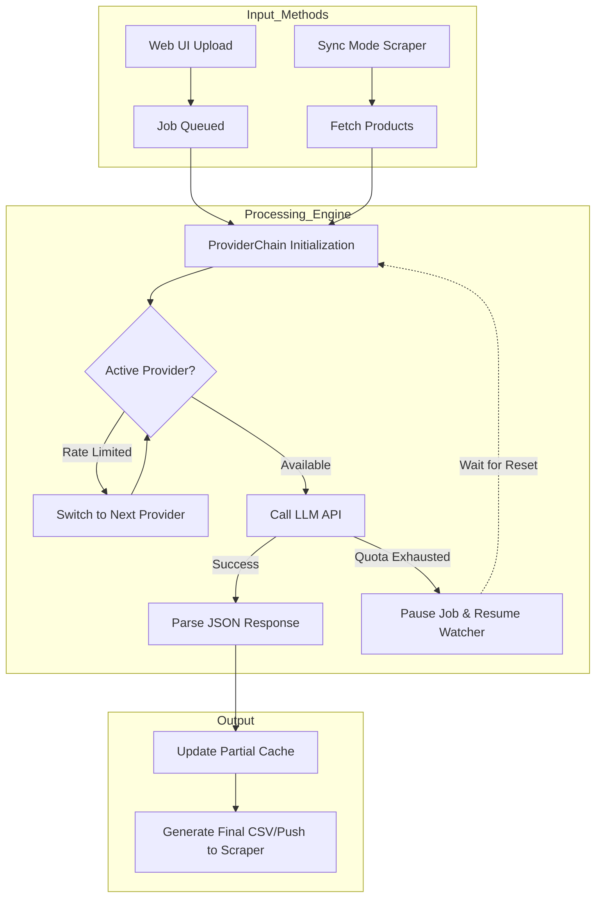
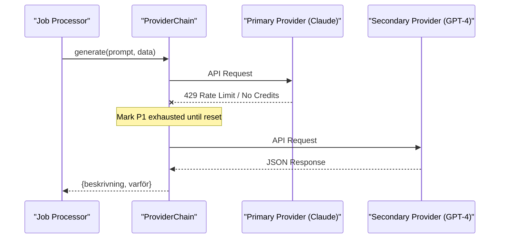

Relevant source files

The following files were used as context for generating this wiki page:

- [README.md](README.md)
- [AGENTS.md](AGENTS.md)
- [CLAUDE.md](CLAUDE.md)
- [main.py](main.py)
- [app.py](app.py)
- [providers.py](providers.py)
- [prompts.py](prompts.py)
- [docker-compose.yml](docker-compose.yml)

# Project Introduction

The product-describer project is a specialized tool designed to generate Swedish product descriptions ("Beskrivning") and justifications ("Varför") using various Large Language Model (LLM) providers. It supports integration with Anthropic (Claude), OpenAI (ChatGPT), Google (Gemini), and Azure OpenAI Service. The system is architected to handle high-volume batch processing with robust failover mechanisms and automatic job resumption upon hitting API rate limits.

The project offers two primary operational modes: a multi-tenant Web UI built with Flask for file-based processing (CSV, Excel, TXT, DOCX, PDF) and a CLI-based Sync mode that integrates directly with a scraper API to automate catalog enrichment.

Sources: [README.md:1-25](README.md#L1-L25), [AGENTS.md:1-12](AGENTS.md#L1-L12), [CLAUDE.md:1-15](CLAUDE.md#L1-L15)

## Core Architecture and Components

The system follows a modular architecture separating the web interface, the core generation logic, and the provider abstractions. It leverages a "Provider Chain" to ensure continuous operation even when individual API quotas are exhausted.

### High-Level Component Overview

| Component | Description |
| :--- | :--- |
| **Flask Web UI** | Handles user authentication, file uploads, and job management (`app.py`). |
| **Provider Engine** | Manages the `ProviderChain` and failover logic (`providers.py`). |
| **Sync Worker** | Background process that polls external APIs for products needing descriptions (`main.py`, `app.py`). |
| **Prompts Engine** | Dynamically constructs system instructions based on user-defined tone and audience (`prompts.py`). |
| **Persistence Layer** | Uses encrypted-at-rest JSON for credentials and disk-based caching for job states (`app.py`, `AGENTS.md`). |

Sources: [AGENTS.md:14-25](AGENTS.md#L14-L25), [CLAUDE.md:17-30](CLAUDE.md#L17-L30), [app.py:100-115](app.py#L100-L115)

### System Data Flow

The following diagram illustrates how a product description request moves from input (Web or Sync) through the Provider Chain to the final output.

The diagram shows the transition from input ingestion to the intelligent failover processing logic.
Sources: [README.md:65-80](README.md#L65-L80), [main.py:115-150](main.py#L115-L150), [providers.py:200-240](providers.py#L200-L240)

## Generation and Failover Logic

The project's most significant feature is its `ProviderChain` class in `providers.py`, which handles automatic failover. If a provider returns a `RateLimitError` or indicates insufficient billing credits, the system identifies the next available provider in the user-defined priority list.

### Multi-Provider Failover Flow

The sequence diagram details the internal logic of the `ProviderChain` when encountering API limits.
Sources: [providers.py:20-55](providers.py#L20-L55), [providers.py:204-245](providers.py#L204-L245)

### Job Resumption and Persistence
To prevent data loss during long-running tasks or API outages:
*  **Partial Caching:** Results for each row are saved incrementally to `{job_id}_partial.json`.
*  **Resume Watcher:** A background thread in `app.py` periodically checks for "paused" jobs whose `resume_at` time has passed.
*  **Encrypted Storage:** API keys are encrypted using Fernet (via `PROVIDER_CONFIG_MASTER_KEY`).

Sources: [app.py:130-150](app.py#L130-L150), [app.py:280-300](app.py#L280-L300), [AGENTS.md:46-52](AGENTS.md#L46-L52)

## Integration and Deployment

The system is designed for containerized deployment using Docker. It requires two master keys for security: `PROVIDER_CONFIG_MASTER_KEY` (for API key encryption) and `FLASK_SECRET_KEY` (for session signing).

### Deployment Configuration

| Variable | Requirement | Description |
| :--- | :--- | :--- |
| `PROVIDER_CONFIG_MASTER_KEY` | **Required** | Generated via cryptography.fernet; used for at-rest encryption. |
| `FLASK_SECRET_KEY` | **Required** | Secure hex string for login session management. |
| `SYNC_ENABLED` | Optional | Set to `true` to enable the background scraper worker. |
| `SCRAPER_URL` | Optional | Internal or external URL for the scraper API (e.g., `http://scraper:8000`). |

Sources: [README.md:40-60](README.md#L40-L60), [docker-compose.yml:9-25](docker-compose.yml#L9-L25)

### Operational Modes
1.  **File Upload Mode:** Users interact with `index.html` to upload structured or unstructured files. The `extractors.py` module (referenced in file overviews) handles row extraction.
2.  **Sync Mode:** Designed for headless operation. It polls the scraper API's `/products` endpoint for items where `missing_description=true` and writes results back using a `PUT` request to `/products/{id}/description`.

Sources: [main.py:58-75](main.py#L58-L75), [README.md:90-110](README.md#L90-L110), [app.py:530-570](app.py#L530-L570)

## Conclusion
The product-describer project provides a resilient infrastructure for Swedish content generation. By abstracting LLM providers into a prioritized chain and implementing persistent background workers, it ensures high availability and cost-efficient processing for both manual file uploads and automated scraping workflows.

Sources: [README.md:120-125](README.md#L120-L125), [AGENTS.md:70-75](AGENTS.md#L70-L75)
