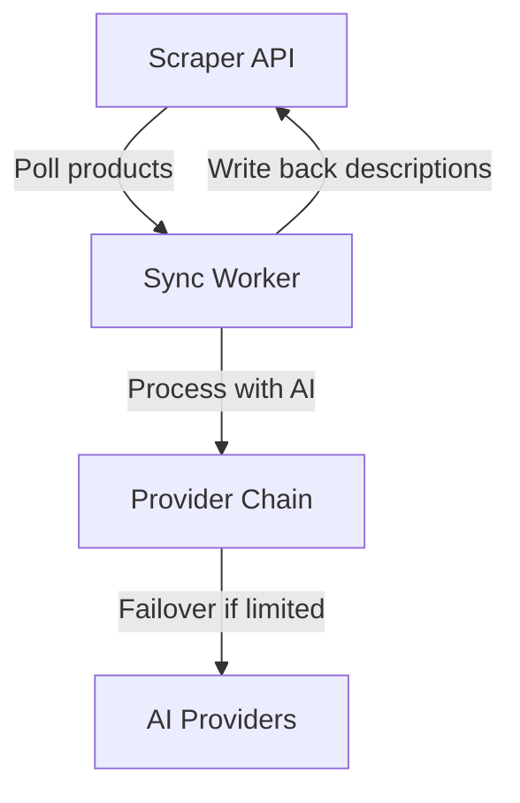
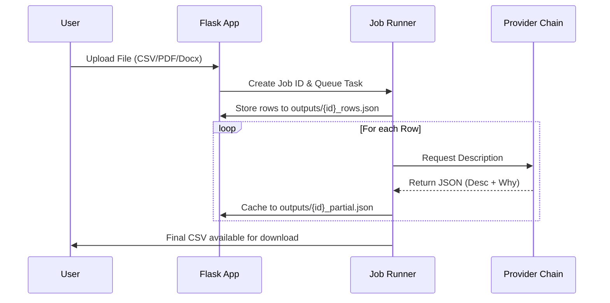

<details>
<summary>Relevant source files</summary>

The following files were used as context for generating this wiki page:

- [README.md](README.md)
- [docker-compose.yml](docker-compose.yml)
- [AGENTS.md](AGENTS.md)
- [CLAUDE.md](CLAUDE.md)
- [app.py](app.py)
- [main.py](main.py)
</details>

# Getting Started

The **product-describer** is a specialized tool designed to generate Swedish product descriptions and justifications ("varför") using various AI provider APIs, including Anthropic (Claude), OpenAI (ChatGPT), Google (Gemini), and Azure OpenAI. It is built as a multi-tenant Flask application that supports both a web-based UI for manual file uploads and a background sync mode for integration with external scrapers.

Sources: [README.md:1-12](README.md#L1-L12), [AGENTS.md:1-6](AGENTS.md#L1-L6), [CLAUDE.md:1-6](CLAUDE.md#L1-L6)

The system is designed for high reliability through a "ProviderChain" failover engine, which automatically switches between configured AI providers when rate limits or quotas are reached. It manages jobs asynchronously, allowing for automatic pausing and resumption without losing progress.

Sources: [AGENTS.md:33-40](AGENTS.md#L33-L40), [app.py:228-245](app.py#L228-L245)

## Initial Environment Setup

Before deploying the application, two critical security keys must be generated and set in your environment variables. These keys ensure that saved API credentials are encrypted at rest and that user sessions remain stable.

| Variable | Purpose | Generation Command |
| :--- | :--- | :--- |
| `PROVIDER_CONFIG_MASTER_KEY` | Encrypts saved API keys at rest using Fernet encryption. | `python -c "from cryptography.fernet import Fernet; print(Fernet.generate_key().decode())"` |
| `FLASK_SECRET_KEY` | Signs the login session cookie to prevent tampering. | `python -c "import secrets; print(secrets.token_hex(32))"` |

Sources: [README.md:32-41](README.md#L32-L41), [docker-compose.yml:9-10](docker-compose.yml#L9-L10)

## Deployment Modes

The application supports three distinct operational modes, each serving different use cases from local development to automated production workflows.

### 1. Web UI (Docker Deployment)
The primary way to use the application is via the Web UI, which handles multi-tenant account management and file processing.

```bash
# To start the web interface:
docker compose up -d
```

Once running, the interface is accessible at `http://your-server:5050`. Users must create an account and configure their own API keys under **Inställningar** (Settings).

Sources: [README.md:24-30](README.md#L24-L30), [AGENTS.md:29-31](AGENTS.md#L29-L31)

### 2. CLI Batch Mode
The CLI mode is intended for direct file processing and is unrelated to the web accounts system. It reads API keys directly from environment variables.

```bash
# Run against a local CSV
python main.py run products.csv --workers 4
```

Sources: [README.md:43-46](README.md#L43-L46), [main.py:114-118](main.py#L114-L118)

### 3. Sync Mode
Sync mode integrates with a scraper API to automatically process products missing descriptions. It can be enabled as a background worker within the Docker stack.



*The diagram above illustrates the data flow between the Scraper API and the Sync Worker during automated processing.*

To enable this mode, set `SYNC_ENABLED=true` and provide the `SCRAPER_URL`.

Sources: [README.md:63-75](README.md#L63-L75), [app.py:539-550](app.py#L539-L550)

## Core System Architecture

The application is structured into several modular components that handle extraction, generation, and job management.

### Component Overview

| Component | Responsibility | Relevant Files |
| :--- | :--- | :--- |
| **Flask Web UI** | Handles multi-tenant routing, authentication, and job monitoring. | `app.py`, `templates/` |
| **Provider Engine** | Manages API abstractions and failover logic (`ProviderChain`). | `providers.py` |
| **Job Runner** | Asynchronous execution of descriptions with auto-pause/resume. | `app.py`, `main.py` |
| **Extractors** | Converts uploaded files (CSV, Excel, PDF, etc.) into processable rows. | `extractors.py` |
| **Prompts** | Dynamic construction of system prompts based on user options (tone, length). | `prompts.py` |

Sources: [AGENTS.md:14-23](AGENTS.md#L14-L23), [CLAUDE.md:17-26](CLAUDE.md#L17-L26)

### Data Processing Flow

When a user uploads a file through the Web UI, the system follows a specific sequence of operations:



*The sequence diagram shows how the system caches intermediate results to disk to prevent data loss during provider exhaustion.*

Sources: [app.py:157-226](app.py#L157-L226), [AGENTS.md:45-47](AGENTS.md#L45-L47)

## Multi-Provider Failover Logic

One of the project's core features is the ability to handle API rate limits gracefully. The `ProviderChain` iterates through a list of user-configured providers in priority order.

1. **Active Provider**: The engine uses the first provider in the list.
2. **Rate Limit Detection**: If the provider returns a 429 (Rate Limit) or a quota exhaustion error (e.g., "insufficient_quota"), the engine catches the `RateLimitExceeded` exception.
3. **Automatic Failover**: The job switches to the next configured provider immediately.
4. **Pause and Resume**: If all providers are exhausted, the job status changes to `paused`. A background `resume_watcher` thread checks every 120 seconds (default) and resumes the job once a provider's quota is expected to reset.

Sources: [providers.py:214-245](providers.py#L214-L245), [app.py:307-320](app.py#L307-L320), [README.md:48-59](README.md#L48-L59)

## Configuration and Environment

The application relies on environment variables for global settings and volumes for persistent data.

| Environment Variable | Description | Default |
| :--- | :--- | :--- |
| `SYNC_ENABLED` | Enables the background scraper sync worker. | `false` |
| `SCRAPER_URL` | Base URL for the scraper API integration. | `http://scraper:8000` |
| `SYNC_INTERVAL` | Seconds between scraper polls. | `300` |
| `JOB_RETENTION_DAYS` | Days to keep job files before auto-purging. | `30` |
| `RESUME_CHECK_INTERVAL` | Seconds between checking for resumable paused jobs. | `120` |

Sources: [app.py:64-70](app.py#L64-L70), [app.py:539-543](app.py#L539-L543), [docker-compose.yml:14-18](docker-compose.yml#L14-L18)

### Persistent Volumes
- `uploads/`: Stores the raw files uploaded by users.
- `outputs/`: Stores the final CSVs, job metadata (`jobs.json`), and partial progress caches.
- `config/`: Stores encrypted API keys and provider priority orders.

Sources: [docker-compose.yml:32-35](docker-compose.yml#L32-L35), [app.py:73-75](app.py#L73-L75)

## Summary

To get started with **product-describer**, deploy the container using Docker Compose after generating the required master and secret keys. The system provides a robust, multi-tenant environment for generating high-quality Swedish product descriptions with a built-in failover mechanism that ensures long-running batch jobs complete successfully even when faced with API provider limitations.

Sources: [README.md:92-95](README.md#L92-L95), [AGENTS.md:5-12](AGENTS.md#L5-L12)
