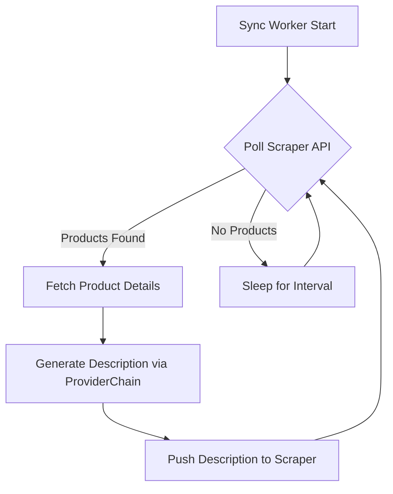
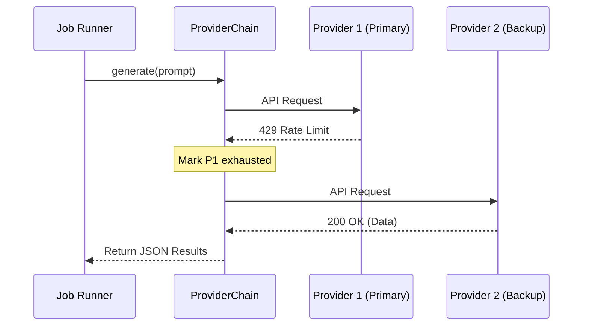

Relevant source files

The following files were used as context for generating this wiki page:

- [README.md](README.md)
- [app.py](app.py)
- [main.py](main.py)
- [AGENTS.md](AGENTS.md)
- [CLAUDE.md](CLAUDE.md)
- [templates/index.html](templates/index.html)
- [prompts.py](prompts.py)
- [providers.py](providers.py)

# Using the Application

The **Product Describer** is a specialized tool designed to generate Swedish product descriptions ("Beskrivning") and justifications ("Varför") using various AI Large Language Model (LLM) providers. It supports multiple input formats including CSV, Excel, `.txt`, `.docx`, and `.pdf`. The system is built to be resilient, featuring automatic failover between configured API providers (Anthropic, OpenAI, Google, and Azure) when rate limits or quotas are reached.

The application offers three primary operational modes: a Web Interface for interactive use, a Command Line Interface (CLI) for batch processing, and a Sync Mode for automated integration with external scraper APIs. It is multi-tenant, allowing individual users to manage their own API keys and job history securely.

Sources: [README.md:9-25](README.md#L9-L25), [AGENTS.md:1-10](AGENTS.md#L1-L10), [CLAUDE.md:10-18](CLAUDE.md#L10-L18)

## Operational Modes

### Web Interface Usage
The Web UI provides a graphical way to upload files and monitor generation progress. Users must create an account and configure at least one API key under "Inställningar" (Settings) before processing files.

1.  **Authentication**: Users sign up or log in via `templates/signup.html` and `templates/login.html`.
2.  **File Upload**: Drag and drop supported files into the upload zone. Unstructured formats (PDF/Word/TXT) use AI-assisted extraction to find product rows.
3.  **Job Configuration**: Users can specify generation parameters:
  *  **Tone**: Saklig (Factual), Entusiastisk, Humoristisk, or Lyxig (Luxurious).
  *  **Length**: Kort (Short), Medel (Medium), or Lang (Long).
  *  **Audience**: Specific target groups (e.g., "children").
  *  **Custom Direction**: Specific instructions for the AI.
4.  **Monitoring**: The "Jobb" table displays real-time progress, showing which provider is active and providing download links for completed CSV files.

Sources: [README.md:46-55](README.md#L46-L55), [templates/index.html:435-470](templates/index.html#L435-L470), [prompts.py:14-25](prompts.py#L14-L25)

### Command Line Interface (CLI)
The CLI allows for direct batch processing without the web overhead. Unlike the Web UI, the CLI reads API keys directly from environment variables.

*  **Batch Run**: `python main.py run <input_file> [--output <output_file>] [--workers <count>]`
*  **Sync Execution**: `python main.py sync [--watch] [--interval <seconds>]`

Sources: [main.py:6-10](main.py#L6-L10), [README.md:41-44](README.md#L41-L44)

### Sync Mode (Scraper Integration)
Sync mode allows the application to act as a background worker for the [scraper](https://github.com/blixten85/scraper) project. It polls the scraper API for products missing descriptions, processes them, and pushes the results back.

Sources: [main.py:165-212](main.py#L165-L212), [app.py:679-710](app.py#L679-L710), [README.md:71-85](README.md#L71-L85)

## AI Provider Configuration

The application uses a `ProviderChain` to manage multiple LLM backends. If a provider returns a rate limit error (HTTP 429) or a billing exhaustion error, the system automatically fails over to the next provider in the user's defined priority list.

### Supported Providers
| Provider | Field Requirements | Available Models (Examples) |
| :--- | :--- | :--- |
| **Anthropic** | `api_key` | claude-sonnet, claude-haiku, claude-opus |
| **OpenAI** | `api_key` | gpt-4, gpt-4o, gpt-4-mini |
| **Google** | `api_key` | gemini-2.5-flash, gemini-2.5-pro |
| **Azure OpenAI** | `api_key`, `endpoint`, `deployment` | Defined by Azure deployment name |

Sources: [providers.py:80-185](providers.py#L80-L185), [app.py:421-435](app.py#L421-L435)

### Failover and Auto-Resume Logic
When all providers are exhausted, the job enters a `paused` state. A background watcher (`_resume_watcher` in `app.py`) checks every 120 seconds (configurable via `RESUME_CHECK_INTERVAL`) to see if any provider's quota has reset.

Sources: [providers.py:270-305](providers.py#L270-L305), [app.py:218-245](app.py#L218-L245)

## Input and Output Data Structures

### Input Extraction
The system extracts product data into a standard row format containing `Site`, `Product`, and `Price (SEK)`.

### Output CSV Format
The final output is always a CSV containing all original columns plus two generated fields:
*  **Beskrivning**: A 1-2 sentence natural Swedish description.
*  **Varför**: A 1-2 sentence justification for why a customer would want the product.

Sources: [main.py:20-25](main.py#L20-L25), [prompts.py:5-10](prompts.py#L5-L10), [app.py:290-305](app.py#L290-L305)

## Configuration and Secrets

The application requires specific environment variables for security and core functionality.

| Variable | Description | Source |
| :--- | :--- | :--- |
| `PROVIDER_CONFIG_MASTER_KEY` | Fernet key used to encrypt API keys at rest. | `app.py`, `README.md` |
| `FLASK_SECRET_KEY` | Key for signing session cookies. | `app.py`, `README.md` |
| `SYNC_ENABLED` | Set to `true` to enable background sync worker. | `app.py`, `README.md` |
| `SCRAPER_URL` | Base URL for the external Scraper API. | `main.py`, `app.py` |
| `JOB_RETENTION_DAYS` | Number of days to keep job files before purging (Default: 30). | `app.py:65` |

Sources: [README.md:28-40](README.md#L28-L40), [app.py:61-68](app.py#L61-L68), [docker-compose.yml:10-15](docker-compose.yml#L10-L15)

## Summary

The Product Describer provides a robust environment for generating high-quality Swedish marketing content. By abstracting multiple AI providers into a single resilient chain, it ensures that high-volume batch jobs can continue even if individual API quotas are met. Whether used via the multi-tenant Web UI or integrated directly into a scraping pipeline via Sync Mode, the application maintains state and progress across restarts and API interruptions.

Sources: [AGENTS.md:1-25](AGENTS.md#L1-L25), [CLAUDE.md:1-15](CLAUDE.md#L1-L15)
