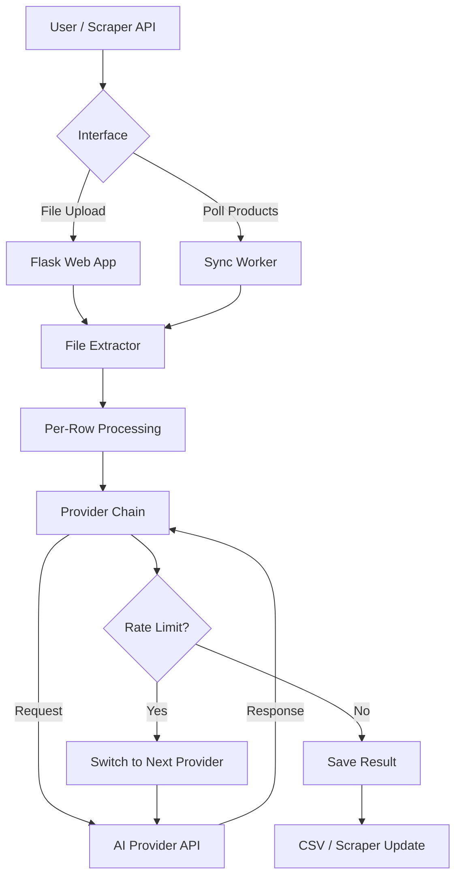
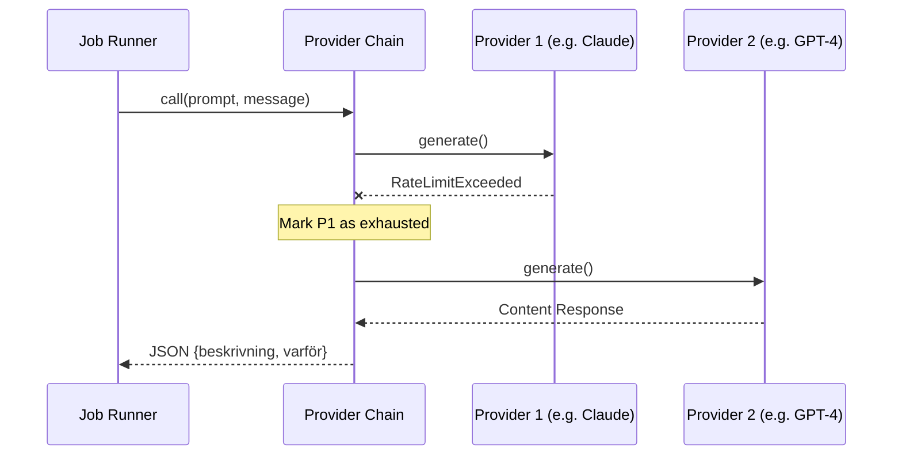

Relevant source files

The following files were used as context for generating this wiki page:

- [README.md](README.md)
- [AGENTS.md](AGENTS.md)
- [CLAUDE.md](CLAUDE.md)
- [main.py](main.py)
- [app.py](app.py)
- [providers.py](providers.py)
- [prompts.py](prompts.py)
- [docker-compose.yml](docker-compose.yml)

# Project Introduction

Product-describer is a technical solution designed to automate the generation of Swedish product descriptions and justifications ("varför"). It leverages large language models (LLMs) from providers like Anthropic (Claude), OpenAI (ChatGPT), Google (Gemini), and Azure OpenAI Service. The system is built to handle batch processing of product data through multiple interfaces while maintaining high reliability through an automatic failover engine.

Sources: [README.md:8-14](README.md#L8-L14), [AGENTS.md:5-10](AGENTS.md#L5-L10)

The project caters to developers and content managers by providing two primary operational modes: a web-based UI for manual file uploads and a headless synchronization mode that integrates directly with external scraper APIs. It features a multi-tenant architecture where individual accounts manage their own API credentials, ensuring clear financial isolation for API usage costs.

Sources: [CLAUDE.md:12-16](CLAUDE.md#L12-L16), [README.md:20-27](README.md#L20-L27)

## System Architecture

The project is structured as a Python-based application utilizing Flask for the web interface and a custom provider abstraction layer for LLM communication. It follows a modular design where core logic is separated into extractors, prompt builders, and provider chains.

### Core Components

| Component | Responsibility | Relevant Files |
| :--- | :--- | :--- |
| **Web UI** | Flask-based interface for job management, settings, and file uploads. | `app.py`, `templates/index.html` |
| **CLI / Sync** | Command-line tool for batch runs and automated background synchronization. | `main.py` |
| **Provider Chain** | Failover engine managing LLM API requests and rate limit handling. | `providers.py` |
| **Prompt Builder** | Logic to construct system prompts based on user preferences (tone, length). | `prompts.py` |
| **Account System** | Multi-tenant authentication and isolated credential storage. | `auth.py`, `provider_config.py` |

Sources: [AGENTS.md:19-27](AGENTS.md#L19-L27), [CLAUDE.md:23-31](CLAUDE.md#L23-L31)

### High-Level Data Flow

The following diagram illustrates the flow of data from an initial user request through the generation process to the final output.

The diagram shows how the system handles both manual and automated inputs, processing them through a failover-capable provider chain.
Sources: [app.py:168-245](app.py#L168-L245), [main.py:117-158](main.py#L117-L158), [providers.py:276-309](providers.py#L276-L309)

## Operational Modes

### File Upload Mode
Users can upload files in various formats including CSV, Excel (`.xlsx`), `.txt`, `.docx`, and `.pdf`. The system extracts product information, processes it in the background using a configurable number of parallel "workers," and provides a downloadable CSV containing the original data plus `Beskrivning` and `Varför` columns.

Sources: [README.md:16-18](README.md#L16-L18), [app.py:530-575](app.py#L530-L575)

### Sync Mode
In Sync mode, the application acts as a background worker. It polls an external scraper API for products missing descriptions, generates them, and writes the results back to the scraper. This mode is typically enabled via environment variables (`SYNC_ENABLED=true`) and managed through Docker Compose profiles.

Sources: [README.md:76-85](README.md#L76-L85), [main.py:161-205](main.py#L161-L205)

## Provider & Failover Logic

The core reliability of the project stems from the `ProviderChain`. This mechanism manages an ordered list of AI providers and automatically switches to the next one if a rate limit or quota error occurs.

### Failover Sequence
1. **Request**: The active provider attempts to generate a description.
2. **Error Handling**: If a `RateLimitError` or billing-related error occurs, the provider is marked as exhausted.
3. **Failover**: The `ProviderChain` immediately attempts the same request with the next provider in the user-defined priority list.
4. **Auto-Resume**: If all providers are exhausted, the job is paused. A background watcher (`_resume_watcher`) checks periodically and resumes the job once a provider's quota is expected to reset.

Sources: [providers.py:276-309](providers.py#L276-L309), [app.py:284-297](app.py#L284-L297), [README.md:58-69](README.md#L58-L69)

This sequence illustrates the transparent failover between configured AI providers during a job run.
Sources: [providers.py:293-309](providers.py#L293-L309), [app.py:202-230](app.py#L202-L230)

## Security and Configuration

The application enforces strict security practices regarding credential management. API keys are never hardcoded and are stored encrypted at rest using Fernet encryption when saved through the Web UI.

### Critical Configuration Variables

| Variable | Requirement | Description |
| :--- | :--- | :--- |
| `PROVIDER_CONFIG_MASTER_KEY` | **Required** | A Fernet key used to encrypt saved API keys at rest. |
| `FLASK_SECRET_KEY` | **Required** | Used for signing session cookies. |
| `SYNC_ENABLED` | Optional | Enables the background sync worker. |
| `SCRAPER_URL` | Optional | The endpoint for the scraper API (default: `http://scraper:8000`). |

Sources: [README.md:38-51](README.md#L38-L51), [AGENTS.md:39-47](AGENTS.md#L39-L47), [docker-compose.yml:9-12](docker-compose.yml#L9-L12)

## Summary

The Product-describer project provides a robust, multi-tenant framework for generating AI-driven product content. By combining a flexible Web UI with a powerful failover-capable provider engine and deep integration with scraper APIs, it offers a scalable solution for managing Swedish product descriptions while minimizing manual intervention and maximizing uptime across various LLM providers.

Sources: [README.md:1-5](README.md#L1-L5), [CLAUDE.md:7-16](CLAUDE.md#L7-L16)
