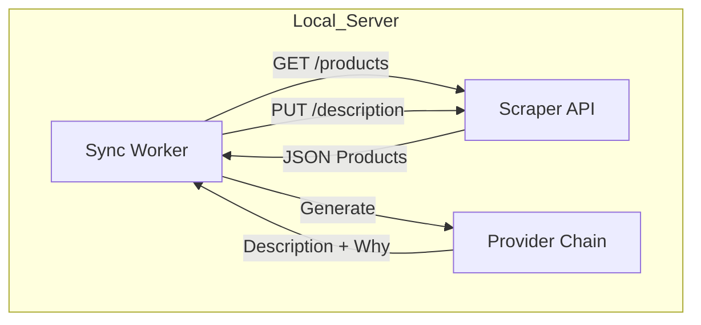
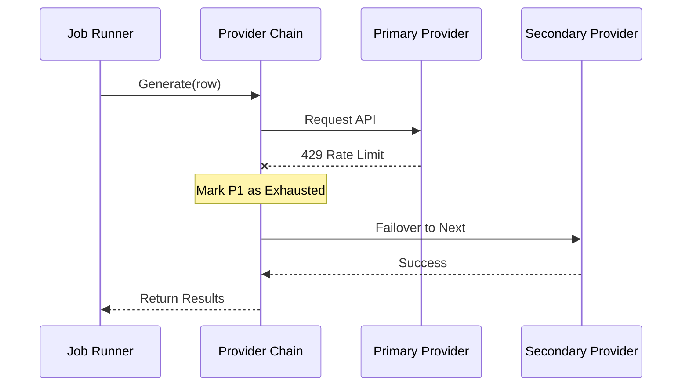

<details>
<summary>Relevant source files</summary>

The following files were used as context for generating this wiki page:

- [README.md](README.md)
- [docker-compose.yml](docker-compose.yml)
- [AGENTS.md](AGENTS.md)
- [CLAUDE.md](CLAUDE.md)
- [app.py](app.py)
- [main.py](main.py)
- [SECURITY.md](SECURITY.md)
</details>

# Getting Started

The **Product Describer** is a system designed to generate Swedish product descriptions and justifications ("varför") using various AI providers including Claude (Anthropic), ChatGPT (OpenAI), Gemini (Google), and Azure OpenAI Service. It supports automatic failover between providers when rate limits are reached and provides both a Web UI for manual uploads and a Sync mode for automated integration with external scrapers.

Sources: [README.md:1-12](README.md#L1-L12), [AGENTS.md:3-8](AGENTS.md#L3-L8)

## System Prerequisites

Before deploying the application, two critical security keys must be generated and configured. These keys ensure that saved API credentials are encrypted at rest and that user sessions remain stable across container restarts.

| Requirement | Environment Variable | Description | Generation Command |
| :--- | :--- | :--- | :--- |
| **Master Key** | `PROVIDER_CONFIG_MASTER_KEY` | Encrypts saved API keys at rest. | `python -c "from cryptography.fernet import Fernet; print(Fernet.generate_key().decode())"` |
| **Secret Key** | `FLASK_SECRET_KEY` | Signs the login session cookie. | `python -c "import secrets; print(secrets.token_hex(32))"` |

Sources: [README.md:31-41](README.md#L31-L41), [docker-compose.yml:9-12](docker-compose.yml#L9-L12)

## Deployment via Docker

The primary method for running the Product Describer is through Docker Compose. This encapsulates the Flask web server, the background job runner, and the optional sync worker.

```bash
# To start the standard Web UI
docker compose up -d
```

Once the container is running, the interface is accessible at `http://your-server:5050`. Users must create an account and configure at least one AI provider API key under the "Inställningar" (Settings) menu to begin processing files.

Sources: [README.md:27-30](README.md#L27-L30), [AGENTS.md:28-31](AGENTS.md#L28-L31), [docker-compose.yml:1-20](docker-compose.yml#L1-L20)

### Multi-Tenant Architecture
The system is multi-tenant; each account (email/password) is isolated. API keys, provider failover orders, and job data are stored per `account_id`, ensuring the operator is not financially responsible for other users' API usage.

Sources: [CLAUDE.md:10-14](CLAUDE.md#L10-L14), [app.py:85-93](app.py#L85-L93)

## Operating Modes

The application supports three distinct modes of operation depending on the user's workflow requirements.

### 1. Web UI (File Upload)
Users can drag and drop supported file formats directly into the browser. The system supports CSV, Excel (`.xlsx`), `.txt`, `.docx`, and `.pdf`. Processing occurs in the background, and results are downloadable as a CSV.

Sources: [README.md:14-22](README.md#L14-L22), [AGENTS.md:33-34](AGENTS.md#L33-L34)

### 2. CLI Batch Mode
The CLI operates independently of the multi-tenant account system. It reads API keys directly from environment variables (e.g., `ANTHROPIC_API_KEY`) rather than the encrypted database.

```bash
# Run batch processing via CLI
python main.py run products.csv --workers 4
```

Sources: [README.md:43-47](README.md#L43-L47), [main.py:122-127](main.py#L122-L127)

### 3. Sync Mode (Scraper Integration)
Sync mode allows the system to poll an external scraper API for products missing descriptions. It generates the text and writes the results back to the scraper database automatically.



*The diagram shows the data flow between the Product Describer's Sync Worker and the external Scraper API.*

Sources: [README.md:65-71](README.md#L65-L71), [main.py:186-218](main.py#L186-L218)

## Failover Logic and Persistence

A core feature of the system is the `ProviderChain`, which manages automatic failover between AI services to maximize uptime and bypass rate limits.



*This sequence illustrates how the system transitions to a secondary provider without manual intervention when the primary provider's quota is exhausted.*

### Persistence and Resumption
- **Partial Progress**: Results are cached incrementally to `outputs/{job_id}_partial.json`.
- **Auto-Resume**: If all providers are exhausted, the job pauses. A background watcher (`_resume_watcher`) checks every 120 seconds to resume jobs once the earliest quota reset time is reached.
- **Data Safety**: Secrets and API keys must never be committed to version control and should be managed via `.env` files or the `config/` volume.

Sources: [README.md:52-63](README.md#L52-L63), [AGENTS.md:52-54](AGENTS.md#L52-L54), [app.py:120-134](app.py#L120-L134), [SECURITY.md:16-18](SECURITY.md#L16-L18)

## Summary
To get started with Product Describer, deploy the Docker container with the required security environment variables, register an account via the Web UI, and configure your AI provider keys. The system will then handle the complexities of AI generation, rate-limit management, and result persistence automatically.
