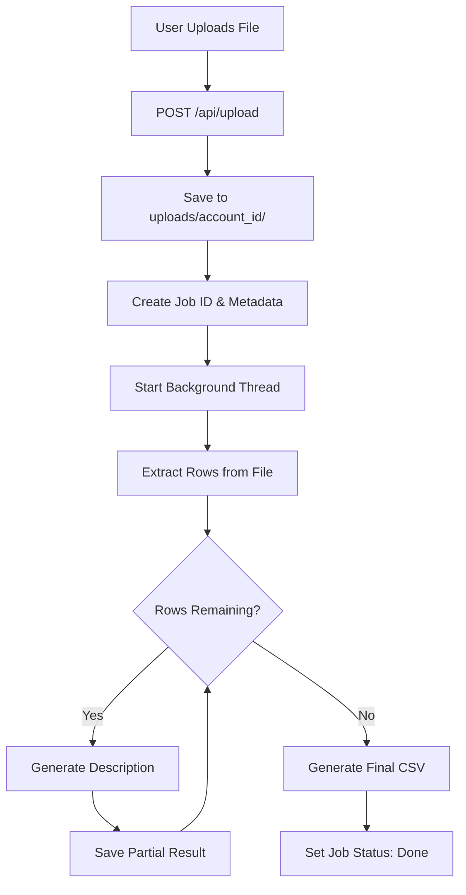
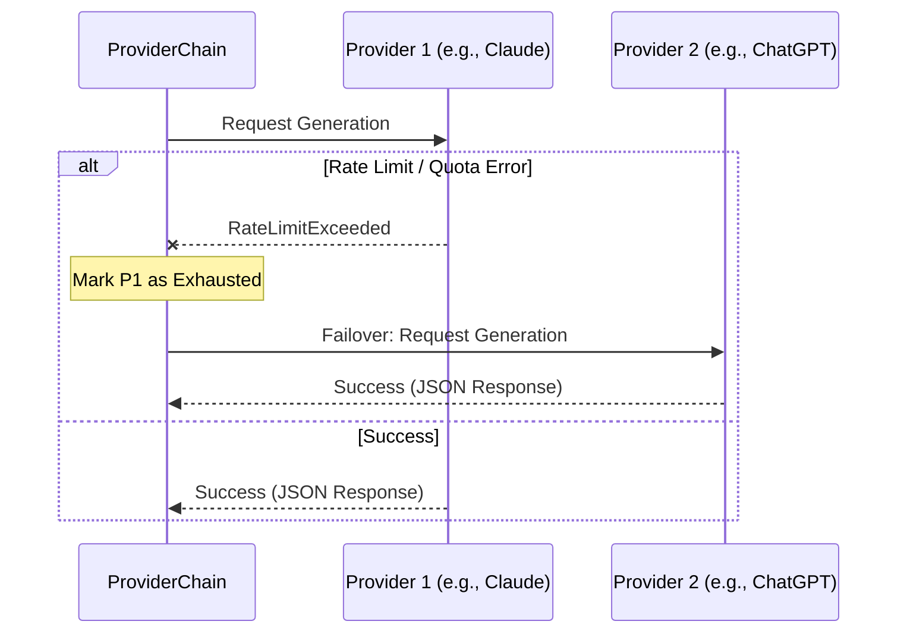

<details>
<summary>Relevant source files</summary>

The following files were used as context for generating this wiki page:

- [README.md](README.md)
- [templates/index.html](templates/index.html)
- [app.py](app.py)
- [main.py](main.py)
- [AGENTS.md](AGENTS.md)
- [CLAUDE.md](CLAUDE.md)
- [prompts.py](prompts.py)
- [providers.py](providers.py)
</details>

# Usage Guide

The Product Describer is a multi-tenant AI tool designed to generate Swedish product descriptions and justifications ("Varför") using various AI providers including Anthropic, OpenAI, Google Gemini, and Azure OpenAI. The system is architected to handle large batches of products via file uploads or direct integration with a scraper API, featuring automatic failover and job persistence to handle provider rate limits.

Sources: [README.md:1-12](README.md#L1-L12), [CLAUDE.md:1-12](CLAUDE.md#L1-L12), [AGENTS.md:1-12](AGENTS.md#L1-L12)

## Core Operating Modes

The application supports three distinct operational interfaces to accommodate different workflows: Web UI, Command Line Interface (CLI), and Background Sync.

### 1. Web User Interface
The Web UI provides a multi-tenant environment where users sign up, configure their own API keys, and manage batch jobs through a browser.

*  **Authentication:** Users must sign up with an email and password. Every account is isolated, meaning API keys and jobs are scoped to specific `account_id` values.
*  **Job Management:** Users drag and drop files (CSV, Excel, TXT, DOCX, PDF). The system extracts product data and processes descriptions in the background.

Sources: [app.py:164-192](app.py#L164-L192), [templates/index.html:437-450](templates/index.html#L437-L450), [CLAUDE.md:13-16](CLAUDE.md#L13-L16)

### 2. Command Line Interface (CLI)
The CLI is intended for developers or automated scripts and operates independently of the multi-tenant account system.

*  **Key Configuration:** Unlike the Web UI, the CLI reads API keys directly from environment variables (e.g., `ANTHROPIC_API_KEY`).
*  **Commands:** 
  *  `python main.py run <file>`: Processes a local file.
  *  `python main.py sync`: Operates in synchronization mode.

Sources: [main.py:1-12](main.py#L1-L12), [README.md:38-44](README.md#L38-L44), [AGENTS.md:35-37](AGENTS.md#L35-L37)

### 3. Sync Mode (Scraper Integration)
Sync mode allows the system to poll a [scraper API](https://github.com/blixten85/scraper) for products missing descriptions, generate them, and write them back automatically.

*  **Activation:** Enabled by setting `SYNC_ENABLED=true`.
*  **Logic:** The `sync_loop` fetches products using `fetch_products_missing_description` and updates them using `push_description`.

Sources: [app.py:539-573](app.py#L539-L573), [README.md:65-75](README.md#L65-L75), [main.py:177-217](main.py#L177-L217)

---

## Workflow Diagrams

### Job Processing Flow (Web UI)
The following diagram illustrates the lifecycle of a description generation job initiated via the Web UI.



The job runner uses a background thread to prevent blocking the web server during long-running AI generations.
Sources: [app.py:307-393](app.py#L307-L393), [templates/index.html:565-594](templates/index.html#L565-L594)

### Multi-Provider Failover Logic
The `ProviderChain` ensures that if one AI service reaches a quota limit, the job continues using the next available service.



Sources: [providers.py:270-302](providers.py#L270-L302), [README.md:52-57](README.md#L52-L57)

---

## Configuration and Setup

### Environment Variables
Essential configuration required for the system to function securely and integrate with external services.

| Variable | Description | Source |
| :--- | :--- | :--- |
| `PROVIDER_CONFIG_MASTER_KEY` | Fernet key used to encrypt API keys at rest. | [README.md:46-50](README.md#L46-L50) |
| `FLASK_SECRET_KEY` | Key used to sign login session cookies. | [README.md:46-50](README.md#L46-L50) |
| `SYNC_ENABLED` | Set to `true` to enable the background sync worker. | [README.md:67](README.md#L67) |
| `SCRAPER_URL` | The endpoint for the scraper API (default: `http://scraper:8000`). | [main.py:22](main.py#L22) |
| `JOB_RETENTION_DAYS` | Number of days to keep job files before purging (default: 30). | [app.py:82](app.py#L82) |

### AI Generation Options
When submitting a job via the UI, users can customize the generation output.

| Option | Values / Input | Description |
| :--- | :--- | :--- |
| **Tone** | Saklig, Entusiastisk, Humoristisk, Lyxig | Controls the stylistic output of the description. |
| **Length** | Kort, Medel, Lång | Sets sentence limits (e.g., Kort = max 1 sentence). |
| **Audience** | Custom Text | Tailors the justification for a specific group (e.g., "barn"). |
| **Custom Direction** | Custom Text | Direct user instructions appended to the prompt. |

Sources: [prompts.py:15-49](prompts.py#L15-L49), [templates/index.html:454-486](templates/index.html#L454-L486)

---

## Technical Implementation Details

### Data Persistence and Resume Logic
Jobs are resilient to restarts and provider exhaustion:
1.  **Row Caching:** Extracted rows are saved to `outputs/{job_id}_rows.json`.
2.  **Partial Results:** Completed rows are saved to `outputs/{job_id}_partial.json` every 5 successful generations.
3.  **Resume Watcher:** A background thread (`_resume_watcher`) checks for paused jobs every 120 seconds and restarts them if the provider quota is expected to have reset.

Sources: [app.py:108-144](app.py#L108-L144), [app.py:441-456](app.py#L441-L456)

### Prompt Construction
The system builds a structured prompt for the AI to ensure responses are returned in a parsable JSON format.

```python
# From prompts.py
BASE_PROMPT = (
    "Du är en assistent som skriver korta produktbeskrivningar på svenska. "
    "Svara ALLTID med endast giltig JSON i exakt detta format, utan kodstaket eller extra text:\n"
    '{"beskrivning": "...", "varför": "..."}\n'
    "- 'beskrivning' (1–2 meningar): kort, naturlig beskrivning av produkten.\n"
    "- 'varför' (1–2 meningar): varför någon skulle vilja eller behöva produkten.\n"
)
```

Sources: [prompts.py:3-13](prompts.py#L3-L13)

## Summary
The Usage Guide details a system designed for high reliability in AI-assisted content generation. By utilizing a multi-tenant web architecture, a flexible CLI, and a background sync worker, the Product Describer serves both manual batch processing and automated pipelines. Its core strength lies in its failover engine, which mitigates the volatility of external AI API quotas.
