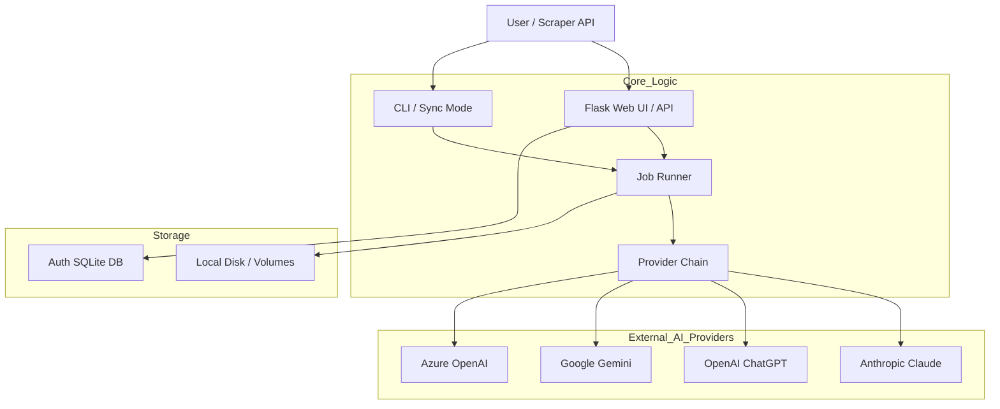
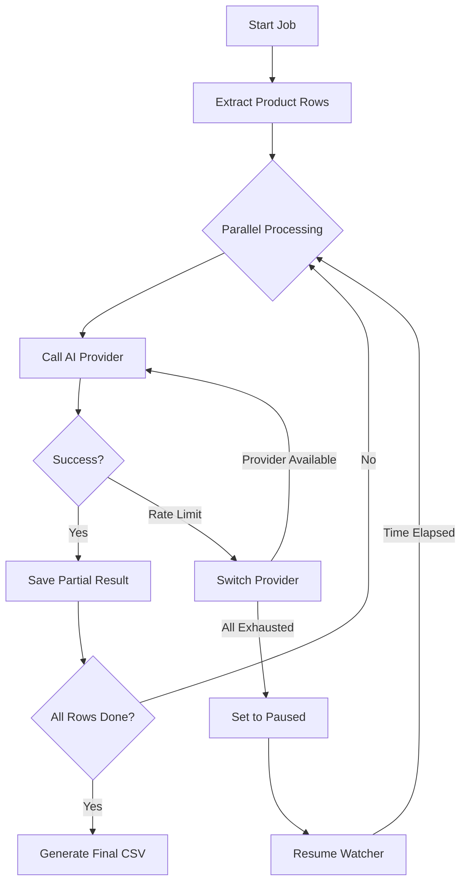

<details>
<summary>Relevant source files</summary>

The following files were used as context for generating this wiki page:

- [AGENTS.md](AGENTS.md)
- [CLAUDE.md](CLAUDE.md)
- [README.md](README.md)
- [app.py](app.py)
- [main.py](main.py)
- [providers.py](providers.py)
- [prompts.py](prompts.py)
- [docker-compose.yml](docker-compose.yml)
</details>

# High-Level Architecture Overview

The Product Describer is a Python-based system designed to generate Swedish product descriptions and justifications using Large Language Models (LLMs) from multiple providers (Anthropic, OpenAI, Google, and Azure OpenAI). Its primary purpose is to automate the enrichment of product data extracted from various file formats or external scraper APIs.

The system is built with a focus on reliability through a multi-provider failover mechanism, ensuring that background jobs continue processing even when individual API quotas are exhausted. It provides both a multi-tenant Flask-based web interface for manual file processing and a CLI-based worker for automated synchronization with external data sources.

Sources: [README.md:1-15](README.md#L1-L15), [AGENTS.md:1-12](AGENTS.md#L1-L12), [CLAUDE.md:1-15](CLAUDE.md#L1-L15)

## System Architecture

The project follows a modular architecture consisting of a web frontend/backend, a background job runner, and a provider abstraction layer.

### Core Components

*  **Web UI (Flask):** A multi-tenant interface allowing users to sign up, manage API keys, and upload files for processing.
*  **Job Runner:** A background processing system that manages long-running tasks, handles persistence of partial results, and implements auto-resume logic.
*  **Provider Chain:** An abstraction layer that manages multiple AI providers and implements failover logic when rate limits are hit.
*  **CLI/Sync Worker:** A standalone mode for batch processing local files or syncing with a [scraper API](https://github.com/blixten85/scraper).



The diagram shows the interaction between user interfaces, the core processing logic, and external AI services.
Sources: [app.py:53-70](app.py#L53-L70), [main.py:104-120](main.py#L104-L120), [AGENTS.md:18-30](AGENTS.md#L18-L30), [providers.py:270-305](providers.py#L270-L305)

## Data Flow and Job Management

The system processes product data through a defined lifecycle. Whether initiated via file upload or API sync, every task is treated as a "job" with state persistence.

### Job Processing Lifecycle
1.  **Extraction:** Rows are extracted from input files (CSV, Excel, .txt, .docx, .pdf) using specific extractors.
2.  **Queueing:** Jobs are added to a background queue. In the Web UI, this involves creating a `job_id` and saving metadata to `jobs.json`.
3.  **Execution:** A `ThreadPoolExecutor` processes rows in parallel using the `ProviderChain`.
4.  **State Persistence:** Partial results are saved incrementally to disk to prevent data loss during interruptions.
5.  **Failover/Pause:** If a provider returns a 429 (Rate Limit) error, the `ProviderChain` switches to the next configured provider. If all are exhausted, the job enters a `paused` state.
6.  **Auto-Resume:** A background watcher (`_resume_watcher`) checks for paused jobs and restarts them once the retry-after period has elapsed.



This flowchart illustrates the robust retry and failover logic implemented in the job runner.
Sources: [app.py:165-225](app.py#L165-L225), [app.py:290-310](app.py#L290-L310), [providers.py:284-305](providers.py#L284-L305), [CLAUDE.md:65-72](CLAUDE.md#L65-L72)

## Provider Failover Mechanism

The `ProviderChain` is the heart of the system's reliability. It handles the nuances of different AI SDKs and unifies their error reporting.

| Feature | Description |
| :--- | :--- |
| **Ordered Priority** | Users define a failover order (e.g., Claude -> ChatGPT -> Gemini) in settings. |
| **Smart Parsing** | Model outputs are expected in JSON format; the system includes a fallback to plain text if parsing fails. |
| **Billing Awareness** | Explicitly detects billing-related exhaustion (insufficient quota) separately from standard rate limits. |
| **Incremental Savings** | The web UI saves progress every 5 successful rows to `_partial.json`. |

Sources: [providers.py:24-34](providers.py#L24-L34), [providers.py:242-263](providers.py#L242-L263), [app.py:215-225](app.py#L215-L225), [README.md:46-55](README.md#L46-L55)

## Prompt Engineering and Configuration

The system uses a centralized prompt builder to ensure consistent output quality while allowing user customization.

### Prompt Components
*  **Base Prompt:** Enforces JSON output format and specific Swedish language requirements.
*  **Tone/Length/Audience:** Dynamically injected based on job configuration.
*  **Custom Directions:** User-provided text strings appended to the system prompt.

```python
# Sources: prompts.py:5-10, 44-55
BASE_PROMPT = (
    "Du är en assistent som skriver korta produktbeskrivningar på svenska. "
    "Svara ALLTID med endast giltig JSON i exakt detta format..."
)

def build_system_prompt(options: dict | None = None, custom_direction: str = "") -> str:
    # Logic to assemble prompt based on tone, length, and audience
    ...
```

Sources: [prompts.py:5-22](prompts.py#L5-L22), [prompts.py:41-61](prompts.py#L41-L61)

## Deployment and Environment

The application is containerized using Docker and managed via Docker Compose. It supports two distinct operational modes.

| Mode | Entry Point | Purpose |
| :--- | :--- | :--- |
| **App Service** | `app.py` | Hosts the Flask web UI on port 5050. Manages multi-tenant accounts and local file uploads. |
| **Sync Service** | `main.py sync` | Background worker that polls an external scraper URL. Enabled via `SYNC_ENABLED=true`. |

### Security and Storage
*  **Encryption:** API keys are encrypted at rest using Fernet (cryptography) via `PROVIDER_CONFIG_MASTER_KEY`.
*  **Volumes:** Persistent storage is required for `uploads`, `outputs`, and `config` to maintain state across container restarts.
*  **Multi-tenancy:** In the web UI, jobs and API keys are scoped to `account_id` stored in an SQLite database (`auth.py`).

Sources: [docker-compose.yml:4-44](docker-compose.yml#L4-L44), [README.md:28-44](README.md#L28-L44), [CLAUDE.md:44-55](CLAUDE.md#L44-L55), [AGENTS.md:40-50](AGENTS.md#L40-L50)

## Conclusion

The High-Level Architecture of the Product Describer ensures a resilient, scalable, and user-friendly environment for bulk-generating product content. By combining a flexible provider abstraction layer with persistent job state management, the system successfully handles the volatile nature of external AI API availability and quotas.

Sources: [README.md:46-55](README.md#L46-L55), [app.py:307-315](app.py#L307-L315)
