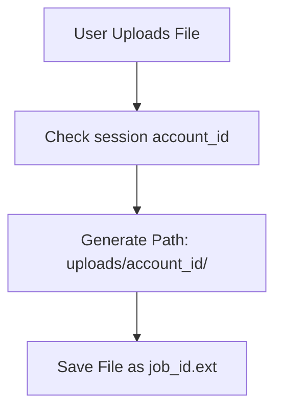
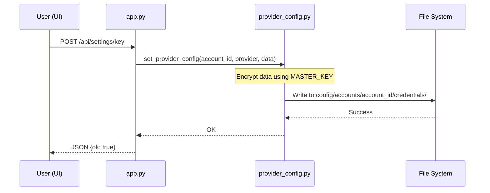

<details>
<summary>Relevant source files</summary>

The following files were used as context for generating this wiki page:

- [app.py](app.py)
- [auth.py](auth.py)
- [provider_config.py](provider_config.py)
- [CLAUDE.md](CLAUDE.md)
- [README.md](README.md)
- [main.py](main.py)
- [tests/test_provider_config.py](tests/test_provider_config.py)
</details>

# Multi-Tenant Isolation

Multi-tenant isolation in the Product Describer project ensures that each user account remains financially and operationally independent. Every user provides their own API keys for LLM providers (Anthropic, OpenAI, Google Gemini, Azure), meaning the system operator does not incur costs for tenant API usage. Tenant data, including credentials, background jobs, and uploaded files, is strictly scoped to the specific `account_id` stored in the session.

Sources: [CLAUDE.md:14-16](CLAUDE.md#L14-L16), [README.md:21-24](README.md#L21-L24)

## Authentication and Session Management

The system uses a Flask-based authentication layer where users sign up with an email and password. Once authenticated, an `account_id` is stored in the Flask session. This ID serves as the primary key for all isolation logic throughout the application.

### Secure Route Access
Most API endpoints and views are protected by a `@login_required` decorator. This decorator not only ensures a user is logged in but also sets the user context for monitoring tools like Sentry using the `account_id`.

```python
def login_required(view):
    @functools.wraps(view)
    def wrapped(*args, **kwargs):
        if "account_id" not in session:
            if request.path.startswith("/api/"):
                return jsonify({"error": "Inte inloggad"}), 401
            return redirect(url_for("login"))
        sentry_sdk.set_user({"id": session["account_id"]})
        return view(*args, **kwargs)
    return wrapped
```

Sources: [app.py:73-82](app.py#L73-L82), [CLAUDE.md:52-54](CLAUDE.md#L52-L54)

## Data and File System Isolation

Isolation is enforced at the file system level by partitioning directories based on the `account_id`. This prevents cross-tenant data leakage during file uploads and job processing.

| Data Type | Isolation Strategy | File Path Pattern |
| :--- | :--- | :--- |
| **Credentials** | Encrypted per-account JSON | `config/accounts/<account_id>/credentials/` |
| **Failover Order** | Per-account JSON config | `config/accounts/<account_id>/provider_order.json` |
| **Uploaded Files** | Scoped subdirectories | `uploads/<account_id>/<job_id>.<ext>` |
| **Job Metadata** | Filtered by account_id in memory | Scoped in `_jobs` dictionary and `jobs.json` |

Sources: [CLAUDE.md:44-46](CLAUDE.md#L44-L46), [CLAUDE.md:52-54](CLAUDE.md#L52-L54), [app.py:277-280](app.py#L277-L280)

### Upload Pathing Logic
When a user uploads a file, the system creates a dedicated directory for that specific account if it does not already exist, ensuring files are never mixed at the storage level.



Sources: [app.py:274-280](app.py#L274-L280)

## Provider and Credential Isolation

A core component of the multi-tenant architecture is that every account "brings its own keys." API keys are encrypted at rest using a master key (`PROVIDER_CONFIG_MASTER_KEY`) and stored within account-specific directories.

### Credential Encryption Flow
1. User submits an API key via the `/api/settings/key` endpoint.
2. The system retrieves the `account_id` from the session.
3. The key is encrypted using Fernet (symmetric encryption).
4. The encrypted blob is saved to the account's specific configuration directory.



Sources: [app.py:221-238](app.py#L221-L238), [provider_config.py](provider_config.py), [CLAUDE.md:47-51](CLAUDE.md#L47-L51)

## Job Execution Scoping

Background jobs are strictly filtered to ensure users can only view or interact with their own processes. When a user requests a list of jobs or a specific job status, the system filters the global `_jobs` registry by the session's `account_id`.

### Ownership Validation
For every job-related request, including status checks and file downloads, the system performs an explicit ownership check. If the requested `job_id` does not match the `account_id` in the session, a 404 error is returned, preventing ID guessing attacks.

```python
@app.route("/api/jobs/<job_id>")
@login_required
def get_job(job_id: str):
    with _lock:
        job = _jobs.get(job_id)
    if not job or job.get("account_id") != session["account_id"]:
        return jsonify({"error": "Hittar inte jobbet"}), 404
    return jsonify(job)
```

Sources: [app.py:307-313](app.py#L307-L313), [CLAUDE.md:52-54](CLAUDE.md#L52-L54)

## CLI and Sync Mode Differences

It is important to note that the CLI modes (`main.py run` and `main.py sync`) operate outside the multi-tenant account system. Instead of reading keys from account-scoped configuration files, they read credentials directly from environment variables (e.g., `ANTHROPIC_API_KEY`, `OPENAI_API_KEY`). This mode is intended for single-tenant or administrative use.

| Mode | Credential Source | Scoping |
| :--- | :--- | :--- |
| **Web UI** | `config/accounts/<id>/` | Account-isolated |
| **CLI Run** | Environment Variables | Global/Single-user |
| **Sync Worker** | Environment Variables | Global/System-level |

Sources: [main.py:101-111](main.py#L101-L111), [CLAUDE.md:17-18](CLAUDE.md#L17-L18), [README.md:26-30](README.md#L26-L30)

## Conclusion
The multi-tenant isolation system relies on strict directory partitioning and session-based filtering to keep tenant data separate. By requiring users to provide their own API keys, the architecture removes financial liability from the operator while providing a secure, isolated environment for processing product descriptions.

Sources: [CLAUDE.md:14-16](CLAUDE.md#L14-L16), [app.py:307-313](app.py#L307-L313)
