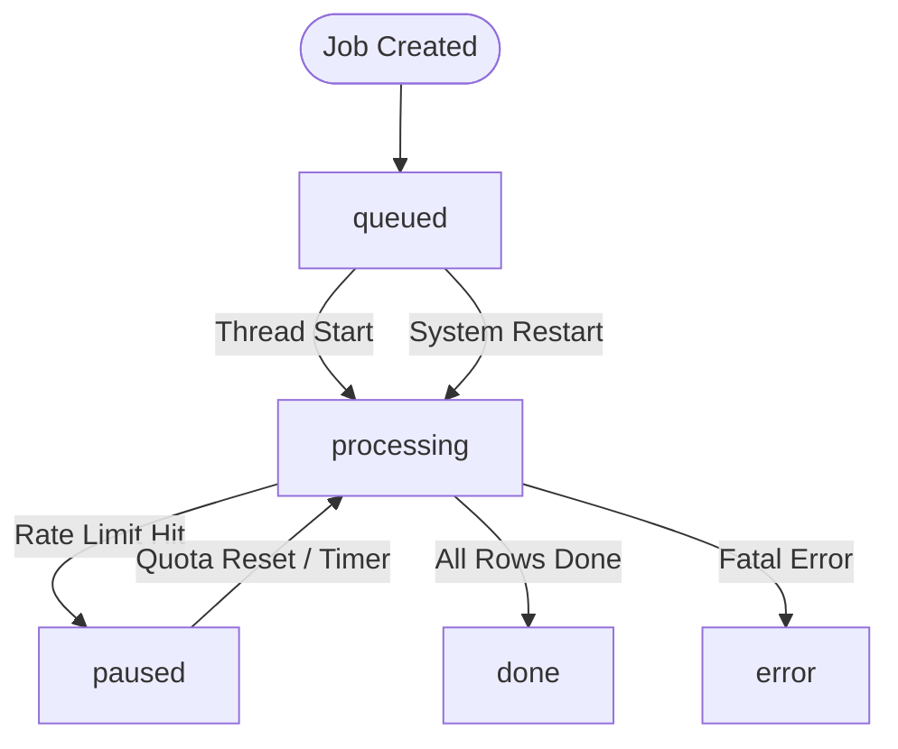
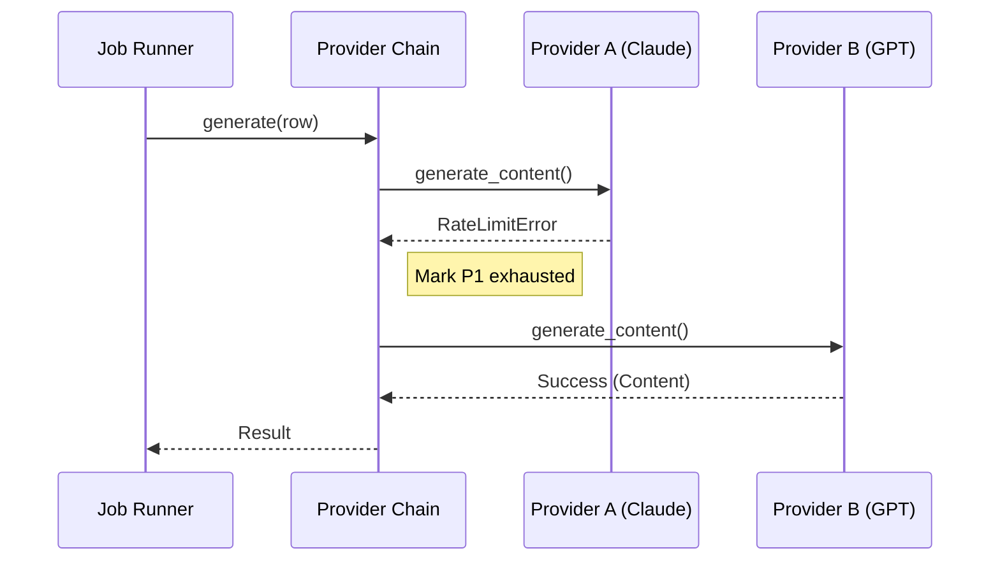

Relevant source files

The following files were used as context for generating this wiki page:

- [app.py](app.py)
- [main.py](main.py)
- [providers.py](providers.py)
- [AGENTS.md](AGENTS.md)
- [CLAUDE.md](CLAUDE.md)
- [README.md](README.md)

# Background Jobs & State Machine

The Product Describer system utilizes a robust background processing architecture to handle long-running AI generation tasks. This system is designed to process large batches of product data asynchronously, ensuring that the web UI remains responsive while the AI generation occurs in the background. It incorporates a state machine to track job progress and a failover mechanism to handle provider rate limits gracefully.

The architecture supports both user-initiated file uploads via a Flask-based web interface and automated synchronization with external scraper APIs. A key feature of this system is its "auto-resume" capability, which preserves work-in-progress during provider exhaustion or system restarts by caching partial results to disk.

Sources: [app.py:126-150](app.py#L126-L150), [AGENTS.md:52-53](AGENTS.md#L52-L53), [CLAUDE.md:73-75](CLAUDE.md#L73-L75)

## Job Lifecycle and State Transitions

Jobs in the system transition through a defined set of states. These states manage the flow from initial queuing to final completion or error handling.

### State Definitions

| State | Description |
| :--- | :--- |
| `queued` | Initial state after a file is uploaded or a sync task is created. |
| `processing` | The job is currently active, with workers calling AI providers. |
| `paused` | All available AI providers have reached their rate limits or quotas. |
| `done` | All product rows have been processed and the output file is generated. |
| `error` | A fatal error occurred that prevents the job from continuing (e.g., no providers configured). |

Sources: [app.py:339-346](app.py#L339-L346), [templates/index.html:840-846](templates/index.html#L840-L846)

### State Machine Flow

The following diagram illustrates the transitions between job states, including the automatic pause and resume logic triggered by provider exhaustion.

The system uses a `resume-watcher` thread that periodically checks for `paused` jobs and moves them back to `processing` once the `resume_at` timestamp has passed.

Sources: [app.py:277-289](app.py#L277-L289), [app.py:292-299](app.py#L292-L299), [README.md:61-69](README.md#L61-L69)

## Core Components

### 1. Job Runner (`_process`)
The `_process` function in `app.py` serves as the primary engine for background jobs. It initializes the `ProviderChain`, extracts rows from input files, and manages a `ThreadPoolExecutor` to process product rows in parallel.

*  **Concurrency:** Jobs use a configurable number of "workers" (defaulting to 2, max 8) to perform concurrent API requests.
*  **Persistence:** As rows are processed, results are saved to `outputs/{job_id}_partial.json` every 5 iterations to prevent data loss.

Sources: [app.py:173-252](app.py#L173-L252), [app.py:377-384](app.py#L377-L384)

### 2. Provider Chain & Failover Logic
The `ProviderChain` manages the selection of AI providers. If the active provider returns a `RateLimitExceeded` error, the chain automatically switches to the next configured provider.

If all providers in the chain are exhausted, the system raises an `AllProvidersExhausted` exception, which contains a `resume_at` timestamp indicating when the first provider is expected to reset.

Sources: [providers.py:255-279](providers.py#L255-L279), [providers.py:28-34](providers.py#L28-L34), [README.md:61-65](README.md#L61-L65)

### 3. Sync Worker
The Sync Worker is a specialized background thread for continuous integration with the [scraper](https://github.com/blixten85/scraper) API.

*  **Polling:** It polls the `/products` endpoint for items missing descriptions.
*  **Update:** Upon successful generation, it pushes results back via the `/description` endpoint.
*  **Environment Variables:** Configured via `SYNC_ENABLED`, `SYNC_INTERVAL`, and `SYNC_LIMIT`.

Sources: [app.py:469-502](app.py#L469-L502), [main.py:166-212](main.py#L166-L212), [README.md:73-82](README.md#L73-L82)

## Data Persistence & Recovery

The system ensures reliability through disk-based caching, allowing jobs to survive application restarts and provider outages.

### File Structure for Jobs

| Path | Purpose |
| :--- | :--- |
| `outputs/jobs.json` | Master list of all job metadata and current statuses. |
| `outputs/{id}_rows.json` | Cached extracted product rows for a specific job. |
| `outputs/{id}_partial.json` | Progressively saved results (Beskrivning/Varför). |
| `uploads/{account_id}/{id}.ext` | The original uploaded source file. |

Sources: [app.py:108-112](app.py#L108-L112), [app.py:143-169](app.py#L143-L169), [CLAUDE.md:73-75](CLAUDE.md#L73-L75)

### Automatic Recovery
On startup, `app.py` executes `_resume_interrupted_jobs()`. This function identifies any jobs left in `queued` or `processing` states from a previous session and restarts their processing threads. Because partial results are loaded from disk, the job resumes exactly where it left off without duplicating API calls.

Sources: [app.py:292-299](app.py#L292-L299), [AGENTS.md:52-53](AGENTS.md#L52-L53)

## Technical Summary
The Background Jobs & State Machine system provides a resilient framework for AI-assisted content generation. By decoupling the API interaction from the user interface and implementing a multi-provider failover strategy, the system maximizes throughput while minimizing the impact of provider-specific rate limits. The combination of state persistence and automatic watchers ensures that long-running tasks are handled with high reliability and minimal manual intervention.

Sources: [README.md:61-71](README.md#L61-L71), [app.py:515-516](app.py#L515-L516)
