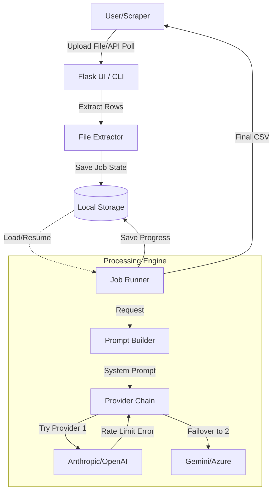
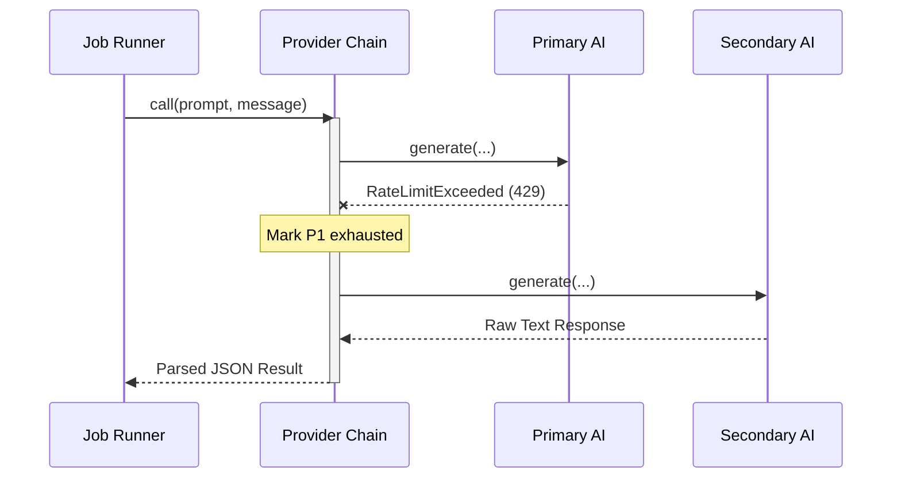

Relevant source files

The following files were used as context for generating this wiki page:

- [app.py](app.py)
- [main.py](main.py)
- [providers.py](providers.py)
- [prompts.py](prompts.py)
- [AGENTS.md](AGENTS.md)
- [CLAUDE.md](CLAUDE.md)

# High-Level Architecture Overview

The **product-describer** system is a specialized AI-driven platform designed to generate Swedish product descriptions and justifications ("varför"). It serves as an orchestration layer between various input sources (manual file uploads or external scraper APIs) and multiple Large Language Model (LLM) providers, including Anthropic, OpenAI, Google Gemini, and Azure OpenAI.

The architecture is built to be resilient, featuring a multi-provider failover engine that automatically switches AI backends upon encountering rate limits or quota exhaustion. It supports both a multi-tenant web interface for interactive use and a CLI-based synchronization mode for automated background processing.

Sources: [AGENTS.md:3-8](AGENTS.md#L3-L8), [README.md:1-12](README.md#L1-L12)

## Core Architectural Components

The system is divided into three primary functional areas: the User Interface/API Layer, the Job Processing Engine, and the AI Provider Abstraction Layer.

### 1. User Interface and API Layer
The web interface is powered by **Flask**, providing a multi-tenant environment where users manage their own API keys and job history. 

*  **Web UI (`app.py`):** Handles user authentication, file uploads, and settings management.
*  **CLI (`main.py`):** Provides an entry point for batch processing and "Sync Mode" via a scraper API.
*  **Authentication (`auth.py`):** Manages account lifecycle and session security using Fernet encryption for at-rest data.

Sources: [app.py:53-75](app.py#L53-L75), [main.py:15-18](main.py#L15-L18), [AGENTS.md:16-23](AGENTS.md#L16-L23)

### 2. Job Processing Engine
The processing engine manages the lifecycle of a description request. It handles file extraction, row-by-row AI generation, and persistence of partial results to prevent data loss.

*  **Extractor Module:** Converts uploaded formats (CSV, Excel, PDF, Docx) into structured product rows.
*  **Job Runner:** Orchestrates parallel execution using thread pools and manages "paused" states during provider exhaustion.
*  **Persistence:** Uses JSON-based caching for rows and partial results (`{job_id}_rows.json` and `{job_id}_partial.json`) to allow resumes across restarts.

Sources: [app.py:125-147](app.py#L125-L147), [app.py:173-200](app.py#L173-L200), [CLAUDE.md:65-67](CLAUDE.md#L65-L67)

### 3. AI Provider Abstraction Layer
The `providers.py` module defines a unified interface for interacting with different AI SDKs.

*  **ProviderChain:** An engine that prioritizes a list of configured providers and handles failover logic.
*  **Provider Subclasses:** Specialized implementations for Anthropic, OpenAI, Gemini, and Azure.

Sources: [providers.py:1-10](providers.py#L1-L10), [providers.py:238-255](providers.py#L238-L255)

## System Workflow Diagram

The following diagram illustrates the high-level flow of a product description job from upload to completion.

*This diagram shows the path of data from ingestion through the failover-capable AI processing engine.*
Sources: [app.py:173-230](app.py#L173-L230), [providers.py:270-290](providers.py#L270-L290)

## Multi-Provider Failover Logic

Resiliency is achieved through the `ProviderChain` class. When a specific provider raises a `RateLimitExceeded` exception, the engine calculates a `resume_at` time based on API headers or default resets and moves to the next available provider.

### Failover Sequence

*The sequence demonstrates the transparent failover mechanism when the primary AI provider is exhausted.*
Sources: [providers.py:270-298](providers.py#L270-L298), [README.md:46-55](README.md#L46-L55)

## Component Summary Table

| Component | Responsibility | Relevant Files |
| :--- | :--- | :--- |
| **Flask App** | Manages web routes, user sessions, and API endpoints. | `app.py`, `templates/` |
| **Sync Worker** | Background process polling external Scraper API for new products. | `main.py`, `app.py` |
| **Provider Chain** | Logic for prioritizing AI backends and handling 429/quota errors. | `providers.py` |
| **Prompt Engine** | Dynamic construction of system instructions based on tone/audience. | `prompts.py` |
| **Persistence Layer** | Incremental saving of job progress to JSON files. | `app.py` |

Sources: [AGENTS.md:16-23](AGENTS.md#L16-L23), [app.py:461-500](app.py#L461-L500), [prompts.py:35-50](prompts.py#L35-L50)

## Data Models and Configuration

The system relies on environment variables and local JSON files for its state management.

*  **API Configuration:** Stored as encrypted Fernet blobs per user account.
*  **Master Key:** `PROVIDER_CONFIG_MASTER_KEY` is required for encrypting API keys at rest.
*  **Job Metadata:** Tracks status (`queued`, `processing`, `paused`, `done`, `error`) and progress statistics.

Sources: [app.py:65-72](app.py#L65-L72), [README.md:34-40](README.md#L34-L40), [CLAUDE.md:52-57](CLAUDE.md#L52-L57)

## Conclusion
The architecture of **product-describer** emphasizes reliability and provider independence. By decoupling the job execution logic from specific AI vendors and implementing a robust file-based persistence layer, the system ensures that long-running batch jobs can survive network interruptions, provider downtime, and local restarts without losing progress.
