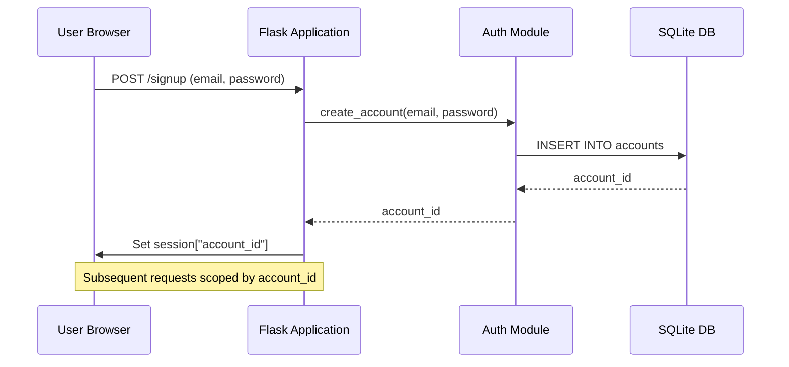
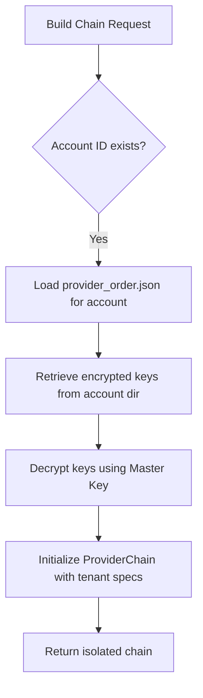

<details>
<summary>Relevant source files</summary>

The following files were used as context for generating this wiki page:

- [app.py](app.py)
- [auth.py](auth.py)
- [CLAUDE.md](CLAUDE.md)
- [provider_config.py](provider_config.py)
- [README.md](README.md)
- [tests/test_provider_config.py](tests/test_provider_config.py)
</details>

# Multi-Tenant Isolation

The Product Describer project implements a multi-tenant architecture designed to ensure that individual users (tenants) remain financially and logically isolated from one another. Each account holder is responsible for their own API usage costs by providing their own API keys for services like Anthropic, OpenAI, Google Gemini, or Azure OpenAI. The system ensures that jobs, credentials, and files are strictly scoped to the `account_id` of the logged-in user.

Isolation is achieved through a combination of session-based authentication, account-scoped directory structures on the filesystem, and encrypted-at-rest storage for sensitive credentials. This approach prevents cross-tenant data leakage and ensures that the system operator does not become financially liable for the API consumption of users.

Sources: [CLAUDE.md:14-17](CLAUDE.md#L14-L17), [README.md:32-35](README.md#L32-L35)

## Authentication and Session Scoping

The primary mechanism for tenant identification is the `account_id`, which is stored in the Flask session after a successful login or signup. All web routes (with the exception of login and signup) are protected by a `@login_required` decorator that enforces this isolation.

### Key Components of Authentication
- **Session Management**: The `session["account_id"]` is used to filter all requests for jobs, provider configurations, and file downloads.
- **CSRF Protection**: The `SESSION_COOKIE_SAMESITE` is set to "Lax" to block cross-site POST requests, which is a primary CSRF vector for state-changing routes like settings updates and file uploads.
- **Security Headers**: `SESSION_COOKIE_HTTPONLY` is enabled to prevent client-script access to cookies, and `SESSION_COOKIE_SECURE` is enforced for production environments.

Sources: [app.py:80-92](app.py#L80-L92), [CLAUDE.md:46-48](CLAUDE.md#L46-L48)



Diagram shows the flow of establishing a tenant session. Sources: [app.py:270-280](app.py#L270-L280), [auth.py](auth.py)

## Logical Data Isolation

The system enforces isolation at the application logic layer by validating ownership of every resource requested.

| Isolation Area | Implementation Method | Source Reference |
| :--- | :--- | :--- |
| **API Keys** | Stored in account-specific directories: `config/accounts/<id>/credentials/`. | [CLAUDE.md:37-38](CLAUDE.md#L37-L38) |
| **Failover Order** | Saved per-account in `config/accounts/<account_id>/provider_order.json`. | [CLAUDE.md:44-45](CLAUDE.md#L44-L45) |
| **Uploads** | Files are saved to `uploads/<account_id>/<job_id><suffix>`. | [app.py:461-463](app.py#L461-L463) |
| **Job Access** | ownership is checked on every job lookup in `/api/jobs/<job_id>`. | [app.py:504-508](app.py#L504-L508) |

### Job Scoping Logic
When a user requests the status of a job or a file download, the system retrieves the job from the global `_jobs` dictionary but explicitly verifies that the `account_id` associated with the job matches the `account_id` in the current session.

```python
@app.route("/api/jobs/<job_id>")
@login_required
def get_job(job_id: str):
    with _lock:
        job = _jobs.get(job_id)
    if not job or job.get("account_id") != session["account_id"]:
        return jsonify({"error": "Hittar inte jobbet"}), 404
    return jsonify(job)
```

Sources: [app.py:503-509](app.py#L503-L509)

## Credential Encryption and Storage

Sensitive tenant credentials (API keys) are protected using encryption-at-rest to ensure that even with filesystem access, tenant keys are not immediately readable in their raw form.

- **Encryption Method**: Keys are saved as a single encrypted-at-rest JSON blob per provider using Fernet encryption.
- **Master Key**: The encryption requires a `PROVIDER_CONFIG_MASTER_KEY` environment variable. If this key is missing, the application will refuse to start or will return a clear error when attempting to save new keys.
- **Legacy Support**: The system retains the ability to read legacy plaintext key files if the master key is not configured, primarily for backward compatibility during transitions.

Sources: [CLAUDE.md:39-41](CLAUDE.md#L39-L41), [README.md:37-45](README.md#L37-L45), [tests/test_provider_config.py:46-55](tests/test_provider_config.py#L46-L55)

### Provider Configuration Architecture
The `provider_config` module handles the building of the "Provider Chain" for each tenant. This chain is an ordered list of API providers configured by that specific user.



Diagram shows how tenant-specific configurations are transformed into an operational provider chain. Sources: [provider_config.py](provider_config.py), [app.py:168-170](app.py#L168-L170)

## Resource Retention and Purging

To prevent storage exhaustion across multiple tenants, the system implements an automatic purging mechanism for old jobs.

- **Purge Interval**: Jobs marked as `done` or `error` that are older than `JOB_RETENTION_DAYS` (default 30) are automatically deleted.
- **Scope of Deletion**: Purging removes the job entry from memory, the input file in `uploads/`, the output CSV in `outputs/`, and any intermediate partial result JSON files.

Sources: [app.py:220-244](app.py#L220-L244)

## Summary

Multi-tenant isolation in the Product Describer ensures a secure environment where user data, configuration, and financial responsibility for API usage are strictly separated. By leveraging account-specific directories, session-bound request handling, and encrypted credential storage, the system maintains a robust barrier between tenants while allowing them to share a single application deployment.

Sources: [CLAUDE.md:14-17](CLAUDE.md#L14-L17), [app.py:80-86](app.py#L80-L86)
