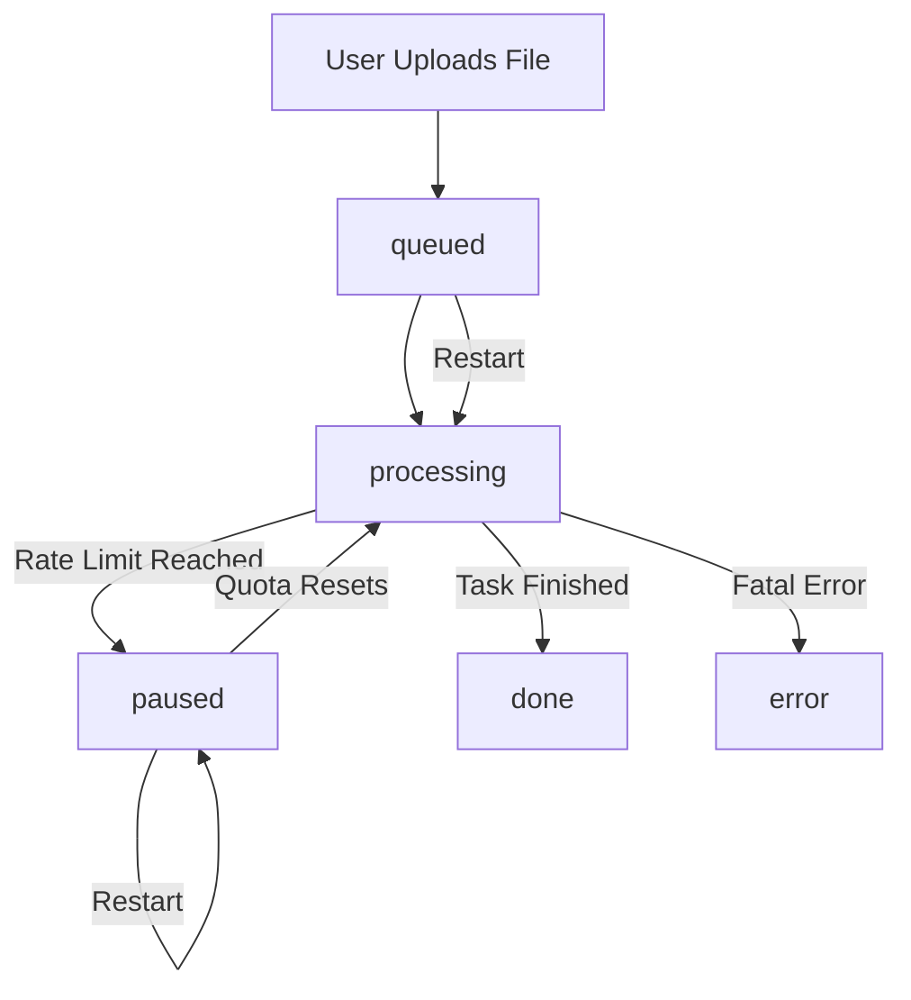
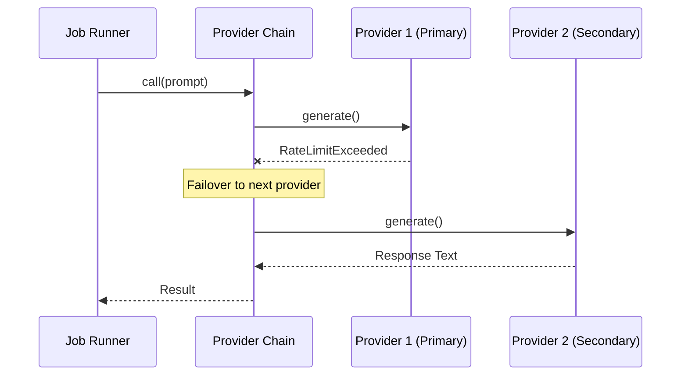

<details>
<summary>Relevant source files</summary>

The following files were used as context for generating this wiki page:

- [app.py](app.py)
- [main.py](main.py)
- [providers.py](providers.py)
- [AGENTS.md](AGENTS.md)
- [CLAUDE.md](CLAUDE.md)
- [templates/index.html](templates/index.html)
</details>

# Background Jobs & State Machine

## Introduction
The Background Jobs and State Machine system in the Product Describer project manages the asynchronous processing of product description generations. Since generating descriptions via AI APIs can be time-consuming and subject to rate limits, the system offloads these tasks to background threads. This ensures the web UI remains responsive while the system handles file extraction, API communication, and automatic failover.

The core of this system is a state machine that tracks the lifecycle of a "job"—from initial queuing to completion or failure. A critical feature of this architecture is the "Pause & Resume" capability, which allows jobs to halt when API quotas are exhausted and automatically resume once the provider's limits reset. This state is persisted to disk to prevent data loss across application restarts.

Sources: [app.py:173-176](app.py#L173-L176), [AGENTS.md:50-52](AGENTS.md#L50-L52), [CLAUDE.md:78-80](CLAUDE.md#L78-L80)

## Job Lifecycle & State Transitions
A job moves through several distinct states managed by the backend processing logic. These states are reflected in the UI and persisted in the `jobs.json` file.

### State Definitions
| State | Description |
| :--- | :--- |
| `queued` | The job has been created and is waiting for a background thread to pick it up. |
| `processing` | The job is actively being processed by worker threads. |
| `paused` | Processing is halted because all configured AI providers have reached their rate limits or quotas. |
| `done` | All product descriptions in the job have been successfully generated and the final CSV is ready. |
| `error` | A fatal error occurred that prevents the job from continuing (e.g., no providers configured). |

Sources: [app.py:341-352](app.py#L341-L352), [templates/index.html:846-852](templates/index.html#L846-L852)

### State Machine Flow
The following diagram illustrates the transitions between different job states during the processing lifecycle:



This diagram shows the high-level flow of a job through the system.
Sources: [app.py:173-182](app.py#L173-L182), [app.py:236-241](app.py#L236-L241), [app.py:326-331](app.py#L326-L331)

## Implementation Details

### Background Processing (`_process` function)
The `_process` function in `app.py` is the primary worker logic. It executes in a separate daemon thread to avoid blocking the Flask main loop. It utilizes a `ThreadPoolExecutor` to process multiple product rows in parallel based on the user-defined worker count.

Key steps in `_process`:
1. **Initialization**: Sets state to `processing` and builds the `ProviderChain`.
2. **Extraction**: Converts the uploaded file into rows if not already cached.
3. **Execution Loop**: Submits rows to the thread pool for generation.
4. **Error Handling**: Catches `AllProvidersExhausted` to trigger the `paused` state.
5. **Persistence**: Periodically saves partial results to `{job_id}_partial.json` to ensure progress is saved.

Sources: [app.py:173-231](app.py#L173-L231), [app.py:243-264](app.py#L243-L264)

### Pause and Resume Logic
Automatic resumption is handled by the `_resume_watcher` thread. This background task periodically checks for jobs in the `paused` state whose `resume_at` timestamp has passed.

```python
def _resume_watcher() -> None:
    while True:
        time.sleep(RESUME_CHECK_INTERVAL)
        now = datetime.now(timezone.utc)
        with _lock:
            due = [
                j["id"] for j in _jobs.values()
                if j["status"] == "paused" and j.get("resume_at")
                and datetime.fromisoformat(j["resume_at"]) <= now
            ]
        for job_id in due:
            threading.Thread(target=_process, args=(job_id,), daemon=True).start()
```

Sources: [app.py:313-324](app.py#L313-L324)

### Resilience and Persistence
To survive system crashes or restarts, the state machine implements two critical mechanisms:
- **Disk Persistence**: Job metadata is saved in `outputs/jobs.json`, while product rows and partial results are stored in separate JSON files named by `job_id`.
- **Interrupted Job Recovery**: On application startup, the `_resume_interrupted_jobs` function identifies any jobs left in `queued` or `processing` states and restarts them.

Sources: [app.py:117-124](app.py#L117-L124), [app.py:326-331](app.py#L326-L331), [CLAUDE.md:78-80](CLAUDE.md#L78-L80)

## Multi-Provider Failover Sequence
The state machine interacts with the `ProviderChain` to handle API-level transitions. When the active provider fails, the system attempts to failover to the next one before moving the job into a `paused` state.



This diagram depicts the failover logic within the `ProviderChain` that occurs while a job is in the `processing` state.
Sources: [providers.py:270-286](providers.py#L270-L286), [main.py:126-135](main.py#L126-L135)

## Configuration Options
The behavior of the background jobs system is influenced by several environment variables:

| Variable | Type | Default | Description |
| :--- | :--- | :--- | :--- |
| `RESUME_CHECK_INTERVAL` | Integer | `120` | Seconds between checks for paused jobs to resume. |
| `JOB_RETENTION_DAYS` | Integer | `30` | Number of days to keep job metadata and files before purging. |
| `SYNC_INTERVAL` | Integer | `300` | Seconds between polls in Sync mode. |
| `SYNC_ENABLED` | Boolean | `false` | Whether to start the background sync worker. |

Sources: [app.py:64](app.py#L64), [app.py:80](app.py#L80), [app.py:461-463](app.py#L461-L463)

## Conclusion
The Background Jobs & State Machine system provides a robust framework for handling long-running AI tasks. By combining threaded execution, granular state tracking, and persistent storage, it ensures that product description tasks are completed efficiently, even in the face of API limitations or system restarts. This architecture allows the Product Describer to scale processing without sacrificing user experience or data integrity.
