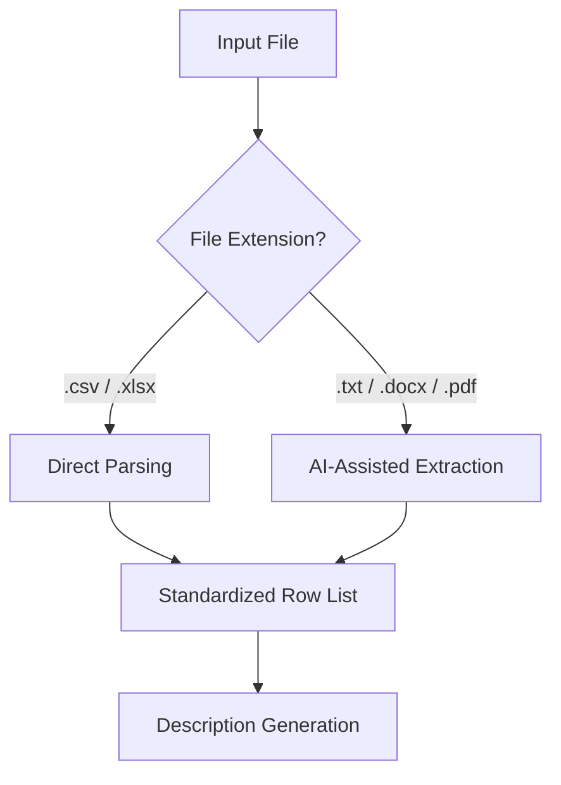
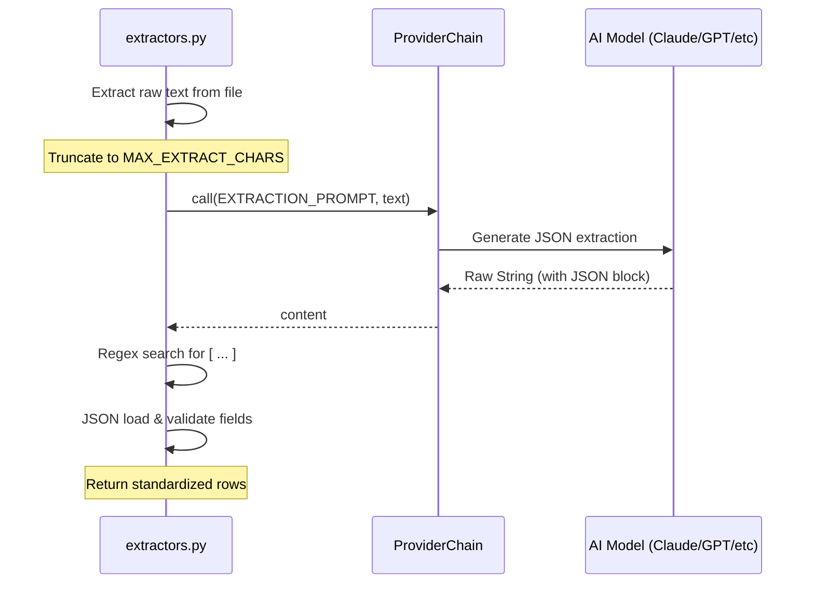

Relevant source files

The following files were used as context for generating this wiki page:

- [extractors.py](extractors.py)
- [tests/test_extractors.py](tests/test_extractors.py)
- [main.py](main.py)
- [app.py](app.py)
- [templates/index.html](templates/index.html)
- [README.md](README.md)

# Supported Input Formats & File Handlers

The Product Describer system is designed to ingest product data from a variety of structured and unstructured file formats. Its primary purpose is to convert these inputs into a standardized internal representation (list of dictionaries) which can then be processed to generate Swedish product descriptions.

The system distinguishes between **Structured Formats** (like CSV and Excel), where data is directly mapped from columns, and **Unstructured Formats** (like TXT, DOCX, and PDF), which leverage an AI-assisted extraction process to identify product entities within free-form text.

Sources: [README.md:10-12](README.md#L10-L12), [extractors.py:1-6](extractors.py#L1-L6)

## Input Architecture Overview

The file handling logic is centralized in `extractors.py`. When a file is uploaded via the Web UI or provided via the CLI, the `extract_rows` function determines the appropriate parsing strategy based on the file extension.

This diagram illustrates the high-level decision logic for processing different input types.
Sources: [extractors.py:35-47](extractors.py#L35-L47), [app.py:530-534](app.py#L530-L534)

## Supported Formats

The system explicitly supports five main file extensions.

| Extension | Format Type | Handling Method | Dependencies |
| :--- | :--- | :--- | :--- |
| `.csv` | Structured | Native Python `csv` module | None |
| `.xlsx` | Structured | Workbook parsing via `openpyxl` | `openpyxl` |
| `.txt` | Unstructured | Direct text reading | None |
| `.docx` | Unstructured | Paragraph extraction via `python-docx` | `python-docx` |
| `.pdf` | Unstructured | Multi-page text extraction via `pdfplumber` | `pdfplumber` |

Sources: [extractors.py:17](extractors.py#L17), [extractors.py:58](extractors.py#L58), [extractors.py:84-100](extractors.py#L84-L100), [requirements.txt:9-11](requirements.txt#L9-L11)

## Structured Data Parsing

Structured formats are parsed by mapping file columns to internal fields. The system expects or defaults to specific field names: `Site`, `Product`, `Price (SEK)`, and `Link`.

### CSV Processing
The `_parse_csv` function utilizes `csv.DictReader` to convert rows into dictionaries. It assumes UTF-8 encoding.
Sources: [extractors.py:50-55](extractors.py#L50-L55), [tests/test_main.py:27-33](tests/test_main.py#L27-L33)

### Excel Processing
Excel files are handled by `_parse_excel`. It reads the active sheet and uses the first row as headers. It includes logic to skip empty rows and handles `None` values by converting them to empty strings.
Sources: [extractors.py:58-73](extractors.py#L58-L73)

## AI-Assisted Extraction (Unstructured)

For unstructured formats (TXT, DOCX, PDF), the system cannot rely on columns. Instead, it extracts the raw text and sends it to an AI model with a specific `EXTRACTION_PROMPT`.

### Extraction Logic
1. **Text Extraction:** Raw text is pulled from the file. For PDFs, the system respects a `MAX_PDF_PAGES` limit (default 200).
2. **AI Call:** The text is truncated to `MAX_EXTRACT_CHARS` (default 50,000) and sent to the `ProviderChain`.
3. **JSON Parsing:** The AI is instructed to return a JSON array. The system uses a regex `_JSON_ARRAY` (`\[.*\]`) to find the JSON block in the response.
4. **Standardization:** Extracted items are mapped to the standard `ROW_FIELDS`.

Sources: [extractors.py:19-32](extractors.py#L19-L32), [extractors.py:103-138](extractors.py#L103-L138)

### Extraction Sequence

This sequence demonstrates the coordination between the extraction module and the AI providers for unstructured data.
Sources: [extractors.py:112-125](extractors.py#L112-L125), [providers.py:246-260](providers.py#L246-L260)

## Configuration & Constraints

The system implements several safety limits to prevent resource exhaustion during file processing.

| Configuration Constant | Default Value | Description |
| :--- | :--- | :--- |
| `MAX_PDF_PAGES` | 200 | Maximum number of PDF pages to process. |
| `MAX_EXTRACT_CHARS` | 50,000 | Maximum characters sent to AI for product extraction. |
| `MAX_CONTENT_LENGTH` | 50 MB | Flask configuration for maximum upload size. |
| `SUPPORTED_EXTENSIONS` | {csv, xlsx, txt, docx, pdf} | Allowed file types for upload. |

Sources: [extractors.py:19-21](extractors.py#L19-L21), [app.py:65](app.py#L65), [extractors.py:17](extractors.py#L17)

## Error Handling

The system implements `ExtractionError` for various failure states during file handling:
- **Missing AI Provider:** Raised if an unstructured file is uploaded but no AI provider is configured.
- **Empty Documents:** Raised if `_extract_text` returns no content.
- **Unparseable AI Response:** Raised if the AI fails to return valid JSON or finds no products.
- **Unsupported Extensions:** Validation occurs both at the API route level and within the extractor.

Sources: [extractors.py:31-32](extractors.py#L31-L32), [extractors.py:44-46](extractors.py#L44-L46), [extractors.py:116-121](extractors.py#L116-L121), [tests/test_extractors.py:15-19](tests/test_extractors.py#L15-L19)

## Conclusion
The file handling system provides a robust gateway for product data, balancing the simplicity of direct CSV/Excel parsing with the flexibility of AI-driven extraction for documents. By standardizing all inputs into a common row format early in the pipeline, the system ensures that the subsequent generation logic remains decoupled from the original input format.
