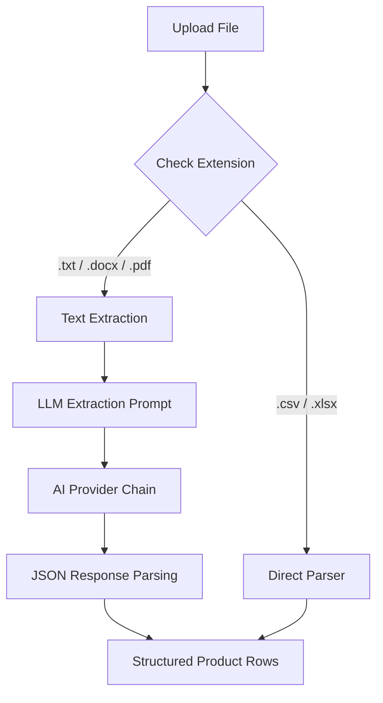
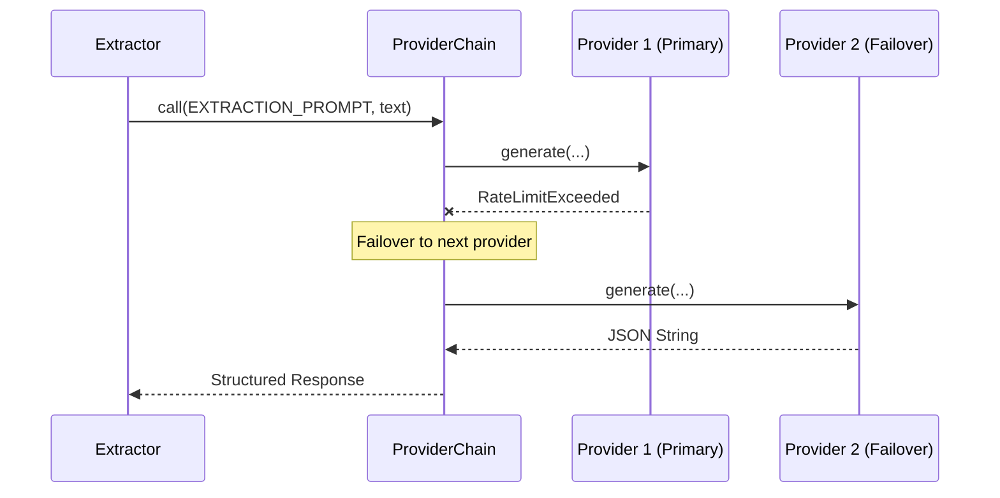

<details>
<summary>Relevant source files</summary>

The following files were used as context for generating this wiki page:

- [extractors.py](extractors.py)
- [prompts.py](prompts.py)
- [app.py](app.py)
- [providers.py](providers.py)
- [main.py](main.py)
- [tests/test_extractors.py](tests/test_extractors.py)
</details>

# AI-Assisted Unstructured Extraction

AI-Assisted Unstructured Extraction is a core capability of the `product-describer` project that enables the transformation of free-form documents into structured product data. While structured formats like CSV and Excel are parsed directly, unstructured formats such as `.txt`, `.docx`, and `.pdf` require Large Language Models (LLMs) to identify and extract product entities, including their names, associated stores, and prices.

This system serves as the ingestion layer for the description generation pipeline. By converting arbitrary text into a uniform JSON structure, the application can generate Swedish product descriptions and justifications regardless of the original input format.

Sources: [extractors.py:1-11](extractors.py#L1-L11), [AGENTS.md:3-9](AGENTS.md#L3-L9)

## Extraction Workflow

The extraction process begins when a user uploads a file through the Web UI or provides one via the CLI. The system branches its logic based on the file extension: structured files follow a standard parsing path, while unstructured files are routed through the AI extraction engine.

### Data Flow Architecture

The following diagram illustrates the flow from file upload to structured row generation:



The diagram shows how the system differentiates between structured parsers and the AI-driven unstructured path.
Sources: [extractors.py:46-59](extractors.py#L46-L59), [app.py:539-556](app.py#L539-L556)

## Supported Formats and Methods

The system handles different unstructured formats using specialized Python libraries before passing the consolidated text to the AI.

| Format | Library / Method | Max Constraints |
| :--- | :--- | :--- |
| **.txt** | `Path.read_text()` | `MAX_EXTRACT_CHARS` (50,000) |
| **.docx** | `python-docx` | `MAX_EXTRACT_CHARS` (50,000) |
| **.pdf** | `pdfplumber` | `MAX_PDF_PAGES` (200) |

Sources: [extractors.py:23-25](extractors.py#L23-L25), [extractors.py:80-96](extractors.py#L80-L96), [requirements.txt:7-10](requirements.txt#L7-L10)

### Unstructured Text Processing logic
For documents like PDFs, the system iterates through allowed pages (up to 200) and joins the extracted text. To prevent resource exhaustion and stay within LLM context limits, the final string is truncated to 50,000 characters before being sent to the AI provider.

Sources: [extractors.py:90-96](extractors.py#L90-L96), [extractors.py:104-108](extractors.py#L104-L108)

## AI Extraction Engine

The AI extraction engine uses a specific system prompt (`EXTRACTION_PROMPT`) to instruct the LLM to identify every product mentioned. The engine enforces a strict JSON output format to ensure compatibility with the downstream processing tasks.

### Extraction Prompting
The prompt defines the expected schema and constraints:
- **Product** (Required): The name of the item.
- **Site** (Optional): The retail site or store.
- **Price (SEK)** (Optional): The numerical price.

```python
EXTRACTION_PROMPT = (
    "Du får ett textdokument. Hitta varje enskild produkt/pryl som nämns i texten. "
    "Svara ALLTID med endast en giltig JSON-array, utan kodstaket eller extra text, "
    "i exakt detta format:\n"
    '[{"Product": "...", "Site": "...", "Price (SEK)": "..."}]\n'
    "- 'Product' (krävs): produktens namn.\n"
    "- 'Site' och 'Price (SEK)' (valfria): lämna som tom sträng om okänt.\n"
    "Hitta om möjligt ALLA produkter i dokumentet, inte bara de första."
)
```

Sources: [extractors.py:32-41](extractors.py#L32-L41)

### Provider Interaction
The extraction logic uses the `ProviderChain` to handle the LLM request. This provides automatic failover: if the primary AI provider (e.g., Anthropic) is rate-limited during extraction, the system automatically switches to the next configured provider (e.g., OpenAI) to complete the task.



Sources: [providers.py:270-295](providers.py#L270-L295), [extractors.py:109](extractors.py#L109)

## Structured Output Generation

Once the AI returns a response, the system performs validation and normalization to transform the raw AI output into the internal `ROW_FIELDS` format: `["Site", "Product", "Price (SEK)", "Link"]`.

### Normalization Logic
1. **Regex Extraction**: A regex (`\[.*\]`) is used to locate the JSON array within the AI's response, stripping any conversational filler or markdown code fences.
2. **JSON Loading**: The string is parsed into a Python list of dictionaries.
3. **Field Mapping**: Items are mapped to the standard schema. If a "Product" name is missing after stripping whitespace, the item is discarded.
4. **Link Initialization**: As unstructured documents rarely contain valid machine-readable links for every item, the "Link" field is initialized as an empty string.

Sources: [extractors.py:30](extractors.py#L30), [extractors.py:111-131](extractors.py#L111-L131), [tests/test_extractors.py:31-38](tests/test_extractors.py#L31-L38)

## Error Handling

The extraction process includes several guardrails to handle failures in the AI pipeline or document processing.

| Error Scenario | Exception / Behavior |
| :--- | :--- |
| Missing AI Config | `ExtractionError` (for unstructured files) |
| Empty Document | `ExtractionError`: "Dokumentet innehöll ingen text." |
| No Products Found | `ExtractionError`: "AI-leverantören kunde inte hitta några produkter..." |
| Invalid JSON | `ExtractionError`: "AI-leverantörens svar gick inte att tolka som JSON." |
| Unsupported File | `ExtractionError`: "Filtypen {suffix} stöds inte." |

Sources: [extractors.py:53-56](extractors.py#L53-L56), [extractors.py:101-103](extractors.py#L101-L103), [extractors.py:113-116](extractors.py#L113-L116), [tests/test_extractors.py:40-58](tests/test_extractors.py#L40-L58)

## Summary

The AI-Assisted Unstructured Extraction module is critical for enabling the `product-describer` to function as a versatile tool for various input sources. By combining robust document parsing libraries with the flexible reasoning of LLMs and a resilient failover architecture, the system ensures that product data can be extracted reliably from even the most chaotic text sources, such as meeting notes, PDF catalogs, or raw text scrapes.
