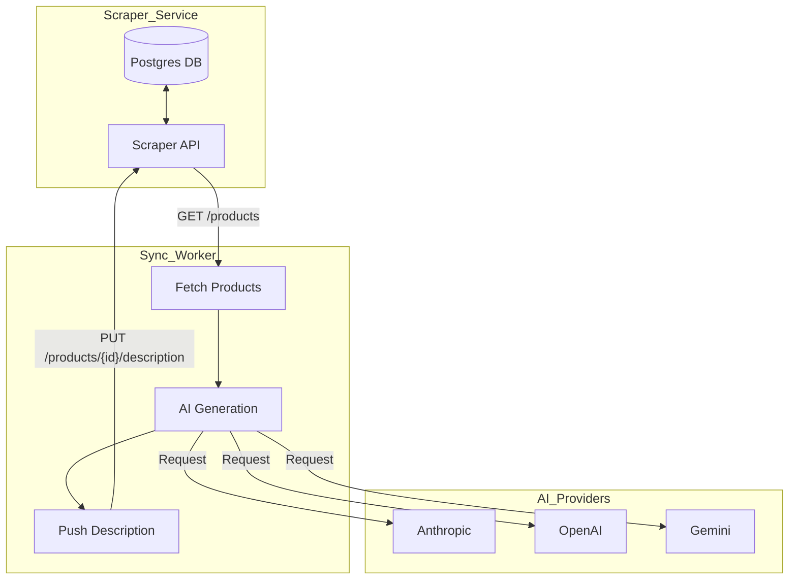
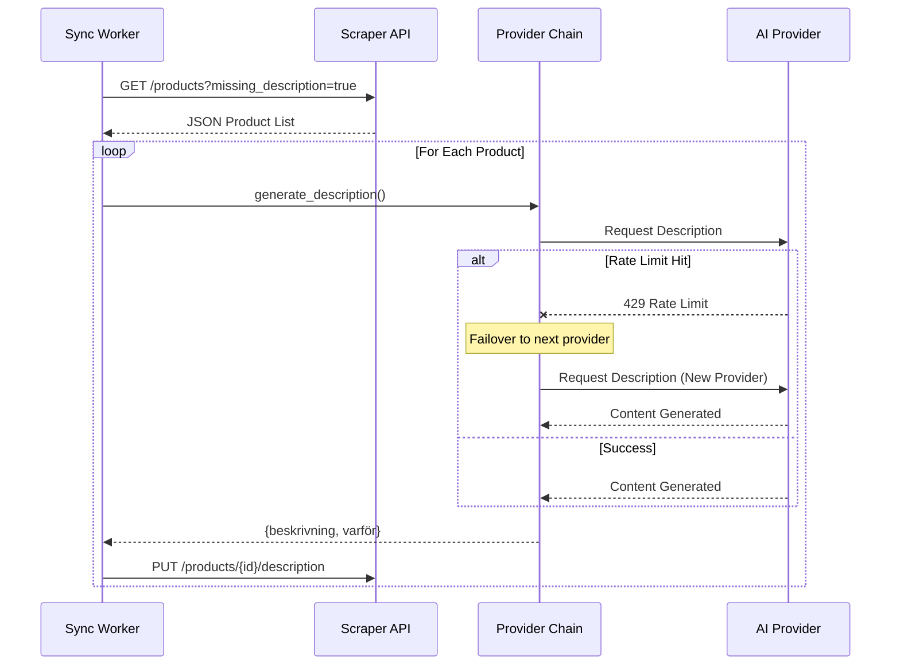

<details>
<summary>Relevant source files</summary>

The following files were used as context for generating this wiki page:

- [main.py](main.py)
- [README.md](README.md)
- [app.py](app.py)
- [docker-compose.yml](docker-compose.yml)
- [AGENTS.md](AGENTS.md)
- [providers.py](providers.py)
</details>

# Application Sync Mode (Scraper Integration)

Application Sync Mode is a background operational state of the **product-describer** system that automates the enrichment of product data by integrating directly with a [scraper API](https://github.com/blixten85/scraper). Instead of requiring manual file uploads, the system polls a remote database for products lacking descriptions, generates content using a prioritized chain of AI providers, and pushes the results back to the source.

Sources: [README.md:21-22](README.md#L21-L22), [AGENTS.md:37-38](AGENTS.md#L37-L38)

## Architecture and Data Flow

The Sync Mode operates as a continuous loop, either as a standalone CLI command or a background thread within the Flask application. It connects the Product Describer service to an external Scraper service over a shared network.



The diagram above illustrates the request-response flow between the Sync Worker, the Scraper API, and the external AI Model Providers.
Sources: [main.py:171-218](main.py#L171-L218), [docker-compose.yml:21-38](docker-compose.yml#L21-L38), [RESUME.md:46-52](RESUME.md#L46-L52)

### Polling Mechanism
The sync loop (implemented in `cmd_sync` and `_sync_loop`) performs the following steps:
1.  **Authentication:** Retrieves the Scraper API key from environment variables or a specified file path.
2.  **Fetching:** Calls the `/products` endpoint with the parameter `missing_description=true`.
3.  **Processing:** Utilizes a `ThreadPoolExecutor` to handle multiple product descriptions in parallel.
4.  **Enrichment:** Sends a `PUT` request to the scraper for each successfully generated description.

Sources: [main.py:61-91](main.py#L61-L91), [app.py:534-569](app.py#L534-L569)

## Configuration and Environment

Sync Mode is enabled via environment variables. When running via Docker Compose, the `sync` profile can be used to start a dedicated container instance running the sync command.

### Environment Variables

| Variable | Description | Default |
| :--- | :--- | :--- |
| `SYNC_ENABLED` | Enables the background sync thread in `app.py`. | `false` |
| `SCRAPER_URL` | The base URL for the scraper API service. | `http://scraper:8000` |
| `SCRAPER_API_KEY` | API key for authenticating with the scraper. | (Empty) |
| `SYNC_INTERVAL` | Seconds to wait between polling loops. | `300` |
| `SYNC_LIMIT` | Maximum products to fetch per loop iteration. | `50` |
| `SYNC_WORKERS` | Number of parallel threads for AI generation. | `2` |

Sources: [README.md:61-75](README.md#L61-L75), [app.py:537-540](app.py#L537-L540), [docker-compose.yml:28-32](docker-compose.yml#L28-L32)

### Networking
In a Docker environment, the Sync Mode requires access to the scraper's network. This is typically configured as an external network named `scraper_default` (or as defined by `SCRAPER_NETWORK`).

Sources: [README.md:77-80](README.md#L77-L80), [docker-compose.yml:40-45](docker-compose.yml#L40-L45)

## Core Logic and Implementation

### Synchronization Sequence
The following sequence diagram detail how the system handles failover during a sync operation if a provider is exhausted.



The sequence demonstrates the failover logic where the `ProviderChain` automatically handles provider exhaustion without terminating the sync loop.
Sources: [providers.py:214-239](providers.py#L214-L239), [main.py:186-215](main.py#L186-L215), [app.py:550-565](app.py#L550-L565)

### Key Functions
*  `fetch_products_missing_description(url, limit)`: Requests product data from the scraper API using the `X-API-Key` header.
*  `push_description(url, product_id, beskrivning, varför)`: Updates the scraper's database with the new AI-generated content.
*  `_process_one(chain, product)`: A wrapper function that formats scraper data for the AI prompt and handles `AllProvidersExhausted` exceptions.
*  `_site_from_url(url)`: Extracts the domain from product URLs to provide site context to the AI.

Sources: [main.py:68-91](main.py#L68-L91), [main.py:161-178](main.py#L161-L178)

## CLI Usage
The sync mode can be triggered manually via the Command Line Interface (CLI) for one-shot updates or continuous watching.

```bash
# Run once and process 50 products
python main.py sync --limit 50

# Run continuously with a 5-minute interval
python main.py sync --watch --interval 300
```

Sources: [main.py:13-14](main.py#L13-L14), [README.md:83-85](README.md#L83-L85)

## Error Handling and Resilience
Sync Mode is designed to be resilient to transient failures:
*  **API Failures:** If the scraper API is unreachable, the system logs the error and retries in the next interval.
*  **Provider Exhaustion:** If all AI providers (Claude, OpenAI, etc.) reach their quota, the sync worker logs a warning and waits for the earliest `resume_at` time provided by the `AllProvidersExhausted` exception.
*  **Reporting:** Errors during the sync process are reported to GitHub Issues if `GITHUB_ERROR_REPORT_TOKEN` is configured.

Sources: [main.py:194-205](main.py#L194-L205), [app.py:548-554](app.py#L548-L554), [AGENTS.md:15-18](AGENTS.md#L15-L18)

## Summary
Application Sync Mode provides a hands-off approach to product description generation. By coupling with a scraper API, it ensures that newly discovered products are automatically described and justified without manual intervention, while leveraging the system's robust multi-provider failover engine to maximize uptime across different AI services.
