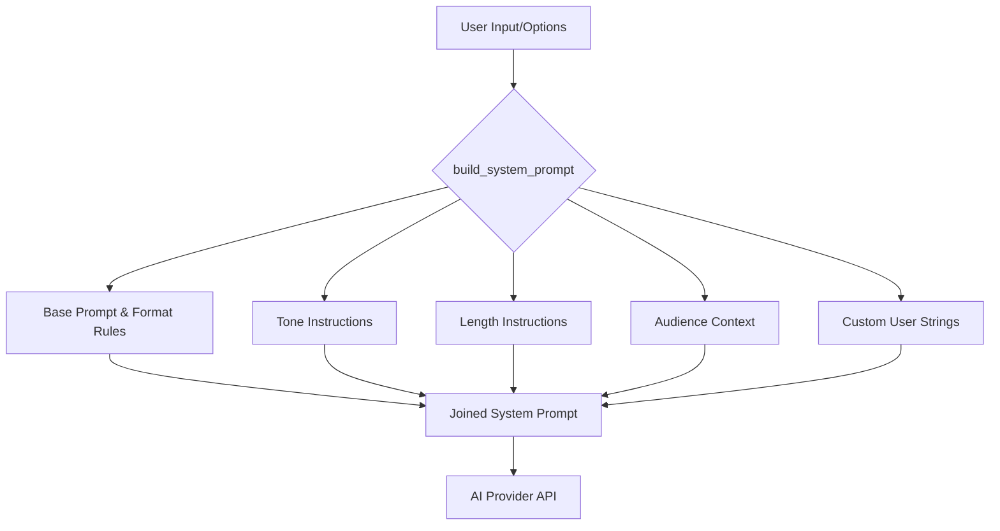
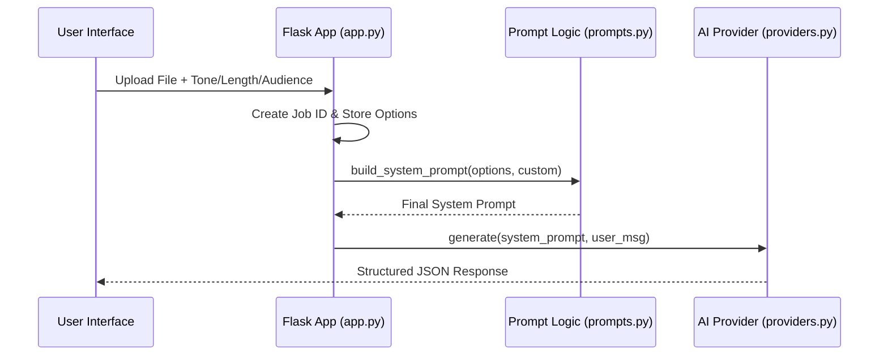

<details>
<summary>Relevant source files</summary>

The following files were used as context for generating this wiki page:

- [prompts.py](prompts.py)
- [tests/test_prompts.py](tests/test_prompts.py)
- [app.py](app.py)
- [main.py](main.py)
- [templates/index.html](templates/index.html)
- [providers.py](providers.py)
</details>

# Prompt Engineering & Customization Controls

## Introduction
The Product Describer system utilizes a modular prompt engineering architecture to generate Swedish product descriptions and justifications ("varför"). This system is designed to transform raw product data—such as title, site origin, and price—into structured JSON responses containing natural language marketing copy. The core of this functionality lies in the dynamic construction of system prompts based on user-selected parameters including tone, length, target audience, and specific custom instructions.

Customization controls are exposed through both a Web UI and a CLI, allowing users to influence the AI's output style and depth. The system ensures consistency by enforcing a strict JSON schema while providing flexibility through a layered prompt building logic that appends specific behavioral constraints to a base instruction set.

Sources: [prompts.py:1-12](prompts.py#L1-L12), [AGENTS.md:1-10](AGENTS.md#L1-L10), [README.md:15-20](README.md#L15-L20)

## Prompt Construction Architecture

The system prompt is constructed dynamically using a modular approach. A static `BASE_PROMPT` defines the AI's role and the required output format, while optional modules are appended based on user configuration.

### System Prompt Components
The prompt builder in `prompts.py` assembles the final instruction string from several distinct layers:

1.  **Base Instructions:** Defines the persona as an assistant writing Swedish descriptions and mandates a JSON response format.
2.  **Tone Selection:** Injects specific stylistic requirements (e.g., "saklig", "lyxig").
3.  **Length Constraints:** Limits or expands the number of sentences allowed per field.
4.  **Audience Adaptation:** Tailors the "why" justification to a specific demographic.
5.  **Custom Direction:** Appends free-form user instructions for unique requirements.



The diagram shows how various configuration layers are concatenated into a single cohesive system prompt before being sent to the AI provider.
Sources: [prompts.py:27-51](prompts.py#L27-L51), [providers.py:41-55](providers.py#L41-L55)

### Data Structure for Customization
The customization options are handled as a dictionary within the application logic.

| Option | Type | Description | Values/Examples |
| :--- | :--- | :--- | :--- |
| `tone` | String | Sets the emotional/professional resonance of the text. | saklig, entusiastisk, humoristisk, lyxig |
| `length` | String | Controls the verbosity of the generated fields. | kort, medel, lang |
| `audience` | String | Provides context for the "varför" field. | e.g., "tonåringar", "småbarnsföräldrar" |
| `custom_direction`| String | Direct manual overrides or additions. | e.g., "Fokusera på hållbarhet" |

Sources: [prompts.py:13-25](prompts.py#L13-L25), [templates/index.html:435-458](templates/index.html#L435-L458)

## User Interface & Control Flow

The Web UI provides granular controls for users to configure their prompts before initiating a generation job. These options are captured during the file upload process and persisted throughout the background processing lifecycle.

### User Interaction Sequence
When a user interacts with the customization panel, the following flow occurs:



Sources: [app.py:221-255](app.py#L221-L255), [templates/index.html:565-585](templates/index.html#L565-L585), [main.py:45-55](main.py#L45-L55)

### Implementation Detail: `build_system_prompt`
The primary logic for prompt assembly is contained in the `build_system_prompt` function. It prioritizes specific tone instructions but falls back to a `DEFAULT_VARIATION` to prevent repetitive outputs if no tone is specified.

```python
# prompts.py:34-45
def build_system_prompt(options: dict | None = None, custom_direction: str = "") -> str:
    options = options or {}
    parts = [BASE_PROMPT]

    tone = options.get("tone")
    if tone in TONE_INSTRUCTIONS:
        parts.append(TONE_INSTRUCTIONS[tone])
    else:
        parts.append(DEFAULT_VARIATION)
    # ... length, audience, and custom logic follows
```

Sources: [prompts.py:34-45](prompts.py#L34-L45)

## Input Formatting (User Message)

While the system prompt sets behavioral rules, the `user_message` provides the specific context for the item being described. This is standardized into a clear, multi-line string to ensure the AI identifies key product attributes.

### User Message Structure
The `user_message` function in `main.py` (and tested in `tests/test_main.py`) formats raw data into a consistent template:
- **Produkt:** The name/title of the item.
- **Butik:** The source domain (extracted from the URL).
- **Pris:** The price in SEK.

Sources: [main.py:35-42](main.py#L35-L42), [tests/test_main.py:10-16](tests/test_main.py#L10-L16)

## Validation and Testing
The project includes a dedicated test suite for prompt logic in `tests/test_prompts.py` to ensure that customization controls behave predictably.

### Test Scenarios
- **Default Behavior:** Verification that the base prompt and default style variation are included when no options are provided.
- **Override Logic:** Ensuring that selecting a specific tone (e.g., "humoristisk") correctly removes the default variation.
- **Sanitization:** Verification that empty strings for audience or custom directions do not add unnecessary headers to the prompt.

Sources: [tests/test_prompts.py:5-35](tests/test_prompts.py#L5-L35)

## Summary
Prompt Engineering & Customization Controls in the Product Describer provide a robust framework for generating targeted Swedish marketing content. By separating the role definition (`BASE_PROMPT`) from stylistic parameters (`TONE_INSTRUCTIONS`, `LENGTH_INSTRUCTIONS`), the system allows for flexible output while maintaining the strict JSON integrity required for downstream processing. The integration between the Flask-based Web UI and the underlying Python prompt logic ensures that end-users can easily tailor the AI's "voice" to match their specific brand or target demographic.

Sources: [app.py:270-285](app.py#L270-L285), [prompts.py:1-12](prompts.py#L1-L12)
