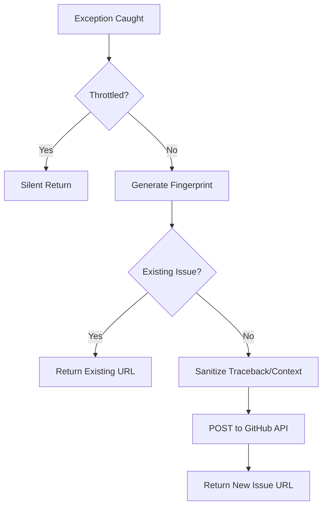

<details>
<summary>Relevant source files</summary>

The following files were used as context for generating this wiki page:

- [github_report.py](github_report.py)
- [app.py](app.py)
- [main.py](main.py)
- [tests/test_github_report.py](tests/test_github_report.py)
- [CLAUDE.md](CLAUDE.md)
</details>

# Automated GitHub Error Reporting

The Automated GitHub Error Reporting system is a specialized utility within the `product-describer` project designed to capture unexpected runtime exceptions and report them as GitHub issues. The primary goal is to facilitate autonomous error handling by integrating with GitHub automation (specifically tagged with `@claude`) while ensuring that sensitive data such as API keys, emails, and local system paths are strictly redacted before submission.

This system acts as a "best-effort" service, meaning it is designed to never crash the main application if reporting fails due to network issues or missing credentials. It is utilized by both the Flask web interface and the background synchronization workers to provide comprehensive error visibility across the entire application stack.

Sources: [github_report.py:1-12](github_report.py#L1-L12), [CLAUDE.md:104-109](CLAUDE.md#L104-L109)

## System Architecture and Logic

The error reporting logic is centralized in `github_report.py`. It provides a structured flow that includes throttling, de-duplication, data sanitization, and final submission to the GitHub API.

### Core Components and Data Flow

1.  **Throttling:** To prevent spamming the repository or hitting GitHub API rate limits during an error loop, the system limits reports to a specific number per time window (defaulting to 20 issues per hour).
2.  **Fingerprinting:** Each exception is converted into a short, stable hash based on the exception type and the location (file and line number) where it was raised. This hash is included in the issue title to identify duplicate errors.
3.  **De-duplication:** Before creating a new issue, the system queries the GitHub Search API for existing open issues containing the same fingerprint. If a match is found, it returns the existing issue URL instead of creating a new one.
4.  **Redaction:** A multi-layered sanitization process identifies and masks sensitive information using regular expressions and environment variable lookups.

The following diagram illustrates the logical flow of an error report from the moment an exception is caught:



The diagram shows the decision-making process within the `report_error_to_github` function, focusing on de-duplication and throttling mechanisms.
Sources: [github_report.py:34-45](github_report.py#L34-L45), [github_report.py:65-75](github_report.py#L65-L75), [github_report.py:84-105](github_report.py#L84-L105)

## Data Sanitization (Redaction)

Redaction is a critical security feature that ensures the application does not leak secrets to a public GitHub repository. The `_redact` function employs several strategies:

*  **Environment-based Masking:** It iterates through all environment variables. If a variable name contains markers like `KEY`, `TOKEN`, `SECRET`, or `PASSWORD`, its value is replaced with `[REDACTED]` throughout the error message.
*  **Pattern Matching:** It uses regular expressions to catch common API key formats (e.g., Anthropic `sk-...`, GitHub `ghp_...`), email addresses, and local home directory paths (e.g., `/home/[user]`).

| Category | Pattern/Mechanism | Replacement |
| :--- | :--- | :--- |
| **Secrets** | KEY, TOKEN, SECRET, PASSWORD, PASS (in Env Var Name) | `[REDACTED]` |
| **Known Keys** | `sk-`, `ghp_`, `gho_`, `AKIA`, `Bearer` | `[REDACTED]` |
| **Emails** | Standard email regex | `[EMAIL REDACTED]` |
| **Paths** | `/home/<username>` | `/home/[user]` |

Sources: [github_report.py:48-62](github_report.py#L48-L62), [tests/test_github_report.py:7-26](tests/test_github_report.py#L7-L26)

## Integration Points

The error reporting system is integrated into various layers of the application to catch different failure modes.

### Flask Web Application
In `app.py`, a global error handler captures unhandled exceptions occurring during HTTP requests. This ensures that internal server errors (500) are not only returned as JSON to the frontend but also logged as GitHub issues for developers to review.

```python
@app.errorhandler(Exception)
def handle_unexpected_error(exc):
    if isinstance(exc, HTTPException):
        return exc
    log.exception("Unhandled error handling %s %s", request.method, request.path)
    report_error_to_github(
        "blixten85/product-describer",
        f"Oväntat fel: {request.method} {request.path}",
        exc,
        context={"method": request.method, "path": request.path},
    )
    return jsonify({"error": "Internt serverfel. Se serverloggen för detaljer."}), 500
```

Sources: [app.py:86-105](app.py#L86-L105)

### Sync Workers and CLI
The system is also used in `main.py` during synchronization tasks. If the background worker fails to fetch products from the scraper API or fails to push generated descriptions back, the error is reported to GitHub with relevant context such as `product_id`.

Sources: [main.py:196-198](main.py#L196-L198), [main.py:221-226](main.py#L221-L226)

## Configuration

The system behavior is controlled via environment variables. If the primary token is missing, the reporting logic effectively no-ops.

| Variable | Description | Default |
| :--- | :--- | :--- |
| `GITHUB_ERROR_REPORT_TOKEN` | Required. The Personal Access Token used to authenticate with GitHub. | None |
| `GITHUB_REPORT_MAX_PER_WINDOW` | Maximum number of issues allowed per time window. | 20 |
| `GITHUB_REPORT_WINDOW_SECONDS` | The duration of the throttling window in seconds. | 3600 |

Sources: [github_report.py:31-32](github_report.py#L31-L32), [github_report.py:86-88](github_report.py#L86-L88), [docker-compose.yml:14](docker-compose.yml#L14)

## Summary

Automated GitHub Error Reporting provides a resilient, privacy-aware telemetry system for the `product-describer` project. By combining intelligent de-duplication via fingerprinting with aggressive data redaction, it allows the application to report operational failures directly into the development workflow without compromising security. Its implementation as a synchronous, best-effort utility ensures that monitoring overhead does not negatively impact the core functionality of generating product descriptions.

Sources: [github_report.py:1-20](github_report.py#L1-L20), [CLAUDE.md:104-109](CLAUDE.md#L104-L109)
