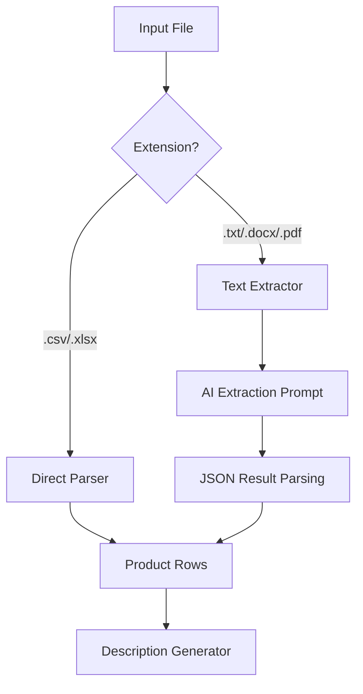
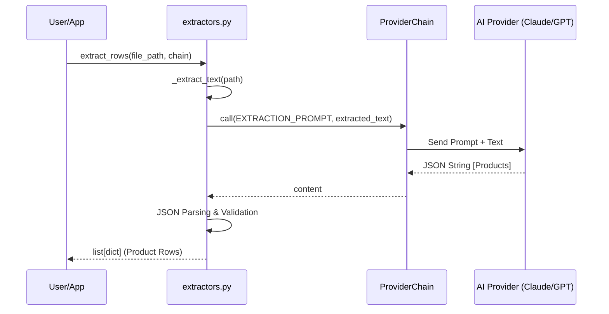

Relevant source files

The following files were used as context for generating this wiki page:

- [extractors.py](extractors.py)
- [main.py](main.py)
- [app.py](app.py)
- [AGENTS.md](AGENTS.md)
- [README.md](README.md)
- [prompts.py](prompts.py)

# Supported Input Formats

The product-describer system is designed to ingest product data from a variety of sources to generate Swedish product descriptions and justifications. The system supports two primary ingestion methods: manual file uploads via a web interface or CLI, and an automated "Sync Mode" that integrates with an external scraper API.

Input formats are categorized into **Structured Formats**, which are parsed directly using standard libraries, and **Unstructured Formats**, which utilize an AI-assisted extraction pipeline to identify product details within free-form text.

Sources: [AGENTS.md:5-10](AGENTS.md#L5-L10), [README.md:15-25](README.md#L15-L25), [extractors.py:1-10](extractors.py#L1-L10)

## File-Based Input Formats

The system supports five main file extensions for manual uploads. These are processed differently based on whether they contain structured or unstructured data.

| Extension | Category | Processing Method |
| :--- | :--- | :--- |
| `.csv` | Structured | Native Python `csv` module |
| `.xlsx` | Structured | `openpyxl` library |
| `.txt` | Unstructured | AI-Assisted Extraction |
| `.docx` | Unstructured | `python-docx` + AI-Assisted Extraction |
| `.pdf` | Unstructured | `pdfplumber` + AI-Assisted Extraction |

Sources: [extractors.py:19](extractors.py#L19), [app.py:539-543](app.py#L539-L543), [README.md:15-18](README.md#L15-L18)

### Structured Formats (CSV & Excel)
For structured files, the system expects specific columns but can adapt to the existing header structure of the file. The primary fields sought are `Site`, `Product`, and `Price (SEK)`.

*  **CSV Processing**: The system uses a `DictReader` to map rows to dictionaries based on the header row.
*  **Excel Processing**: The `openpyxl` library reads the active sheet in `read_only` and `data_only` modes. If the file is empty, it defaults to a standard set of fieldnames.

Sources: [extractors.py:64-88](extractors.py#L64-L88), [extractors.py:27](extractors.py#L27)

### Unstructured Formats (TXT, DOCX, PDF)
When a user uploads a free-form document, the system first extracts the raw text and then sends a portion of that text to a configured AI provider (e.g., Claude or GPT) to identify individual products.

*  **Text Extraction**: 
  *  `.txt`: Read directly with UTF-8 encoding.
  *  `.docx`: Iterates through document paragraphs.
  *  `.pdf`: Uses `pdfplumber` to extract text from pages, subject to a configurable page limit.
*  **AI Extraction Logic**: The system sends the `EXTRACTION_PROMPT` to the AI, instructing it to return a JSON array of products found in the text.

Sources: [extractors.py:91-110](extractors.py#L91-L110), [extractors.py:31-40](extractors.py#L31-L40)

The diagram above illustrates the branching logic between natively parsed structured files and AI-mediated unstructured text extraction.
Sources: [extractors.py:50-61](extractors.py#L50-L61)

## Sync Mode (Scraper Integration)

Sync Mode allows the system to pull products directly from an external [scraper](https://github.com/blixten85/scraper) API. This bypasses file uploads entirely.

*  **Data Source**: The system polls the `/products` endpoint of the scraper API, specifically looking for items where `missing_description=true`.
*  **Data Structure**: The scraper returns JSON objects representing products. The describer maps these to its internal processing format using specific keys:
  *  `title` -> Product name
  *  `url` -> Used to derive the site domain
  *  `current_price` -> Product price

Sources: [main.py:64-73](main.py#L64-L73), [main.py:146-158](main.py#L146-L158), [README.md:65-75](README.md#L65-L75)

## Constraints and Configuration

To prevent resource exhaustion and manage API costs, the system enforces limits on input processing, particularly for AI-assisted extraction.

| Parameter | Default Value | Description |
| :--- | :--- | :--- |
| `MAX_PDF_PAGES` | 200 | Maximum number of PDF pages processed for text extraction. |
| `MAX_EXTRACT_CHARS` | 50,000 | Maximum characters sent to the AI for product identification. |
| `SYNC_LIMIT` | 50 | Number of products fetched per cycle in Sync Mode. |
| `MAX_CONTENT_LENGTH` | 50 MB | Maximum file size for web uploads. |

Sources: [extractors.py:23-25](extractors.py#L23-L25), [app.py:53](app.py#L53), [app.py:522-525](app.py#L522-L525), [main.py:207](main.py#L207)

## Data Flow for AI Extraction

The following sequence highlights how unstructured text is converted into structured product rows using the `ProviderChain`.

The sequence shows the transition from raw text to structured dictionary rows required by the generator.
Sources: [extractors.py:113-146](extractors.py#L113-L146), [providers.py:151-170](providers.py#L151-L170)

## Conclusion

The product-describer ensures flexibility by supporting both traditional structured data (CSV, Excel) and modern AI-driven extraction from unstructured documents (PDF, Word). Additionally, its integration via Sync Mode allows for headless operation within a larger scraping ecosystem, making it adaptable to various enterprise workflows.

Sources: [README.md:15-28](README.md#L15-L28), [AGENTS.md:5-15](AGENTS.md#L5-L15)
