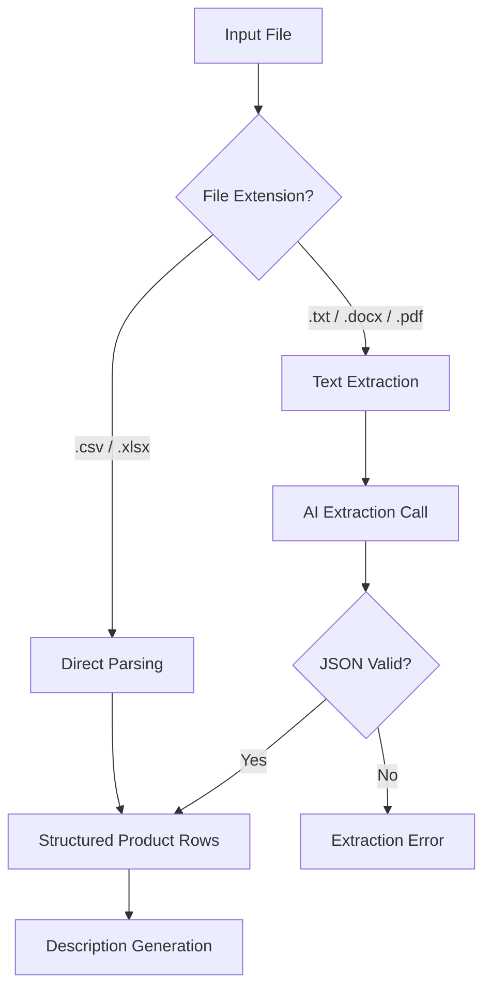
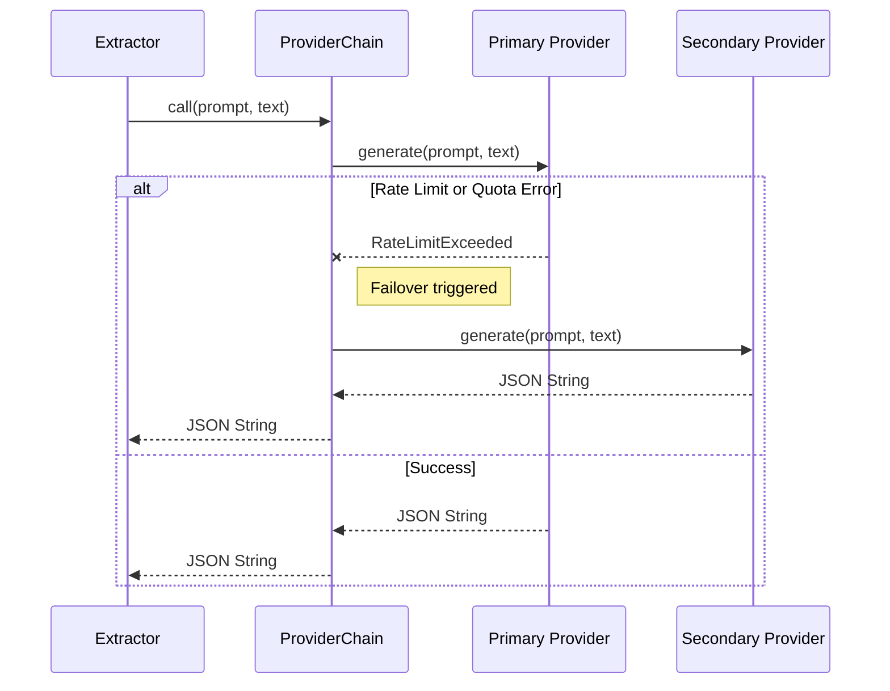

<details>
<summary>Relevant source files</summary>

The following files were used as context for generating this wiki page:

- [extractors.py](extractors.py)
- [prompts.py](prompts.py)
- [providers.py](providers.py)
- [app.py](app.py)
- [main.py](main.py)
- [AGENTS.md](AGENTS.md)
</details>

# AI-Assisted Unstructured Extraction

AI-Assisted Unstructured Extraction is a core capability of the product-describer system designed to transform free-form documents into structured product data. While structured formats like CSV and Excel are parsed directly using standard libraries, unstructured formats—specifically `.txt`, `.docx`, and `.pdf`—require Large Language Models (LLMs) to identify and extract product entities, names, sites, and prices.

This module acts as a pre-processing layer that ensures the description generation engine receives a consistent list of product rows, regardless of the original input format. It leverages a specialized "Extraction Prompt" and a robust failover provider chain to ensure high reliability even when encountering rate limits or quota exhaustion.
Sources: [extractors.py:1-10](extractors.py#L1-L10), [AGENTS.md:31-35](AGENTS.md#L31-L35)

## Architecture and Data Flow

The extraction process begins when a user uploads a file through the Web UI or provides one via the CLI. The system branches the logic based on the file extension. For unstructured data, the system extracts raw text and sends it to an AI provider.

### Extraction Logic Flow

The following diagram illustrates the decision logic and data transformation path for different file types.



The system distinguishes between structured data (direct parse) and unstructured data (AI-mediated extraction).
Sources: [extractors.py:42-55](extractors.py#L42-L55), [main.py:53-57](main.py#L53-L57)

## Components and Key Functions

### Text Extraction Layer
Before the AI can process unstructured files, the system must convert binary or formatted documents into raw strings. The system uses specific libraries for different formats:
*  **`.txt`**: Read directly with UTF-8 encoding.
*  **`.docx`**: Processed via `python-docx` to extract paragraph text.
*  **`.pdf`**: Processed via `pdfplumber`, which handles text extraction page-by-page.

Sources: [extractors.py:76-96](extractors.py#L76-L96)

### AI Extraction Model (`_ai_extract`)
The `_ai_extract` function is the primary coordinator for LLM-based parsing. It enforces safety limits and structures the prompt for the AI.

| Parameter | Type | Description | Default/Limit |
| :--- | :--- | :--- | :--- |
| `MAX_PDF_PAGES` | Integer | Limits PDF reading to prevent resource exhaustion. | 200 |
| `MAX_EXTRACT_CHARS` | Integer | Maximum characters sent to the AI for extraction. | 50,000 |
| `EXTRACTION_PROMPT` | String | System instructions forcing JSON array output. | Defined in `extractors.py` |

Sources: [extractors.py:20-22](extractors.py#L20-L22), [extractors.py:26-34](extractors.py#L26-L34)

### The Extraction Prompt
The extraction logic relies on a strictly formatted prompt that instructs the AI to return a JSON array of objects.

```python
EXTRACTION_PROMPT = (
    "Du får ett textdokument. Hitta varje enskild produkt/pryl som nämns i texten. "
    "Svara ALLTID med endast en giltig JSON-array, utan kodstaket eller extra text, "
    "i exakt detta format:\n"
    '[{"Product": "...", "Site": "...", "Price (SEK)": "..."}]\n'
    "- 'Product' (krävs): produktens namn.\n"
    "- 'Site' och 'Price (SEK)' (valfria): lämna som tom sträng om okänt.\n"
    "Hitta om möjligt ALLA produkter i dokumentet, inte bara de första."
)
```

Sources: [extractors.py:26-34](extractors.py#L26-L34)

## Data Structure and Validation

The output of the extraction process is normalized into a standard list of dictionaries. Even if the AI fails to find certain fields, the extractor ensures the keys exist for downstream compatibility.

### Standard Row Fields
Every extracted item is normalized into the following fields:
*  **`Product`**: (Required) The name of the item.
*  **`Site`**: (Optional) The retail site or store name.
*  **`Price (SEK)`**: (Optional) The detected price in Swedish Krona.
*  **`Link`**: Initialized as an empty string during unstructured extraction.

Sources: [extractors.py:24](extractors.py#L24), [extractors.py:121-126](extractors.py#L121-L126)

## Provider Interaction and Failover

Unstructured extraction utilizes the `ProviderChain` class. Because extraction is a high-token-count operation (sending up to 50,000 characters), it is susceptible to rate limits.



The `ProviderChain` handles automatic failover between providers (e.g., switching from Claude to GPT-4) if the extraction request triggers a quota limit.
Sources: [providers.py:218-243](providers.py#L218-L243), [AGENTS.md:58-61](AGENTS.md#L58-L61)

## Error Handling

The system defines a specific `ExtractionError` for failures during this phase. Common failure states include:
1.  **Unsupported Extension**: Attempting to upload files not in the supported list.
2.  **Missing AI Provider**: Attempting unstructured extraction without a configured API key.
3.  **Empty Document**: The text extraction layer returned no content.
4.  **Invalid JSON**: The AI returned text that could not be parsed as a JSON array.
5.  **No Products Found**: The AI returned an empty array or the document contained no recognizable products.

Sources: [extractors.py:37-39](extractors.py#L37-L39), [extractors.py:102-118](extractors.py#L102-L118)

## Conclusion
AI-Assisted Unstructured Extraction transforms the product-describer from a simple CSV processor into a versatile tool capable of ingesting varied business documents. By combining robust text extraction libraries with LLM-based entity recognition and a failover-ready provider architecture, the system maintains high data integrity for the subsequent generation of Swedish product descriptions.
