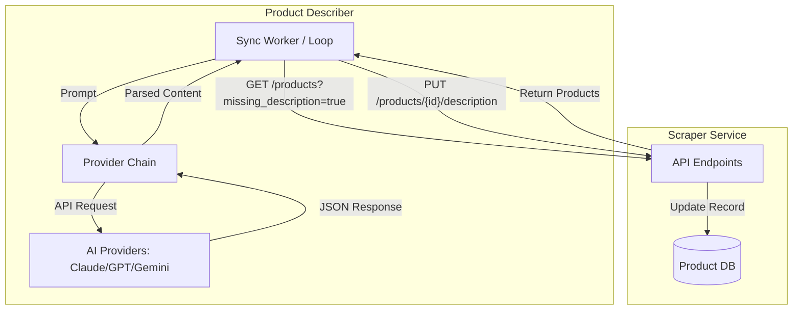
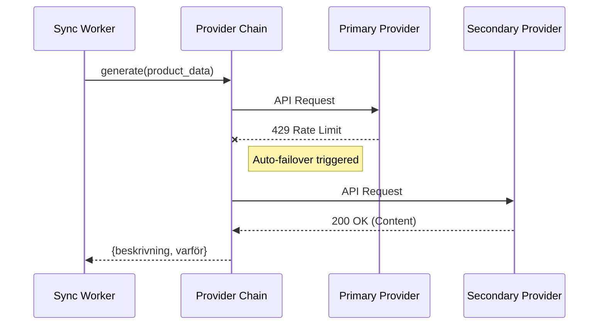

<details>
<summary>Relevant source files</summary>

The following files were used as context for generating this wiki page:

- [main.py](main.py)
- [app.py](app.py)
- [README.md](README.md)
- [AGENTS.md](AGENTS.md)
- [CLAUDE.md](CLAUDE.md)
- [docker-compose.yml](docker-compose.yml)
- [providers.py](providers.py)
</details>

# Application Sync Mode

Application Sync Mode is a background operational state of the product-describer system designed to automate the enrichment of product data by integrating directly with an external scraper API. Instead of relying on manual file uploads via the web UI, Sync Mode polls a configured scraper service for products missing descriptions, generates Swedish product descriptions and justifications ("varför") using AI providers, and pushes the results back to the source.

Sources: [README.md:16-18](README.md#L16-L18), [AGENTS.md:55-56](AGENTS.md#L55-L56)

## Overview and Architecture

Sync Mode functions as a continuous feedback loop between the product-describer and a scraper service. It can be initiated as a standalone CLI command or as a long-running background worker within the main application container or a dedicated Docker service.

### Components and Data Flow

The system architecture for Sync Mode involves three primary interactions:
1.  **Polling:** The worker requests products from the scraper's `/products` endpoint that are flagged as `missing_description`.
2.  **Generation:** The worker processes these products through a `ProviderChain`, which handles AI model selection and automatic failover between providers (e.g., Anthropic, OpenAI, Gemini) if rate limits are hit.
3.  **Submission:** The generated `beskrivning` and `varför` fields are sent back to the scraper via a `PUT` request to the `/products/{id}/description` endpoint.



The diagram shows the iterative cycle of fetching, describing, and updating products.
Sources: [main.py:59-71](main.py#L59-L71), [main.py:165-188](main.py#L165-L188), [README.md:88-100](README.md#L88-L100)

## Implementation Details

### Configuration and Environment Variables

Sync Mode is heavily reliant on environment variables for connectivity and authentication. Unlike the web UI, which uses account-scoped keys, the CLI/Sync mode reads keys directly from the environment.

| Variable | Description | Default |
| :--- | :--- | :--- |
| `SYNC_ENABLED` | Enables the background worker thread in `app.py`. | `false` |
| `SCRAPER_URL` | The base URL of the scraper API. | `http://scraper:8000` |
| `SCRAPER_API_KEY` | Authentication key for the scraper API. | (Empty) |
| `SYNC_INTERVAL` | Seconds between polling loops. | `300` |
| `SYNC_LIMIT` | Max products to fetch per loop iteration. | `50` |
| `SYNC_WORKERS` | Parallel threads for processing descriptions. | `2` |

Sources: [main.py:22-24](main.py#L22-L24), [app.py:539-543](app.py#L539-L543), [README.md:92-95](README.md#L92-L95), [docker-compose.yml:25-30](docker-compose.yml#L25-L30)

### Key Functions

The logic for Sync Mode is primarily implemented in `main.py` and `app.py`.

*  **`fetch_products_missing_description(scraper_url, limit)`**: Executes a GET request to the scraper to retrieve work. It includes the `X-API-Key` header and specifically filters for products where `missing_description=true`.
  *  Sources: [main.py:59-67](main.py#L59-L67)
*  **`push_description(scraper_url, product_id, beskrivning, varför)`**: Sends the generated content back to the scraper in JSON format.
  *  Sources: [main.py:70-78](main.py#L70-L78)
*  **`cmd_sync(args)`**: The entry point for the CLI sync command. It manages the `while True` loop when the `--watch` flag is provided.
  *  Sources: [main.py:165-212](main.py#L165-L212)
*  **`_sync_loop()`**: The background thread implementation in `app.py` that mirrors the CLI logic for the Docker-based worker.
  *  Sources: [app.py:538-570](app.py#L538-L570)

### Failure Handling and Resumption

Sync Mode utilizes the `ProviderChain` to handle AI provider exhaustion. If a rate limit or quota error occurs:
1.  The provider throws a `RateLimitExceeded` exception.
2.  The `ProviderChain` catches this and attempts to failover to the next configured provider in the priority list.
3.  If all providers are exhausted, the loop catches `AllProvidersExhausted`, logs the expected resume time, and waits for the next interval.



Sources: [providers.py:227-248](providers.py#L227-L248), [main.py:182-187](main.py#L182-L187), [app.py:557-561](app.py#L557-L561)

## Deployment via Docker

Sync Mode is typically deployed using a specific Docker Compose profile. This allows the describer to run alongside the scraper on the same network.

```yaml
sync:
  image: ghcr.io/blixten85/product-describer:latest
  profiles: [sync]
  command: ["python", "main.py", "sync", "--watch"]
  networks:
    - default
    - scraper_net
```

The `sync` profile ensures that the background worker only starts when explicitly requested via `docker compose --profile sync up`. It connects to an external network (usually `scraper_default`) to facilitate direct container-to-container communication.

Sources: [docker-compose.yml:20-44](docker-compose.yml#L20-L44), [README.md:102-109](README.md#L102-L109)

## Conclusion

Application Sync Mode provides a robust, hands-off solution for large-scale product enrichment. By bridging the scraper API and AI providers with an automated polling loop and failover engine, it ensures high availability and continuous processing even in the face of API rate limits. This mode is the primary interface for production environments where high-volume, automated Swedish content generation is required.
