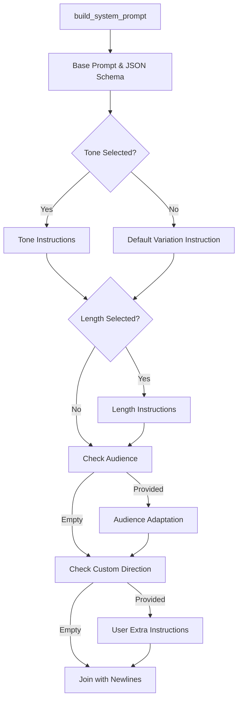
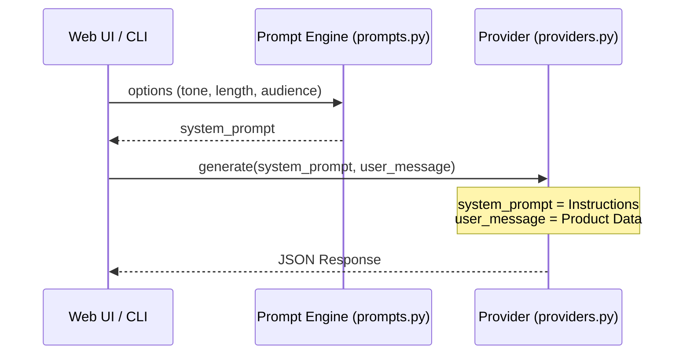

<details>
<summary>Relevant source files</summary>

The following files were used as context for generating this wiki page:

- [prompts.py](prompts.py)
- [main.py](main.py)
- [app.py](app.py)
- [providers.py](providers.py)
- [templates/index.html](templates/index.html)
- [AGENTS.md](AGENTS.md)
</details>

# Prompt Engineering & Controls

The Prompt Engineering & Controls system in `product-describer` is responsible for dynamically generating high-quality Swedish product descriptions and justifications ("varför"). It achieves this by combining a structured base prompt with user-configurable parameters such as tone, length, target audience, and custom directions. The system ensures that the AI output follows a strict JSON schema to facilitate automated parsing and downstream processing.

Sources: [prompts.py:3-9](prompts.py#L3-L9), [AGENTS.md:12-14](AGENTS.md#L12-L14)

## System Prompt Architecture

The system prompt is built dynamically using the `build_system_prompt` function. It concatenates various instructions based on UI selections to guide the AI's behavior, style, and output format.

### Prompt Components
The prompt construction consists of four primary layers:
1.  **Base Prompt:** Sets the persona ("assistent som skriver korta produktbeskrivningar på svenska") and mandates the JSON output format.
2.  **Tone & Style:** Applies specific stylistic constraints or a default variation instruction to avoid repetitive openings like "Självklart!".
3.  **Length Constraints:** Defines the verbosity allowed for each description field.
4.  **Contextual Modifiers:** Injects target audience details and specific user instructions.

Sources: [prompts.py:27-53](prompts.py#L27-L53), [prompts.py:3-11](prompts.py#L3-L11)

### Prompt Construction Flow
The following diagram illustrates how individual components are aggregated into the final system prompt sent to the AI provider.



Sources: [prompts.py:38-55](prompts.py#L38-L55)

## Prompt Controls and Parameters

Users interact with prompt controls through the web UI or CLI arguments. These parameters are passed into the prompt builder to customize the generated content.

### Configurable Options

| Parameter | Type | Source File | Description |
| :--- | :--- | :--- | :--- |
| `tone` | Selection | `prompts.py:13-18` | Sets the mood: saklig, entusiastisk, humoristisk, or lyxig. |
| `length` | Selection | `prompts.py:20-24` | Controls sentence count: kort (1), medel (1-2), or lang (up to 3). |
| `audience` | String | `prompts.py:47-49` | Adapts the "why" justification for a specific demographic. |
| `custom_direction` | String | `prompts.py:51-53` | Direct text injection for specific user requirements (e.g., "focus on sustainability"). |

Sources: [prompts.py:13-53](prompts.py#L13-L53), [templates/index.html:561-591](templates/index.html#L561-L591)

### JSON Output Control
To ensure data integrity, the prompt strictly defines the response format. The system is designed to handle cases where models might include markdown code fences or conversational filler.

```python
BASE_PROMPT = (
    "Du är en assistent som skriver korta produktbeskrivningar på svenska. "
    "Svara ALLTID med endast giltig JSON i exakt detta format, utan kodstaket eller extra text:\n"
    '{"beskrivning": "...", "varför": "..."}\n'
    "- 'beskrivning' (1–2 meningar): kort, naturlig beskrivning av produkten.\n"
    "- 'varför' (1–2 meningar): varför någon skulle vilja eller behöva produkten.\n"
)
```

Sources: [prompts.py:3-11](prompts.py#L3-L11)

## Execution Logic

When a job is initiated via `app.py` or `main.py`, the system prompt is generated once per job or request. This prompt is then combined with a specific `user_message` for every product in the batch.

### User Message Construction
The user message provides the raw product context needed for the description. It includes the product title, site domain, and price.



Sources: [main.py:33-47](main.py#L33-L47), [app.py:186-200](app.py#L186-L200)

### Handling Provider Responses
The `providers.py` module includes a utility `parse_description_response` that uses regular expressions to extract JSON blocks from the model's output. This provides a safety layer in case the AI ignores the instruction to provide *only* JSON.

Sources: [providers.py:38-53](providers.py#L38-L53)

## Conclusion
Prompt Engineering in this project is characterized by a template-based approach that balances rigid structural requirements (JSON) with flexible stylistic controls. By isolating prompt logic in `prompts.py`, the system allows for easy tuning of Swedish linguistic nuances without altering the core processing logic in `app.py` or `main.py`.

Sources: [AGENTS.md:59-59](AGENTS.md#L59), [prompts.py:26-26](prompts.py#L26)
