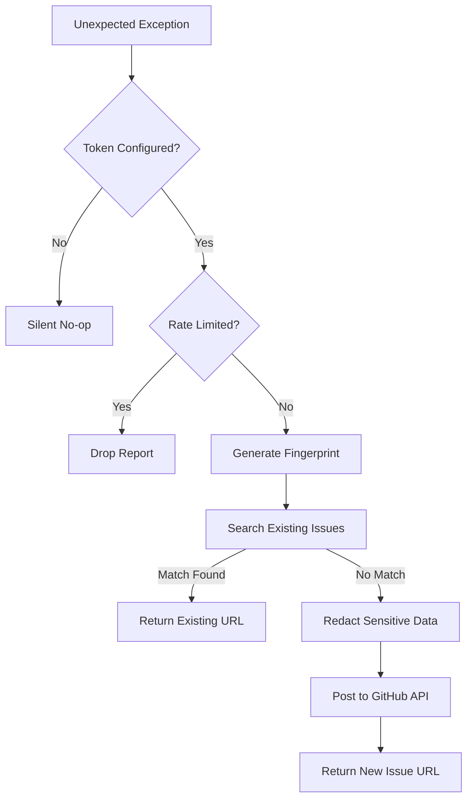
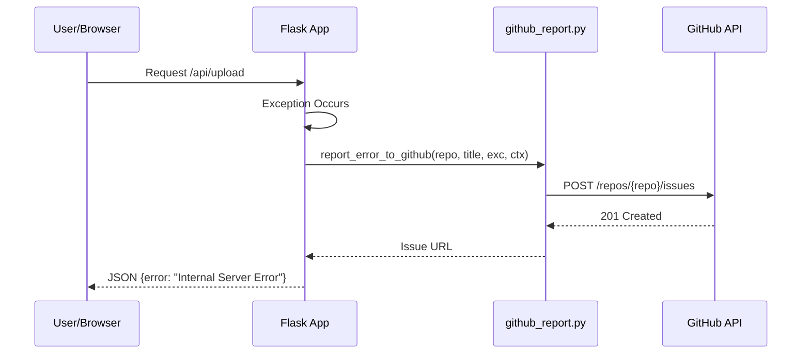

<details>
<summary>Relevant source files</summary>

The following files were used as context for generating this wiki page:

- [github_report.py](github_report.py)
- [app.py](app.py)
- [main.py](main.py)
- [CLAUDE.md](CLAUDE.md)
- [tests/test_github_report.py](tests/test_github_report.py)
- [docker-compose.yml](docker-compose.yml)
</details>

# Automated GitHub Error Reporting

Automated GitHub Error Reporting is a critical diagnostic system within the `product-describer` project designed to capture unhandled exceptions during runtime and report them as GitHub issues. The system provides a "best-effort" reporting mechanism that ensures unexpected failures—whether in the Flask web UI or the background sync worker—are documented for developers without manual intervention.

The system is specifically integrated with GitHub automation by tagging issues with `@claude`, allowing external workflows to process reported bugs automatically. To ensure security and prevent repository spam, the system includes robust data redaction (masking secrets, emails, and paths), error deduplication via fingerprinting, and rate limiting.

Sources: [github_report.py:1-13](github_report.py#L1-L13), [CLAUDE.md:76-81](CLAUDE.md#L76-L81), [app.py:86-93](app.py#L86-L93)

## Architecture and Data Flow

The reporting logic is centralized in `github_report.py`. It is invoked by global error handlers or catch-all blocks in the application's main execution paths.

### Reporting Process Flow
The following diagram illustrates how an error is processed from the moment of failure to the creation of a GitHub issue:



The system first checks for the presence of the `GITHUB_ERROR_REPORT_TOKEN`. If present, it calculates a unique fingerprint for the exception to avoid duplicates before sanitizing the traceback and context data.

Sources: [github_report.py:70-131](github_report.py#L70-L131), [tests/test_github_report.py:40-44](tests/test_github_report.py#L40-L44)

## Data Redaction and Sanitization

Security is a primary concern for the reporting module, as tracebacks and context dictionaries often contain sensitive information. The `_redact` function applies multiple regex-based and environment-aware rules to clean data before submission.

### Redaction Rules
| Category | Rule Logic | Example Mask |
| :--- | :--- | :--- |
| **Secrets** | Any env var value where key contains KEY, TOKEN, SECRET, PASSWORD, PASS | `[REDACTED]` |
| **Patterns** | Matches known prefixes like `sk-`, `ghp_`, `Bearer`, `AKIA` | `[REDACTED]` |
| **Emails** | Matches standard RFC 5322 email patterns | `[EMAIL REDACTED]` |
| **Paths** | Generalizes home directories (e.g., `/home/username/`) | `/home/[user]/` |

Sources: [github_report.py:46-62](github_report.py#L46-L62), [tests/test_github_report.py:7-27](tests/test_github_report.py#L7-L27)

```python
# github_report.py:55-62
def _redact(text: str) -> str:
    for key, value in os.environ.items():
        if value and len(value) >= 8 and any(m in key.upper() for m in _SECRET_ENV_MARKERS):
            text = text.replace(value, "[REDACTED]")
    text = _KEY_PATTERN_RE.sub("[REDACTED]", text)
    text = _EMAIL_RE.sub("[EMAIL REDACTED]", text)
    text = _HOME_PATH_RE.sub("/home/[user]", text)
    return text
```

## Error Deduplication and Fingerprinting

To prevent a single recurring crash from flooding the repository with identical issues, the system implements a fingerprinting mechanism.

*  **Fingerprint Generation:** The `_fingerprint` function extracts the last line of the traceback (filename and line number) and the exception class name. This string is hashed using SHA-256 and truncated to 10 characters.
*  **Search and Skip:** Before posting a new issue, the module queries the GitHub Search API for open issues in the repository containing the specific fingerprint bracket (e.g., `[auto] ... [a1b2c3d4e5]`).

Sources: [github_report.py:65-69](github_report.py#L65-L69), [github_report.py:90-101](github_report.py#L90-L101)

## Integration Points

The reporting system is hooked into the two primary operational modes of the application: the Web UI and the Sync Worker.

### Flask Web UI
In `app.py`, a global error handler is registered using `@app.errorhandler(Exception)`. This ensures that any crash during an HTTP request is reported while still returning a clean JSON error response to the client.



Sources: [app.py:86-104](app.py#L86-L104)

### Sync Worker
In `main.py`, the sync loop (which polls a scraper API for products) wraps operations in try-except blocks. If fetching or pushing descriptions fails unexpectedly, `report_error_to_github` is called to alert maintainers of synchronization failures.

Sources: [main.py:236-241](main.py#L236-L241), [main.py:265-272](main.py#L265-L272)

## Configuration and Limits

The system is configured via environment variables and includes safety throttles to prevent API abuse or accidental spam.

| Variable | Description | Default |
| :--- | :--- | :--- |
| `GITHUB_ERROR_REPORT_TOKEN` | GitHub Personal Access Token (Required for reporting) | None |
| `GITHUB_REPORT_MAX_PER_WINDOW` | Max issues to open within the time window | 20 |
| `GITHUB_REPORT_WINDOW_SECONDS` | Duration of the rate-limit window in seconds | 3600 (1h) |

Sources: [github_report.py:23-26](github_report.py#L23-L26), [docker-compose.yml:13](docker-compose.yml#L13)

## Summary

Automated GitHub Error Reporting provides the `product-describer` project with a self-healing diagnostic layer. By automatically deduplicating, redacting, and reporting crashes, it allows developers to track production stability directly through GitHub Issues while maintaining high standards for security and privacy.
