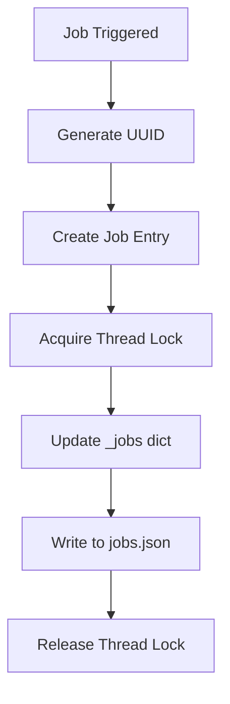
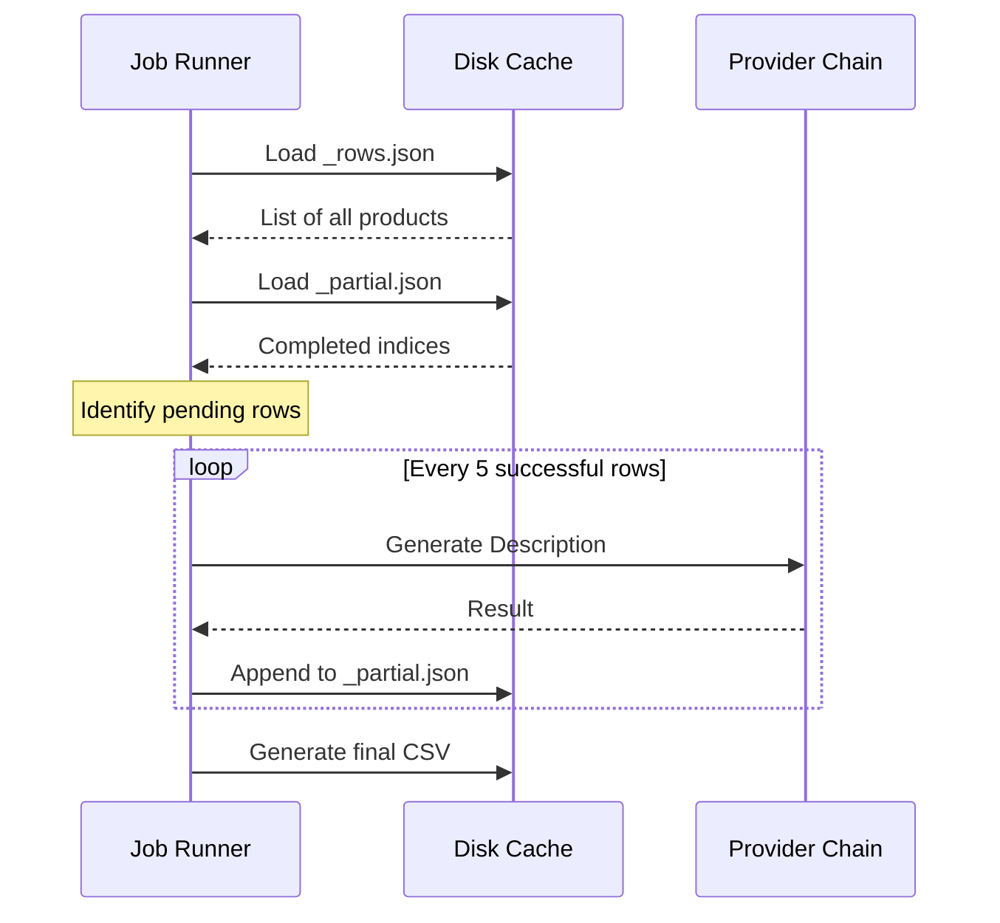

Relevant source files

The following files were used as context for generating this wiki page:

- [app.py](app.py)
- [main.py](main.py)
- [AGENTS.md](AGENTS.md)
- [CLAUDE.md](CLAUDE.md)
- [README.md](README.md)
- [providers.py](providers.py)

# Data Caching & Incremental Saving

The Data Caching & Incremental Saving system in the `product-describer` project is designed to ensure that background processing jobs are resilient to interruptions, provider rate limits, and server restarts. By persisting intermediate results to disk, the system guarantees that no work is lost even if a job is paused due to AI provider exhaustion or if the application process is terminated unexpectedly. Sources: [AGENTS.md:61-63](AGENTS.md#L61-L63), [CLAUDE.md:83-85](CLAUDE.md#L83-L85), [app.py:227-230](app.py#L227-L230)

This mechanism is central to the project's ability to handle large batch operations across multiple AI providers. It allows the system to pick up exactly where it left off, only processing rows that haven't yet received a generated description. Sources: [README.md:68-73](README.md#L68-L73), [app.py:270-272](app.py#L270-L272)

## Job State Persistence

The system maintains a registry of all jobs in a centralized JSON file. Each job entry includes metadata such as the job's status, progress, account ownership, and pointers to input/output files.

### Job Metadata Storage
Job metadata is stored in `outputs/jobs.json`. This file is updated whenever a job's status changes (e.g., from `queued` to `processing` or `paused`). The system uses a global lock (`_lock`) to ensure thread-safe updates to the shared `_jobs` dictionary before flushing to disk. Sources: [app.py:61-62](app.py#L61-L62), [app.py:100-110](app.py#L100-L110)

The diagram shows the sequence of updating the global job registry to ensure persistence across sessions. Sources: [app.py:106-111](app.py#L106-L111), [app.py:408-433](app.py#L408-L433)

## Intermediate Row Caching

When a file is uploaded, it is first processed to extract individual product rows. To avoid re-extracting data from large files during a resume cycle, the system caches the extracted rows and the partial AI-generated results separately.

### Cached Components
The system utilizes specific file naming conventions within the `outputs/` directory to manage job data:

| File Pattern | Content Description | Purpose |
| :--- | :--- | :--- |
| `{job_id}_rows.json` | Extracted JSON list of product rows and fieldnames. | Prevents re-parsing the original upload (CSV, PDF, etc.). |
| `{job_id}_partial.json` | Mapping of row index to AI-generated description/why pairs. | Stores incremental progress during batch processing. |
| `{job_id}_med_beskrivning.csv` | Final exported result. | The completed dataset available for download. |

Sources: [app.py:122-129](app.py#L122-L129), [app.py:202-206](app.py#L202-L206)

### Incremental Progress Logic
During the `_process` loop, the system checks for existing results in the partial cache. Only rows whose indices are missing from the `_load_partial` output are added to the `pending` list for the thread pool. Sources: [app.py:214-222](app.py#L214-L222)

The sequence diagram illustrates how the system consults the disk cache to filter out completed work and performs incremental saves to mitigate data loss. Sources: [app.py:214-255](app.py#L214-L255), [app.py:270-282](app.py#L270-L282)

## Resume Mechanisms

The project implements two primary resume triggers: one for planned pauses due to rate limits and another for recovering from process crashes.

### Automatic Resume (Watcher)
A dedicated `resume-watcher` thread runs periodically (defined by `RESUME_CHECK_INTERVAL`, default 120s). It scans the job registry for jobs with a `paused` status where the `resume_at` timestamp has passed. Sources: [app.py:311-325](app.py#L311-L325)

### Crash Recovery
On application startup, the `_resume_interrupted_jobs` function is called. It identifies any jobs that were left in `queued` or `processing` states—implying the process died before they could finish—and immediately spawns new threads to continue them. Sources: [app.py:328-336](app.py#L328-L336)

## Data Retention and Cleanup

To prevent the `uploads/` and `outputs/` directories from growing indefinitely, a purge mechanism is integrated into the resume watcher.

| Parameter | Default | Description |
| :--- | :--- | :--- |
| `JOB_RETENTION_DAYS` | 30 | Number of days to keep completed/failed jobs before deletion. |
| `RESUME_CHECK_INTERVAL` | 120 | Seconds between checks for paused jobs and old job purging. |

Sources: [app.py:75-77](app.py#L75-L77), [app.py:291-294](app.py#L291-L294)

When a job is purged, the system unlinks the input file, the output CSV, and both JSON cache files (`_rows.json` and `_partial.json`). Sources: [app.py:302-308](app.py#L302-L308)

## Summary

The Data Caching & Incremental Saving system provides a robust backbone for the product-describer application. By decoupling row extraction from generation and persisting every five successful completions to disk, the architecture handles AI provider volatility gracefully. This ensures that users can process large files without the risk of duplicate API costs or data loss during extended multi-day processing windows. Sources: [app.py:254-255](app.py#L254-L255), [README.md:68-73](README.md#L68-L73)
