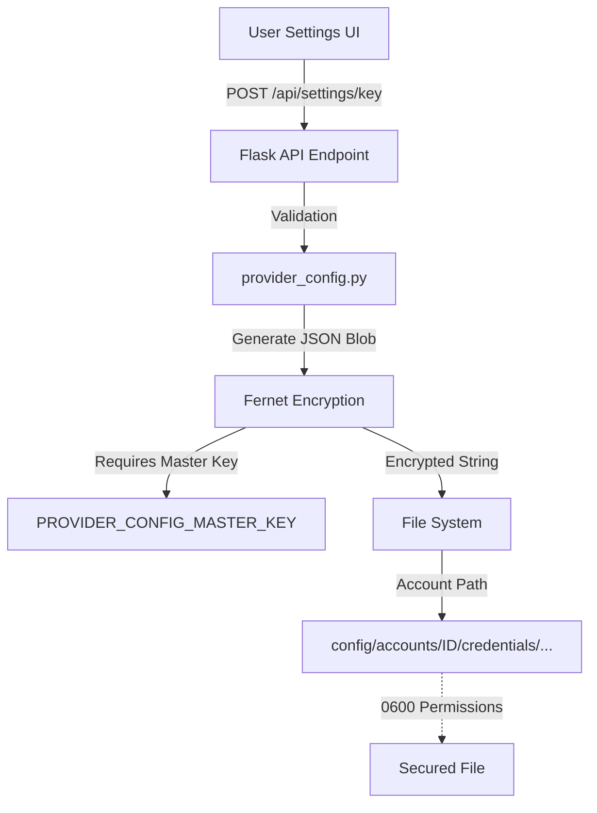
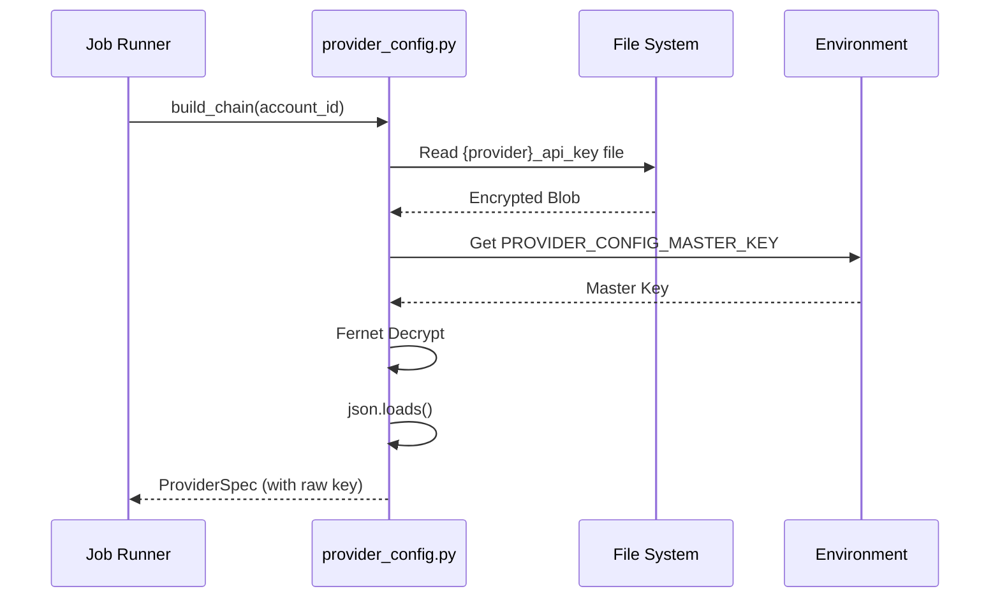

<details>
<summary>Relevant source files</summary>

The following files were used as context for generating this wiki page:

- [provider\_config.py](provider_config.py)
- [tests/test\_provider\_config.py](tests/test_provider_config.py)
- [app.py](app.py)
- [README.md](README.md)
- [AGENTS.md](AGENTS.md)
- [CLAUDE.md](CLAUDE.md)
</details>

# Secrets Encryption at Rest

Secrets Encryption at Rest is a critical security feature in the product-describer project designed to protect sensitive API credentials for various AI providers (Anthropic, OpenAI, Google Gemini, and Azure OpenAI). Since the application follows a multi-tenant model where each user provides their own API keys, these keys must be stored securely on the server's file system to prevent unauthorized access in the event of a storage medium breach.

The system utilizes symmetric encryption based on the Fernet (cryptography) implementation. API keys and associated configuration data (such as Azure endpoints and deployment names) are stored as encrypted JSON blobs within specific account directories. This ensures that even if the underlying storage or a backup is compromised, the actual credentials remain inaccessible without the master encryption key.

Sources: [CLAUDE.md:17-21](CLAUDE.md#L17-L21), [README.md:38-46](README.md#L38-L46), [provider_config.py:1-8](provider_config.py#L1-L8)

## Core Architecture and Components

The encryption system revolves around a master key provided via environment variables and a file-per-provider storage strategy.

### Master Encryption Key
The system requires a `PROVIDER_CONFIG_MASTER_KEY` environment variable. This key must be a valid Fernet key. If this key is missing when attempting to save a new provider configuration, the system raises a `RuntimeError` and returns a clear error to the user interface.

Sources: [app.py:53-56](app.py#L53-L56), [provider_config.py:64-70](provider_config.py#L64-L70), [README.md:44-48](README.md#L44-L48)

### Storage Strategy
Instead of a single database entry, the application writes keys to individual files. This allows the application to apply restrictive file system permissions (User Read/Write only) to each secret.
- **Directory Structure:** `config/accounts/<account_id>/credentials/`
- **File Naming:** `{provider_name}_api_key` (e.g., `openai_api_key`)
- **Permissions:** Files are explicitly set to `stat.S_IRUSR | stat.S_IWUSR` (0600) upon writing.

Sources: [provider_config.py:10-18](provider_config.py#L10-L18), [provider_config.py:105-113](provider_config.py#L105-L113)

### Data Flow Diagram
The following diagram illustrates the lifecycle of a secret from user input to encrypted storage.



The diagram shows the transition from raw user input to a secured file on disk, emphasizing the requirement of the master key for the encryption process. 
Sources: [app.py:317-338](app.py#L317-L338), [provider_config.py:105-113](provider_config.py#L105-L113), [provider_config.py:64-70](provider_config.py#L64-L70)

## Implementation Details

### Encryption Logic
The system bundles the API key and any "extra fields" (like Azure endpoints) into a dictionary, serializes it to JSON, and then encrypts the entire string.

| Component | Function | Description |
| :--- | :--- | :--- |
| `_get_fernet()` | `provider_config.py` | Retrieves the master key from environment and initializes the Fernet object. |
| `set_provider_config()` | `provider_config.py` | Encrypts the JSON-encoded configuration and writes it to disk with restricted permissions. |
| `_decrypt_stored_value()`| `provider_config.py` | Decrypts a value using the master key, with fallback logic for legacy plaintext. |

Sources: [provider_config.py:64-85](provider_config.py#L64-L85), [provider_config.py:105-113](provider_config.py#L105-L113)

### Handling Legacy Data
To ensure backward compatibility, the system includes a fallback mechanism. If the `PROVIDER_CONFIG_MASTER_KEY` is not set, or if decryption fails (suggesting the file was stored before encryption was mandatory), the system attempts to read the file as plaintext. This is primarily for "legacy" keys stored before the migration to the multi-tenant encrypted system.

Sources: [provider_config.py:73-85](provider_config.py#L73-L85), [CLAUDE.md:65-68](CLAUDE.md#L65-L68)

### Sequence Diagram: Retrieving a Secret
The following sequence shows how the system retrieves and decrypts a secret for use in an AI provider request.



The sequence highlights that decryption happens just-in-time when building the provider chain for a processing job.
Sources: [provider_config.py:155-165](provider_config.py#L155-L165), [provider_config.py:73-85](provider_config.py#L73-L85)

## Configuration and Management

Users manage these secrets through the Web UI or via Environment Variables in CLI mode.

### API Endpoints
The following endpoints in `app.py` interact with the encrypted secrets:

| Endpoint | Method | Purpose |
| :--- | :--- | :--- |
| `/api/settings/key` | `POST` | Saves or updates an encrypted key for a specific provider. |
| `/api/settings/key/<provider>` | `DELETE` | Removes the credential file from the account directory. |
| `/api/settings` | `GET` | Returns which providers are "ready" (configured) without exposing the keys. |

Sources: [app.py:317-362](app.py#L317-L362)

### Required Environment Variables
For encryption to function at rest, the following must be defined in the application environment (often via a `.env` file):

```bash
# Generated via: python -c "from cryptography.fernet import Fernet; print(Fernet.generate_key().decode())"
PROVIDER_CONFIG_MASTER_KEY=your_generated_fernet_key
```

Sources: [README.md:44-50](README.md#L44-L50), [docker-compose.yml:8-10](docker-compose.yml#L8-L10)

## Security Considerations

1.  **Scope of Encryption:** Encryption at rest applies only to the multi-tenant web UI. The CLI mode (`main.py run`) reads keys directly from environment variables (e.g., `ANTHROPIC_API_KEY`) and does not use the encryption-at-rest logic for those transient executions.
2.  **File Permissions:** The application uses `os.chmod` to set `stat.S_IRUSR | stat.S_IWUSR`, ensuring that other system users cannot read the encrypted blobs even if they have access to the volume.
3.  **Credential Masking:** The `github_report.py` module explicitly redacts any strings matching the `PROVIDER_CONFIG_MASTER_KEY` or stored API keys before sending automated error reports to GitHub.

Sources: [provider_config.py:113](provider_config.py#L113), [github_report.py:53-61](github_report.py#L53-L61), [CLAUDE.md:50-53](CLAUDE.md#L50-L53), [README.md:52-56](README.md#L52-L56)

## Summary
Secrets Encryption at Rest in the Product Describer project provides a secure, multi-tenant credential storage system. By combining Fernet symmetric encryption with strict file system permissions and account-based directory isolation, the system ensures that sensitive AI provider keys are protected. The architecture balances security with usability by providing a seamless transition for legacy plaintext data while enforcing encryption for all new configuration updates.
