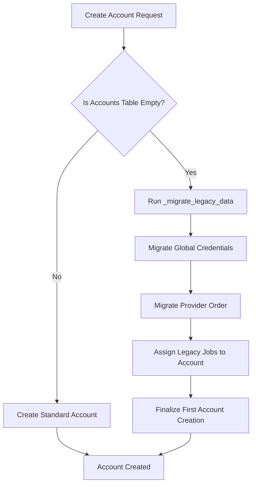

Relevant source files

The following files were used as context for generating this wiki page:

- [auth.py](auth.py)
- [CLAUDE.md](CLAUDE.md)
- [app.py](app.py)
- [tests/test_auth.py](tests/test_auth.py)
- [main.py](main.py)

# Legacy Data Migration

Legacy Data Migration is a specific transition process within the `product-describer` project designed to move global configuration data and job history into a multi-tenant account system. Before this system was implemented, the application stored API keys, provider failover orders, and processing jobs globally. The migration ensures that the first user to register an account automatically inherits this pre-existing data, preventing loss of configuration and work history during the upgrade to versioned accounts.

Sources: [CLAUDE.md:85-87](CLAUDE.md#L85-L87), [app.py:537-542](app.py#L537-L542)

## Migration Architecture and Logic

The migration is triggered automatically during the account creation process. It is a "one-time" event that occurs only when the `accounts` database table is empty, indicating the very first registration in the new system. The logic is encapsulated in the `_migrate_legacy_data` function within the authentication module.

### Migration Flow
The following diagram illustrates the decision logic during the creation of a new account:

This flow ensures that subsequent accounts do not receive legacy data, maintaining strict isolation between the first "admin/legacy" user and new users.
Sources: [CLAUDE.md:85-87](CLAUDE.md#L85-L87), [auth.py:27-35](auth.py#L27-L35), [tests/test_auth.py:126-135](tests/test_auth.py#L126-L135)

## Components of Migration

The migration process targets three primary data types: credentials, provider configuration, and job history.

### 1. API Credentials Migration
Legacy credentials were stored as plaintext files in a global `credentials/` directory (e.g., `anthropic_api_key`). The migration moves these into the account-specific encrypted storage. During migration, these plaintext keys are read and then re-saved using the new Fernet encryption-at-rest system keyed by `PROVIDER_CONFIG_MASTER_KEY`.

Sources: [CLAUDE.md:61-65](CLAUDE.md#L61-L65), [tests/test_auth.py:112-124](tests/test_auth.py#L112-L124)

### 2. Provider Failover Order
The global `provider_order.json` file, which defines the priority of AI providers (e.g., Claude first, then ChatGPT), is moved to the account's specific configuration path: `config/accounts/<account_id>/provider_order.json`.

Sources: [CLAUDE.md:71-73](CLAUDE.md#L71-L73), [tests/test_auth.py:126-133](tests/test_auth.py#L126-L133)

### 3. Job History Ownership
Existing jobs stored in the global `outputs/jobs.json` file are updated. The migration logic iterates through these legacy entries and injects the new `account_id` into each job object. This ensures the first user can view and download results from processing runs performed before the account system existed.

Sources: [CLAUDE.md:85-87](CLAUDE.md#L85-L87), [app.py:108-112](app.py#L108-L112), [tests/test_auth.py:135-143](tests/test_auth.py#L135-L143)

## Technical Implementation Details

The migration relies on specific file paths and environment variables to locate legacy data.

| Component | Legacy Path | Migrated Account Path |
| :--- | :--- | :--- |
| **Credentials** | `config/credentials/` | `config/accounts/<id>/credentials/` |
| **Failover Order**| `config/provider_order.json` | `config/accounts/<id>/provider_order.json` |
| **Job Metadata** | `outputs/jobs.json` (Global) | Updated in-place with `account_id` |

Sources: [CLAUDE.md:57-59](CLAUDE.md#L57-L59), [app.py:73-75](app.py#L73-L75), [tests/test_auth.py:112-117](tests/test_auth.py#L112-L117)

### Job Processing Persistence
Because jobs are cached to disk (`outputs/{job_id}_rows.json` and `_partial.json`), the migration allows interrupted or completed legacy work to remain accessible and resumable. The `app.py` startup routine calls `_resume_interrupted_jobs()`, which scans the migrated job list to restart any tasks that were in `queued` or `processing` states during the transition.

Sources: [CLAUDE.md:77-79](CLAUDE.md#L77-L79), [app.py:284-293](app.py#L284-L293)

## Validation and Security

The migration system includes safeguards to ensure data integrity and security:
*  **Plaintext Compatibility**: While new keys must be encrypted, the migration logic is designed to read legacy plaintext files if the master key is not yet used, preventing lockout during the transition.
*  **Isolation Verification**: Automated tests verify that a second account created after the first does not inherit any legacy data, ensuring the migration only happens once.
*  **Atomic Attribution**: Jobs are attributed to the `account_id` in the JSON store before the user session is finalized, ensuring immediate access upon first login.

Sources: [CLAUDE.md:61-65](CLAUDE.md#L61-L65), [tests/test_auth.py:145-157](tests/test_auth.py#L145-L157)

## Summary
Legacy Data Migration provides a seamless transition from a single-user CLI/Web tool to a multi-tenant platform. By automatically re-routing global credentials, orders, and job histories to the first registered user, the system preserves configuration effort and processing results while enforcing the new security model of account-scoped data isolation.
