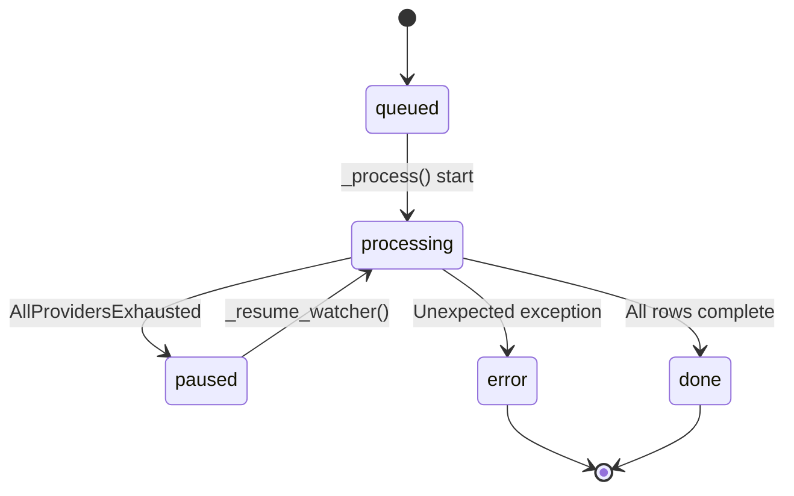
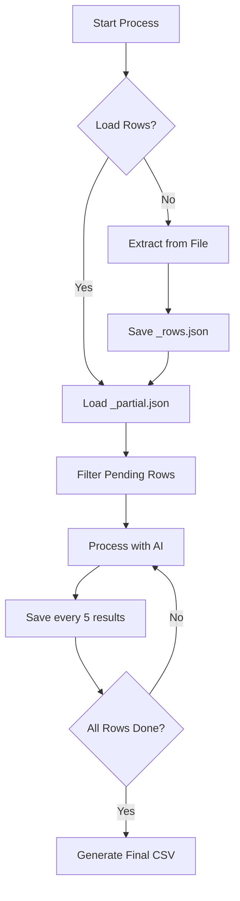

<details>
<summary>Relevant source files</summary>

The following files were used as context for generating this wiki page:

- [app.py](app.py)
- [main.py](main.py)
- [providers.py](providers.py)
- [AGENTS.md](AGENTS.md)
- [CLAUDE.md](CLAUDE.md)
</details>

# Data Caching & Incremental Saving

The "Data Caching & Incremental Saving" system in the product-describer project is a critical architecture designed to ensure resilience against API rate limits and system restarts. By persisting intermediate states and job metadata to disk, the application can pause long-running processing tasks when AI providers are exhausted and resume them seamlessly without losing progress or duplicating API calls.

This mechanism is primarily managed by the background job runner in the web interface and the CLI sync modes. It uses a combination of JSON-based metadata tracking and row-level result caching to maintain a stateful processing pipeline in an otherwise stateless environment.

## Job Metadata and Persistence

Every processing task is treated as a "job" with a unique identifier. Job states, including progress counters and current status, are maintained in a global registry and synchronized to a central `jobs.json` file.

### Job State Management
Jobs transition through several states: `queued`, `processing`, `paused`, `done`, and `error`. When a job is paused—typically due to `AllProvidersExhausted`—the system calculates a `resume_at` timestamp. This allows the `resume-watcher` thread to automatically restart the job once the cooldown period has expired.



The lifecycle of a background job from initiation to finalization, including the automated pause/resume cycle.
Sources: [app.py:101-115](app.py#L101-L115), [app.py:175-185](app.py#L175-L185), [CLAUDE.md:104-106](CLAUDE.md#L104-L106)

### Key Persistence Files
The system uses the `outputs/` directory to store various levels of cached data for each job:

| File Pattern | Description |
| :--- | :--- |
| `jobs.json` | Central registry for all job metadata, including status and creation time. |
| `{job_id}_rows.json` | Extracted raw product rows and CSV fieldnames from the input file. |
| `{job_id}_partial.json` | Incremental storage of AI-generated descriptions indexed by row number. |
| `{job_id}_med_beskrivning.csv` | The final output file generated after successful completion. |

Sources: [app.py:84-86](app.py#L84-L86), [app.py:118-121](app.py#L118-L121), [AGENTS.md:79-81](AGENTS.md#L79-L81)

## Incremental Result Saving

To prevent data loss during long-running tasks, the system saves results incrementally. As the `ThreadPoolExecutor` completes AI description requests, the results are collected into a dictionary and periodically flushed to disk.

### Row-Level Caching Logic
When a job is started or resumed, the system first attempts to load existing cached rows and partial results. Only rows that do not exist in the `{job_id}_partial.json` cache are submitted for processing.



The logical flow of checking for existing cache before initiating API requests to ensure no work is duplicated.
Sources: [app.py:187-215](app.py#L187-L215), [app.py:236-250](app.py#L236-L250)

### Saving Frequency
Incremental saves occur every 5 processed rows. This frequency ensures that even a sudden system crash only loses a minimal amount of work while balancing disk I/O performance.
Sources: [app.py:246-250](app.py#L246-L250), [CLAUDE.md:104-106](CLAUDE.md#L104-L106)

## Automated Recovery and Cleanup

The system includes background watchers to handle automatic resumption and disk space management.

### Recovery from Interruption
The `_resume_interrupted_jobs()` function runs upon application startup. It scans the job registry for any tasks that were in a `queued` or `processing` state when the application was last shut down (e.g., during a container restart) and re-launches them. Because of the partial result caching, these jobs pick up exactly where they left off.
Sources: [app.py:302-311](app.py#L302-L311)

### Automatic Job Purging
To prevent the `uploads/` and `outputs/` directories from growing indefinitely, a retention policy is enforced.

| Configuration | Default | Description |
| :--- | :--- | :--- |
| `JOB_RETENTION_DAYS` | 30 | Jobs older than this limit with status `done` or `error` are deleted. |
| `RESUME_CHECK_INTERVAL` | 120 | Frequency in seconds at which the system checks for paused jobs to resume or old jobs to purge. |

Sources: [app.py:87-90](app.py#L87-L90), [app.py:277-280](app.py#L277-L280)

```python
# Sources: [app.py:277-293]
def _purge_old_jobs() -> None:
    if JOB_RETENTION_DAYS <= 0:
        return
    cutoff = datetime.now(timezone.utc) - timedelta(days=JOB_RETENTION_DAYS)
    with _lock:
        stale = [
            j for j in _jobs.values()
            if j["status"] in ("done", "error") and j.get("created_at")
            and datetime.fromisoformat(j["created_at"]) < cutoff
        ]
        # ... logic to unlink input_path, output_file, and json caches ...
```

## Resilience and Failover
The caching system is tightly integrated with the `ProviderChain` failover engine. When a `RateLimitExceeded` exception is caught, the job is paused and the incremental cache is updated.

1.  **Rate Limit Detection:** `providers.py` catches API-specific errors and raises `RateLimitExceeded`.
2.  **Chain Exhaustion:** If all providers in the chain fail, `AllProvidersExhausted` is raised.
3.  **Pause State:** The runner updates the job status to `paused` and sets a `resume_at` time based on the API's `Retry-After` header or a default window.
4.  **Auto-Resume:** The `resume-watcher` thread monitors these timestamps and moves jobs back into the processing queue.

Sources: [providers.py:244-266](providers.py#L244-L266), [app.py:255-261](app.py#L255-L261), [main.py:133-145](main.py#L133-L145)

## Conclusion
Data caching and incremental saving in product-describer provide a robust backbone for high-volume product description generation. By persisting row-level results and utilizing background watchers, the system guarantees that expensive AI processing is never lost to rate limits or infrastructure restarts, allowing for completely hands-off operation of large-scale jobs.
