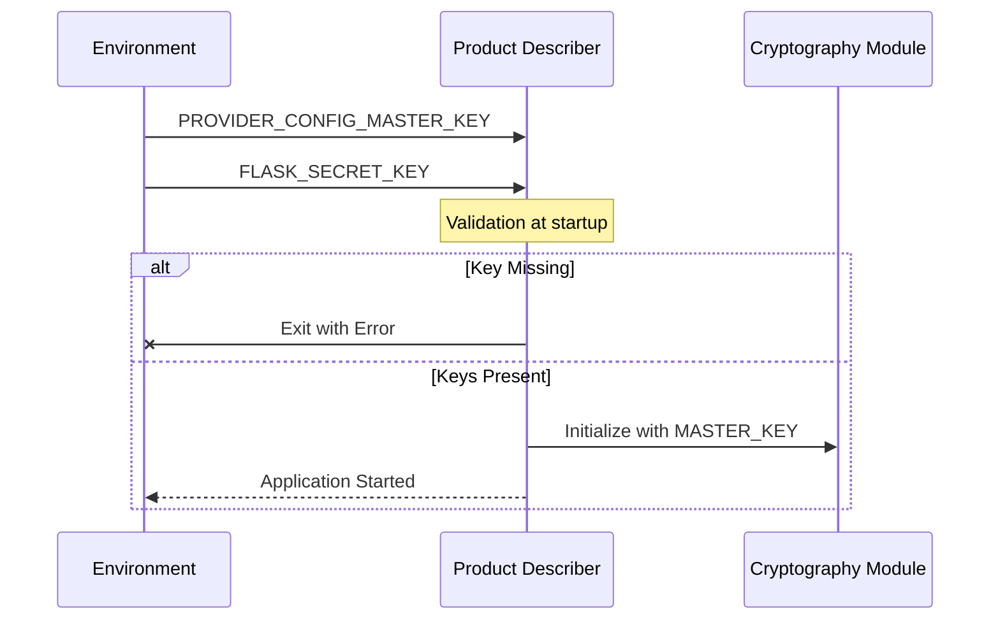
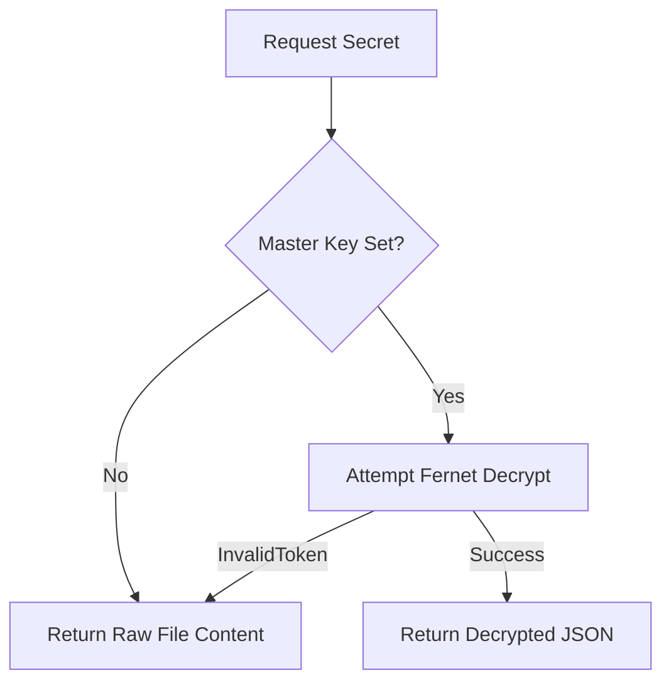
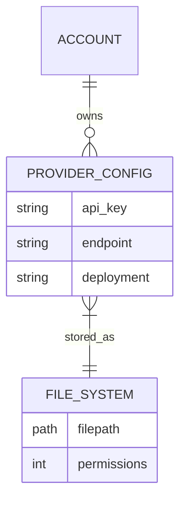

<details>
<summary>Relevant source files</summary>

The following files were used as context for generating this wiki page:

- [provider\_config.py](provider_config.py)
- [app.py](app.py)
- [AGENTS.md](AGENTS.md)
- [CLAUDE.md](CLAUDE.md)
- [README.md](README.md)
- [docker-compose.yml](docker-compose.yml)
- [tests/test\_provider\_config.py](tests/test_provider_config.py)
</details>

# Secrets Encryption at Rest

Secrets Encryption at Rest is a security feature within the Product Describer project designed to protect sensitive API credentials for various AI providers (Anthropic, OpenAI, Google Gemini, and Azure OpenAI). When users provide their API keys via the web interface, the system encrypts these secrets before persisting them to the server's filesystem, ensuring that a compromise of the physical storage or raw configuration files does not immediately expose the plaintext credentials. 

The mechanism utilizes the Fernet symmetric encryption scheme, which is part of the `cryptography` library. This system is multi-tenant aware, isolating encrypted credentials per `account_id` within specific directory structures. While the web UI enforces encryption for new keys, the system maintains backward compatibility for legacy plaintext keys that existed before the encryption requirement was implemented.

Sources: [AGENTS.md:58-63](AGENTS.md#L58-L63), [CLAUDE.md:65-70](CLAUDE.md#L65-L70), [README.md:46-51](README.md#L46-L51), [provider\_config.py:72-84](provider\_config.py#L72-L84)

## Core Configuration and Environment

The encryption system relies on a master key defined as an environment variable. This key must be a valid Fernet key, which is a URL-safe base64-encoded 32-byte key.

### Primary Variables

| Variable | Source | Description |
| :--- | :--- | :--- |
| `PROVIDER_CONFIG_MASTER_KEY` | Environment | The master Fernet key used to encrypt and decrypt stored API configurations. |
| `CONFIG_DIR` | Environment / Default | The root directory for configuration storage (default is `config`). |
| `ACCOUNTS_DIR` | Logic | Path where per-account data is stored: `config/accounts/`. |

Sources: [provider\_config.py:27-29](provider\_config.py#L27-L29), [README.md:53-56](README.md#L53-L56), [docker-compose.yml:10-10](docker-compose.yml#L10)

The following sequence shows how the environment variables are required for the application to start:



Sources: [README.md:53-60](README.md#L53-L60), [docker-compose.yml:10-11](docker-compose.yml#L10-L11)

## Encryption Mechanism

The project uses symmetric encryption to handle the transformation of JSON-serialized provider configurations into encrypted strings. 

### Encryption Logic
When a user saves an API key via the POST `/api/settings/key` endpoint, the `set_provider_config` function is invoked. It performs the following steps:
1.  Retrieves any existing configuration for the provider to merge updates.
2.  Serializes the configuration dictionary (containing `api_key` and any `EXTRA_FIELDS`) into a JSON string.
3.  Encrypts the JSON string using the `Fernet` instance derived from `PROVIDER_CONFIG_MASTER_KEY`.
4.  Writes the resulting encrypted string to a specific file on disk.
5.  Sets file permissions to `0600` (read/write for the owner only).

Sources: [app.py:284-307](app.py#L284-L307), [provider\_config.py:109-117](provider\_config.py#L109-L117), [provider\_config.py:126-126](provider\_config.py#L126)

### Decryption and Fallback
The `_decrypt_stored_value` function handles the retrieval of secrets. It is designed with a fallback mechanism to maintain backward compatibility:
*  **Case 1: Encryption Active**: If the master key is present and the token is valid, it decrypts the value.
*  **Case 2: Missing Master Key**: If no master key is configured, the system assumes the file is a legacy plaintext file and returns the raw string.
*  **Case 3: Invalid Token**: If decryption fails (e.g., the file is plaintext but the master key is present), it catches `InvalidToken` and returns the raw content as a fallback.

Sources: [provider\_config.py:87-100](provider\_config.py#L87-L100), [tests/test\_provider\_config.py:54-58](tests/test\_provider\_config.py#L54-L58)



Sources: [provider\_config.py:87-100](provider\_config.py#L87-L100), [tests/test\_provider\_config.py:54-58](tests/test\_provider\_config.py#L54-L58)

## Storage Architecture

Secrets are stored in a hierarchical directory structure on the filesystem. Unlike other projects that might use a single database, this project uses individual files to allow for specific OS-level file permissions.

### File Structure
The credentials are stored under:
`config/accounts/<account_id>/credentials/<provider_name>_api_key`

Sources: [provider\_config.py:32-33](provider\_config.py#L32-L33), [provider\_config.py:58-61](provider\_config.py#L58-L61)

### Data Models
Stored values are not just API keys; they are JSON blobs that include additional provider-specific metadata.

| Provider | Data Fields |
| :--- | :--- |
| `anthropic` | `api_key` |
| `openai` | `api_key` |
| `gemini` | `api_key` |
| `azure_openai` | `api_key`, `endpoint`, `deployment` |

Sources: [provider\_config.py:51-55](provider\_config.py#L51-L55), [provider\_config.py:102-107](provider\_config.py#L102-L107)



Sources: [provider\_config.py:32-61](provider\_config.py#L32-L61), [provider\_config.py:116-117](provider\_config.py#L116-L117)

## Implementation Details

### Configuration Blob Parsing
The function `_parse_config_blob` ensures that even if a secret was stored as a simple string (legacy) rather than a JSON object, the system can still process it.

```python
# provider_config.py:102-107
def _parse_config_blob(raw: str) -> dict:
    if not raw:
        return {"api_key": ""}
    try:
        data = json.loads(raw)
        if isinstance(data, dict) and "api_key" in data:
            return data
    except json.JSONDecodeError:
        pass
    return {"api_key": raw}
```

Sources: [provider\_config.py:102-107](provider\_config.py#L102-L107)

### File Protection
When secrets are written, the application explicitly restricts file permissions to ensure that only the user running the application process can access the files.

```python
# provider_config.py:116-117
path.write_text(encrypted)
path.chmod(stat.S_IRUSR | stat.S_IWUSR)
```

Sources: [provider\_config.py:116-117](provider\_config.py#L116-L117)

## Summary
Encryption at rest in the Product Describer project provides a critical layer of defense for third-party AI credentials. By combining environment-based master keys, per-account isolation, and symmetric encryption via the Fernet protocol, the system secures user secrets while maintaining accessibility for the background job runners that require these keys for product description generation. The inclusion of fallback logic for legacy plaintext files ensures a smooth upgrade path for existing installations.

Sources: [AGENTS.md:58-63](AGENTS.md#L58-L63), [CLAUDE.md:65-70](CLAUDE.md#L65-L70), [provider\_config.py:1-120](provider\_config.py#L1-L120)
