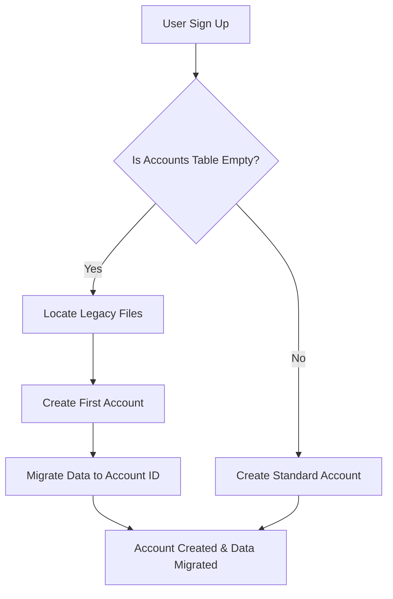

<details>
<summary>Relevant source files</summary>

The following files were used as context for generating this wiki page:

- [auth.py](auth.py)
- [CLAUDE.md](CLAUDE.md)
- [app.py](app.py)
- [tests/test_auth.py](tests/test_auth.py)
- [README.md](README.md)
</details>

# Legacy Data Migration

The Legacy Data Migration system is a specialized utility within the product-describer project designed to transition the application from a single-user system to a multi-tenant architecture. Its primary purpose is to ensure that existing configuration data, API keys, and background jobs are not lost when the project introduces account-based scoping.

The migration logic is triggered automatically during the creation of the very first user account in the system. By migrating global configuration files into the private workspace of the first user, the system maintains backward compatibility for existing deployments while enabling a secure, isolated environment for future users.

Sources: [CLAUDE.md:46-48](CLAUDE.md#L46-L48), [app.py:535-545](app.py#L535-L545)

## Migration Architecture

The migration process is integrated into the account creation workflow. It operates under a "singleton trigger" logic: it only executes when the `accounts` table in the SQLite database is empty. Once the first account is registered, the system identifies pre-existing files in the global `config/` and `outputs/` directories and relocates or re-scopes them to the new `account_id`.

### Execution Flow
The following diagram illustrates how the system detects the need for migration during the signup process.



The migration ensures that transition occurs only once, preventing data conflicts between multiple users.
Sources: [CLAUDE.md:46-48](CLAUDE.md#L46-L48), [auth.py:202-215](auth.py#L202-L215), [tests/test_auth.py:108-112](tests/test_auth.py#L108-L112)

## Data Scopes and Components

Three primary categories of data are handled during the migration: API credentials, provider failover logic, and historical background jobs.

### 1. API Credentials Migration
Before multi-tenancy, API keys (such as `anthropic_api_key`) were stored as plaintext files in a global `credentials/` directory. The migration moves these keys to the account-specific directory: `config/accounts/<account_id>/credentials/`. During this move, keys are often re-processed through the `set_provider_config` logic, which encrypts them at rest using a Fernet key defined by `PROVIDER_CONFIG_MASTER_KEY`.

Sources: [CLAUDE.md:41-45](CLAUDE.md#L41-L45), [tests/test_auth.py:114-123](tests/test_auth.py#L114-L123)

### 2. Provider Failover Order
The system migrates the `provider_order.json` file, which dictates the priority of AI providers (e.g., Claude vs. ChatGPT). This global configuration is moved into the account's specific configuration folder.

Sources: [CLAUDE.md:46-48](CLAUDE.md#L46-L48), [tests/test_auth.py:125-131](tests/test_auth.py#L125-L131)

### 3. Job History and Outputs
Background jobs stored in `outputs/jobs.json` are updated to include the `account_id` of the first user. This ensures that the user can see and download their historical product descriptions from the web UI.

Sources: [app.py:155-165](app.py#L155-L165), [tests/test_auth.py:133-141](tests/test_auth.py#L133-L141)

## Key Migration Logic

The migration is handled primarily by internal functions within the authentication module.

| Component | Responsibility | Source Reference |
| :--- | :--- | :--- |
| `_migrate_legacy_data` | Internal helper that moves files and updates JSON job records. | [auth.py:202](auth.py#L202) |
| `auth.create_account` | Triggers migration if it detects it is creating the first row in the DB. | [auth.py:65](auth.py#L65) |
| `ACCOUNTS_DIR` | The base path (`config/accounts/`) where migrated data is stored. | [provider_config.py:15](provider_config.py#L15) |

### Code Implementation Example
The following snippet demonstrates how the system scopes legacy jobs to the first account:

```python
# From auth.py (conceptual logic based on implementation)
def _migrate_legacy_jobs(account_id):
    jobs_path = OUTPUT_DIR / "jobs.json"
    if jobs_path.exists():
        with open(jobs_path, "r+") as f:
            jobs = json.load(f)
            for job in jobs:
                if "account_id" not in job:
                    job["account_id"] = account_id
            f.seek(0)
            json.dump(jobs, f, indent=2)
            f.truncate()
```

Sources: [app.py:112-120](app.py#L112-L120), [tests/test_auth.py:133-141](tests/test_auth.py#L133-L141)

## Verification and Security

The migration process includes several safety checks to prevent data corruption or unauthorized access during the transition.

*  **Idempotency:** The migration logic checks for the existence of legacy files (like `credentials/anthropic_api_key`) before attempting to move them. If the files do not exist, the specific migration step is skipped.
*  **Isolation:** Subsequent accounts (the second user and onward) do not trigger migration and start with an empty configuration.
*  **Encryption:** Migrated keys are transitioned from legacy plaintext to the new encrypted-at-rest format required by the multi-tenant engine.

Sources: [CLAUDE.md:41-43](CLAUDE.md#L41-L43), [tests/test_auth.py:143-154](tests/test_auth.py#L143-L154)

## Summary
The Legacy Data Migration feature is a critical bridge between the project's single-user origins and its current multi-tenant capability. By automating the transfer of credentials, failover settings, and job history to the first registered user, the system ensures a seamless upgrade path for existing operators while establishing the necessary data isolation for new accounts.

Sources: [CLAUDE.md:12-15](CLAUDE.md#L12-L15), [README.md:45-50](README.md#L45-L50)
