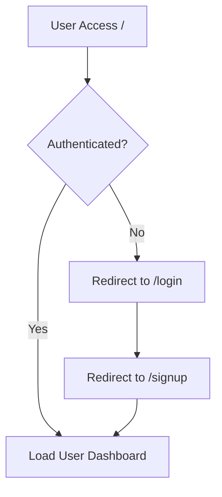
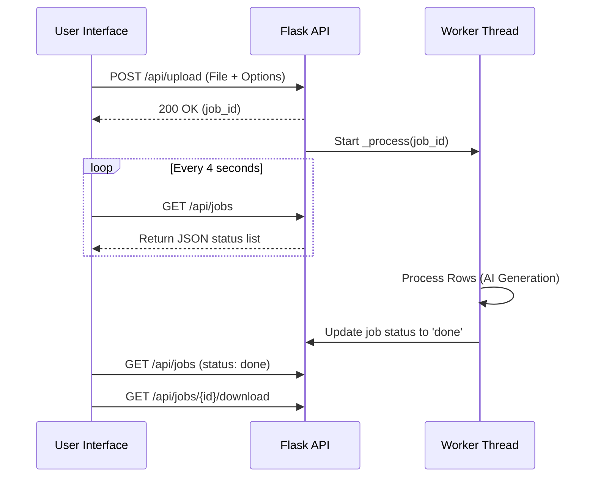

<details>
<summary>Relevant source files</summary>

The following files were used as context for generating this wiki page:

- [templates/index.html](templates/index.html)
- [app.py](app.py)
- [main.py](main.py)
- [templates/login.html](templates/login.html)
- [templates/signup.html](templates/signup.html)
- [CLAUDE.md](CLAUDE.md)
- [README.md](README.md)
</details>

# User Dashboard & File Upload UI

## Introduction
The User Dashboard and File Upload UI serve as the primary interface for the Product Describer application. This system allows users to securely authenticate, manage their AI provider configurations, and upload product datasets in various formats (CSV, Excel, TXT, Word, PDF) to generate Swedish product descriptions. The interface is designed as a single-page application (SPA) style dashboard that provides real-time feedback on background job processing and provider status.

The dashboard is built using a Flask backend and a modern, responsive frontend that utilizes a dark/light theme system and asynchronous polling to track job progress. Every user account is multi-tenant and isolated, meaning users bring their own API keys and manage their own processing jobs independently.
Sources: [CLAUDE.md:14-22](CLAUDE.md#L14-L22), [README.md:27-33](README.md#L27-L33), [templates/index.html:1-10](templates/index.html#L1-L10)

## Authentication and Access Control
Access to the dashboard is restricted to authenticated users. The application provides dedicated pages for user registration (`/signup`) and authentication (`/login`). Security is enforced through Flask sessions and a custom `@login_required` decorator that protects all API and dashboard routes.



The login system includes security features such as login throttling to prevent brute-force attacks and session cookie security (Samesite=Lax, HttpOnly).
Sources: [app.py:82-93](app.py#L82-L93), [app.py:279-317](app.py#L279-L317), [templates/login.html:42-53](templates/login.html#L42-L53), [templates/signup.html:36-48](templates/signup.html#L36-L48)

## File Upload and Job Configuration
The file upload interface features a drag-and-drop zone that supports multiple file extensions. Once a file is selected, the UI reveals configuration options that allow users to customize the AI generation process.

### Supported File Types
| Extension | Description |
| :--- | :--- |
| `.csv` | Comma-Separated Values |
| `.xlsx` | Microsoft Excel Spreadsheet |
| `.txt` | Plain Text File |
| `.docx` | Microsoft Word Document |
| `.pdf` | Portable Document Format |
Sources: [templates/index.html:702-711](templates/index.html#L702-L711), [extractors.py:12](extractors.py#L12)

### Job Parameters
When uploading a file, the user can configure several parameters that are sent to the `/api/upload` endpoint:
*  **Tone:** Options include "Saklig" (Factual), "Entusiastisk" (Enthusiastic), "Humoristisk" (Humorous), and "Lyxig" (Luxurious).
*  **Length:** "Kort" (Short), "Medel" (Medium), or "Lång" (Long).
*  **Audience:** A text field to specify the target group (e.g., "children").
*  **Workers:** Number of parallel requests (1, 2, or 4).
*  **Custom Directions:** Optional free-text instructions for the AI.
Sources: [templates/index.html:719-758](templates/index.html#L719-L758), [app.py:448-453](app.py#L448-L453)

## Background Processing and Monitoring
The dashboard manages file processing as background jobs. When a job is submitted via `submitJob()`, it is assigned a unique UUID and tracked in the `_jobs` dictionary on the server. The frontend uses a polling mechanism (`startPolling`) to refresh job statuses every 4 seconds.



The "Jobs" card in the UI displays a table with the following columns: File, Provider, Progress (with a visual progress bar), Status (Queued, Processing, Paused, Done, or Error), and Creation Date.
Sources: [app.py:165-175](app.py#L165-L175), [templates/index.html:860-945](templates/index.html#L860-L945), [app.py:433-479](app.py#L433-L479)

## Provider Settings and Failover UI
The "Inställningar" (Settings) modal allows users to configure their API keys for different providers (Anthropic, OpenAI, Gemini, Azure OpenAI). A key feature of the dashboard is the **Failover Order Management**. Users can drag or use buttons to reorder providers, determining the priority in which the system attempts to use them during processing.

### Provider Status Indicators
The navigation bar contains a status pill that indicates the current system readiness:
*  **Green Dot:** At least one provider is configured and ready.
*  **Red Dot:** No AI providers are configured or the server is unreachable.
Sources: [templates/index.html:670-681](templates/index.html#L670-L681), [templates/index.html:775-802](templates/index.html#L775-L802), [app.py:339-366](app.py#L339-L366)

## Implementation Details
The dashboard UI is a single HTML file using vanilla JavaScript for state management and DOM manipulation. It includes a persistent theme toggle (Dark/Light) and utilizes `localStorage` to remember user options such as preferred tone and length.

```javascript
// Example of options persistence in the dashboard
const OPTION_FIELDS = ['toneSelect', 'lengthSelect', 'audienceInput', 'customDirection'];
function saveOptionsToStorage() {
    const values = {};
    for (const id of OPTION_FIELDS) values[id] = document.getElementById(id).value;
    localStorage.setItem(OPTIONS_STORAGE_KEY, JSON.stringify(values));
}
```

Sources: [templates/index.html:962-979](templates/index.html#L962-L979), [templates/index.html:31-52](templates/index.html#L31-L52)

## Summary
The User Dashboard & File Upload UI provides a comprehensive control center for the Product Describer. By integrating authentication, flexible file ingestion, and robust job monitoring with real-time failover management, it enables users to handle large-scale Swedish product description tasks. The architecture ensures that long-running tasks are handled asynchronously in the background, allowing the user to stay informed through the progress tracking table and automatic resume notifications.
Sources: [README.md:46-59](README.md#L46-L59), [app.py:236-249](app.py#L236-L249)
