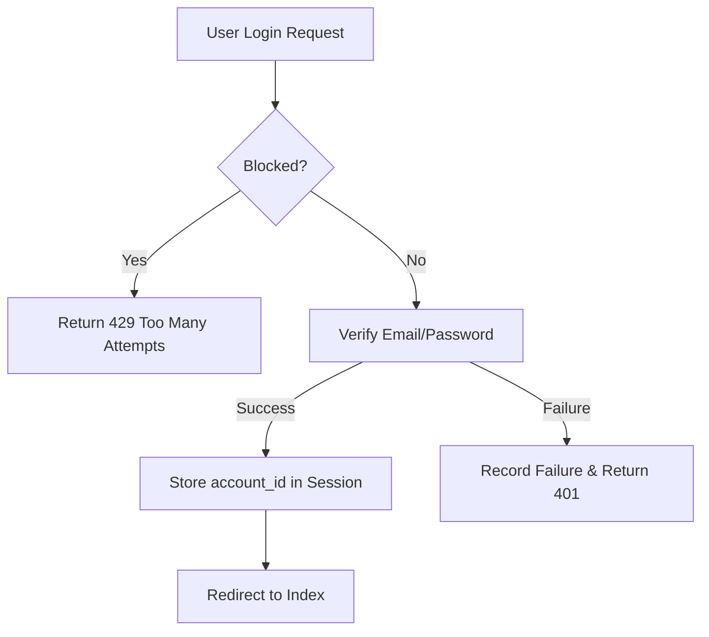
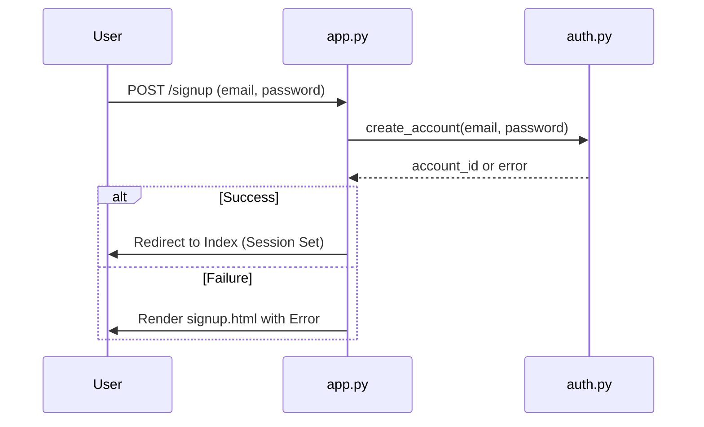

<details>
<summary>Relevant source files</summary>

The following files were used as context for generating this wiki page:

- [templates/login.html](templates/login.html)
- [templates/signup.html](templates/signup.html)
- [app.py](app.py)
- [CLAUDE.md](CLAUDE.md)
- [README.md](README.md)
</details>

# Authentication Views

Authentication in the Product Describer project is implemented as a multi-tenant system that allows individual users to sign up, log in, and manage their own isolated configurations. Each account is identified by an email and password, stored in a SQLite database, and acts as a boundary for API keys, jobs, and uploaded files.

The system enforces session-based security where every route (except for login and signup) requires an active session. This isolation ensures that the operator of the service does not become financially responsible for the API usage of other accounts, as every user must provide their own provider keys.

Sources: [CLAUDE.md:14-16](CLAUDE.md#L14-L16), [app.py:84-93](app.py#L84-L93)

## Core Authentication Logic

The authentication system is built using Flask's session management and a custom decorator to protect private routes. The primary identifier used throughout the application to scope data is the `account_id`.

### Login and Session Management
The login process validates user credentials against the database. Upon success, an `account_id` is stored in the Flask session. To prevent brute-force attacks, the system implements a throttling mechanism based on the user's email and IP address.



The diagram above illustrates the login flow, including security checks for rate limiting and credential verification.
Sources: [app.py:326-342](app.py#L326-L342), [templates/login.html:38-44](templates/login.html#L38-L44)

### Protected Routes
A `@login_required` decorator is applied to all sensitive endpoints. If a user attempts to access a protected route without a session, they are redirected to the login page or receive a 401 JSON error for API requests.

| Component | Description |
| :--- | :--- |
| `login_required` | A Python decorator that checks for `account_id` in the session. |
| `session["account_id"]` | Scopes provider config, jobs, and files to a specific user. |
| `FLASK_SECRET_KEY` | Environment variable used to sign the session cookie. |
| `SESSION_COOKIE_SAMESITE` | Set to 'Lax' to prevent cross-site request forgery (CSRF). |

Sources: [app.py:84-93](app.py#L84-L93), [app.py:73-77](app.py#L73-L77), [CLAUDE.md:65-68](CLAUDE.md#L65-L68)

## Account Management

The project supports self-service account creation. Users sign up with an email address and a password that must be at least 8 characters long.

### Signup Workflow
When a new account is created, the system may perform legacy data migration if it is the first account ever created in the instance. This ensures that global configurations from older versions of the software are assigned to the initial user.



The sequence diagram demonstrates the interaction between the Flask application and the authentication module during user registration.
Sources: [app.py:313-322](app.py#L313-L322), [templates/signup.html:36-42](templates/signup.html#L36-L42), [CLAUDE.md:69-71](CLAUDE.md#L69-L71)

### Multi-Tenancy Isolation
The application strictly enforces data isolation based on the authenticated `account_id`. This affects several subsystems:
*  **Provider Config**: Keys are stored per account in `config/accounts/<id>/credentials/`.
*  **Job Management**: Users can only view or download results for jobs they initiated.
*  **File Storage**: Uploads are partitioned by account ID in the file system.

Sources: [CLAUDE.md:52-54](CLAUDE.md#L52-L54), [app.py:465-470](app.py#L465-L470), [app.py:504-508](app.py#L504-L508)

## Security Configurations

The application enforces several security best practices regarding authentication and session handling:

*  **Cookie Security**: Sessions are protected using `HttpOnly` and `Secure` flags (unless explicitly disabled for local development).
*  **Encrypted API Keys**: User-provided API keys are encrypted at rest using Fernet (AES) with a `PROVIDER_CONFIG_MASTER_KEY`.
*  **Throttling**: Login attempts are tracked by email and remote address to mitigate automated attacks.

```python
# app.py:73-80
app.config["SESSION_COOKIE_SAMESITE"] = "Lax"
app.config["SESSION_COOKIE_SECURE"] = os.getenv("SESSION_COOKIE_SECURE", "1").lower() not in ("0", "false", "no", "")
app.config["SESSION_COOKIE_HTTPONLY"] = True
```

Sources: [app.py:73-80](app.py#L73-L80), [README.md:46-50](README.md#L46-L50), [app.py:330-333](app.py#L330-L333)

## Summary
The Authentication Views provide a robust gateway for the multi-tenant Product Describer system. By combining Flask session management, route protection decorators, and strict account-based data scoping, the system ensures that user data and API credits remain private and secure. Key features include brute-force protection through login throttling and mandatory encryption for external service credentials.
