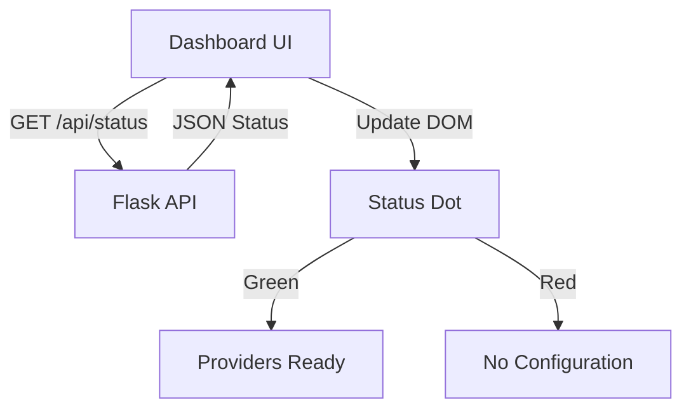
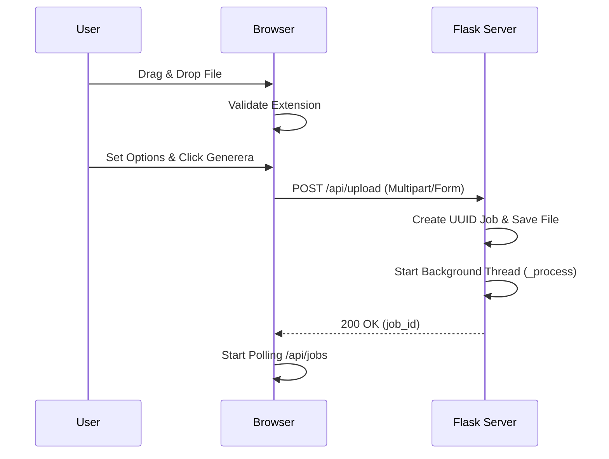
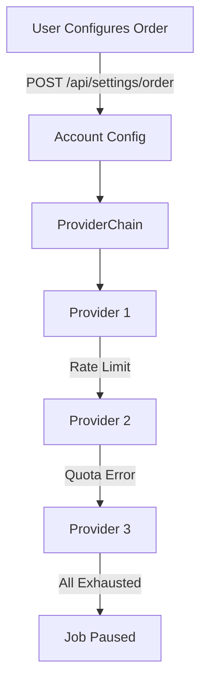

<details>
<summary>Relevant source files</summary>

The following files were used as context for generating this wiki page:

- [templates/index.html](templates/index.html)
- [app.py](app.py)
- [AGENTS.md](AGENTS.md)
- [CLAUDE.md](CLAUDE.md)
- [README.md](README.md)
- [prompts.py](prompts.py)
</details>

# User Dashboard UI

The User Dashboard UI is the primary web interface for the Product Describer application. It serves as a multi-tenant portal where authenticated users can upload product lists, configure AI provider credentials, and monitor the progress of background description generation jobs. The interface is built using a Flask backend and a responsive, dark-themed frontend that utilizes vanilla JavaScript for dynamic updates and asynchronous API interactions.

Sources: [app.py:127-133](app.py#L127-L133), [templates/index.html:1-10](templates/index.html#L1-L10), [README.md:15-25](README.md#L15-L25)

## UI Architecture and Navigation

The dashboard follows a Single Page Application (SPA) pattern for its core functionality, using a sticky navigation bar for branding and access to global settings. It features a theme toggle (light/dark mode) and a status indicator that reflects the connectivity and configuration state of the AI providers.

### Core Components
- **Navigation Bar:** Contains the application logo, AI status indicator, user identity, settings access, and logout functionality.
- **Main Content Area:** Organizes functional blocks into "Cards," including the file upload zone, job status table, and helpful usage tips.
- **Modals and Toasts:** Used for configuration settings and ephemeral notifications (success/error messages).

Sources: [templates/index.html:453-488](templates/index.html#L453-L488), [templates/index.html:565-592](templates/index.html#L565-L592)

### Navigation and Status Logic
The UI implements a polling mechanism to check the provider status via the `/api/status` endpoint. This updates the "status-dot" and "statusLabel" to inform the user if AI providers are correctly configured.



Sources: [templates/index.html:648-662](templates/index.html#L648-L662), [app.py:421-425](app.py#L421-L425)

## Product Upload and Job Configuration

The "Ladda upp produktlista" (Upload product list) section provides a drag-and-drop interface supporting various file formats (CSV, Excel, TXT, Word, PDF). Once a file is selected, the UI expands to reveal job customization options.

### Job Options
Users can fine-tune the AI's output through several parameters that are passed to the backend `build_system_prompt` logic.

| Option | Type | Values | Description |
| :--- | :--- | :--- | :--- |
| **Tone** | Dropdown | Saklig, Entusiastisk, Humoristisk, Lyxig | Sets the stylistic direction of the text. |
| **Length** | Dropdown | Kort, Medel, Lång | Controls the sentence count (1 to 3 per field). |
| **Audience** | Text Input | User-defined string | Tailors the justification to a specific target group. |
| **Custom Direction**| Textarea | User-defined instructions| Injects specific user requirements into the prompt. |
| **Workers** | Select | 1, 2, 4 | Number of parallel requests sent to AI providers. |

Sources: [templates/index.html:496-541](templates/index.html#L496-L541), [prompts.py:14-30](prompts.py#L14-L30)

### Upload Sequence
The UI handles file uploads asynchronously using `FormData` and the `fetch` API.



Sources: [templates/index.html:775-809](templates/index.html#L775-L809), [app.py:534-585](app.py#L534-L585)

## Job Monitoring and Management

The "Jobb" card displays a tabular view of all current and historical generation tasks associated with the user's account.

### Status Tracking
The UI polls `/api/jobs` every 4 seconds to update the progress bars and status badges. The system handles several job states:
- **Queued/Processing:** Shows an active progress bar with a shimmer animation.
- **Done:** Provides a "Ladda ner" (Download) button to retrieve the processed CSV.
- **Paused:** Occurs when all providers hit rate limits; the UI displays a tooltip with the expected `resume_at` time.
- **Error:** Displays a truncated error message describing the failure.

Sources: [templates/index.html:814-912](templates/index.html#L814-L912), [app.py:230-244](app.py#L230-L244)

### Progress Representation
| UI Element | Data Source | Logic |
| :--- | :--- | :--- |
| **Progress Bar** | `job.succeeded / job.total` | Percentage calculation for CSS width. |
| **Provider Column**| `job.provider` | Displays the name of the AI service currently in use. |
| **Action Button** | `job.output_file` | Becomes a download link once status is 'done'. |

Sources: [templates/index.html:847-870](templates/index.html#L847-L870), [app.py:603-616](app.py#L603-L616)

## Provider Settings and Failover Configuration

The Settings modal (`#settingsModal`) allows users to manage their AI credentials and the multi-provider failover sequence.

### Key Management
Users can enter API keys for Anthropic, OpenAI, Gemini, and Azure. For Azure, extra fields like "Endpoint" and "Deployment" are dynamically rendered based on the `EXTRA_FIELDS` configuration in `provider_config.py`. Keys are saved via `POST /api/settings/key`.

### Failover Order
The UI includes a drag-and-drop or arrow-controlled list to define the `ProviderChain` priority. If the primary provider (e.g., Claude) returns a rate limit error, the backend automatically fails over to the next provider in this user-defined list.



Sources: [templates/index.html:681-766](templates/index.html#L681-L766), [README.md:38-48](README.md#L38-L48), [app.py:476-490](app.py#L476-L490)

## Implementation Details

### Client-Side State
The dashboard persists user preferences (tone, length, audience) in `localStorage` to maintain consistency across sessions.

```javascript
// Example of options persistence
const OPTIONS_STORAGE_KEY = 'productOptions';
function saveOptionsToStorage() {
    const values = {};
    for (const id of OPTION_FIELDS) values[id] = document.getElementById(id).value;
    localStorage.setItem(OPTIONS_STORAGE_KEY, JSON.stringify(values));
}
```

Sources: [templates/index.html:936-953](templates/index.html#L936-L953)

### UI Security
- **Authentication:** All routes (except `/login` and `/signup`) are protected by a `@login_required` decorator, which also scopes job lookups to the `session["account_id"]`.
- **CSRF Protection:** The session cookie uses `SameSite=Lax` and `HttpOnly` flags to mitigate cross-site request forgery.
- **Key Safety:** API keys are encrypted at rest using the `PROVIDER_CONFIG_MASTER_KEY`.

Sources: [app.py:100-111](app.py#L100-L111), [app.py:127-142](app.py#L127-L142), [CLAUDE.md:65-72](CLAUDE.md#L65-L72)

The User Dashboard UI provides a robust and user-friendly interface for managing complex AI-driven workflows. By abstracting the complexities of provider failover, background threading, and file parsing into a clean web interface, it enables users to process large product datasets with minimal manual intervention.
