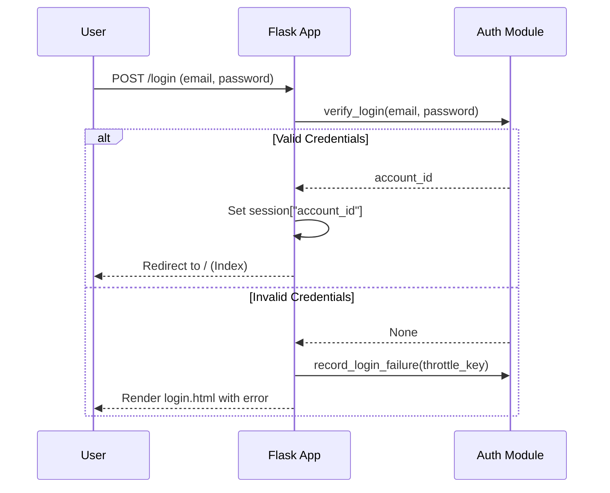
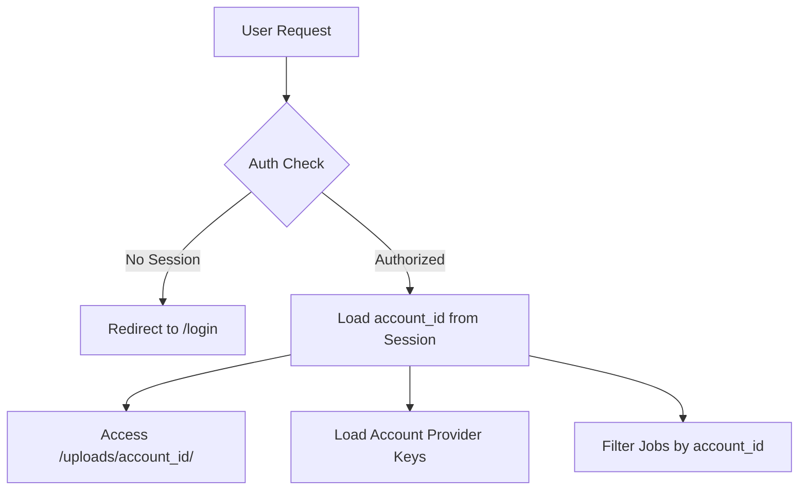

Relevant source files

The following files were used as context for generating this wiki page:

- [templates/login.html](templates/login.html)
- [templates/signup.html](templates/signup.html)
- [app.py](app.py)
- [CLAUDE.md](CLAUDE.md)
- [README.md](README.md)

# Authentication Views

Authentication Views in the Product Describer project facilitate a multi-tenant environment where users can register, log in, and manage their own isolated configurations. Each account is identified by an email and password, and once authenticated, users bring their own API keys for various LLM providers (Claude, OpenAI, Gemini, Azure). This ensures the system operator is not financially responsible for the API usage of individual users.

Sources: [CLAUDE.md:12-14](CLAUDE.md#L12-L14), [README.md:27-29](README.md#L27-L29)

The authentication system is built using Flask and utilizes session-based cookies to track logged-in users. Security is maintained through features like Fernet encryption for at-rest data and secure cookie configurations. Access control is enforced via a specialized decorator that protects routes from unauthorized access.

Sources: [app.py:65-72](app.py#L65-L72), [README.md:32-38](README.md#L32-L38)

## User Onboarding and Session Management

### Signup and Login Logic
The application provides standard forms for creating new accounts and accessing existing ones. During signup, the system requires an email and a password with a minimum length of 8 characters. For logins, the system implements a throttling mechanism to prevent brute-force attacks by blocking attempts after too many failures for a specific email and IP address combination.

Sources: [templates/signup.html:43-45](templates/signup.html#L43-L45), [app.py:321-325](app.py#L321-L325), [app.py:338-344](app.py#L338-L344)

### Session Security
Sessions are managed using a `FLASK_SECRET_KEY`. Cookies are configured with `SameSite=Lax` to mitigate CSRF risks and `HttpOnly` to prevent client-side script access. The `SESSION_COOKIE_SECURE` flag is enabled by default to ensure cookies are only transmitted over HTTPS, though it can be toggled for local development.

Sources: [app.py:65-72](app.py#L65-L72), [README.md:32-38](README.md#L32-L38)

The following sequence diagram illustrates the login flow and session establishment:

Sources: [app.py:335-353](app.py#L335-L353)

## Access Control and Multi-Tenancy

### The `login_required` Decorator
To protect sensitive endpoints, the system uses a `login_required` decorator. If a user attempts to access a protected route without an active session, they are redirected to the login page or receive a 401 Unauthorized response for API calls.

Sources: [app.py:75-84](app.py#L75-L84)

### Data Isolation
Multi-tenancy is achieved by scoping all operations to the `account_id` stored in the session. This includes:
*  **Provider Config**: API keys and failover orders are stored per account.
*  **Job Processing**: Jobs are linked to the account that started them.
*  **File Storage**: Uploaded files and generated outputs are kept in account-specific subdirectories.

Sources: [CLAUDE.md:58-62](CLAUDE.md#L58-L62), [app.py:421-424](app.py#L421-L424)

Sources: [app.py:75-84](app.py#L75-L84), [app.py:421-424](app.py#L421-L424), [CLAUDE.md:58-62](CLAUDE.md#L58-L62)

## Authentication API Endpoints

The following table summarizes the endpoints responsible for authentication and session management:

| Endpoint | Method | Description | Access |
| :--- | :--- | :--- | :--- |
| `/signup` | GET/POST | Displays the registration form and creates new user accounts. | Public |
| `/login` | GET/POST | Authenticates users and establishes the session cookie. | Public |
| `/logout` | POST | Clears the user session and redirects to the login page. | Public |
| `/api/status`| GET | Returns whether the current user has configured AI providers. | Authenticated |

Sources: [app.py:317-362](app.py#L317-L362), [app.py:372-376](app.py#L372-L376)

### Configuration Requirements
For the authentication and encryption systems to function, two environment variables must be defined:

*  `FLASK_SECRET_KEY`: Used to sign the session cookie.
*  `PROVIDER_CONFIG_MASTER_KEY`: Used to encrypt saved API keys at rest using Fernet.

Sources: [README.md:32-38](README.md#L32-L38)

## Conclusion
The Authentication Views provide the foundational security layer for the Product Describer, enabling a secure, multi-tenant environment. By combining session-based security, request throttling, and account-based data isolation, the system ensures that user data and LLM configurations remain private and protected while allowing users to leverage their own provider credentials.

Sources: [CLAUDE.md:12-14](CLAUDE.md#L12-L14), [app.py:65-72](app.py#L65-L72), [app.py:338-344](app.py#L338-L344)
