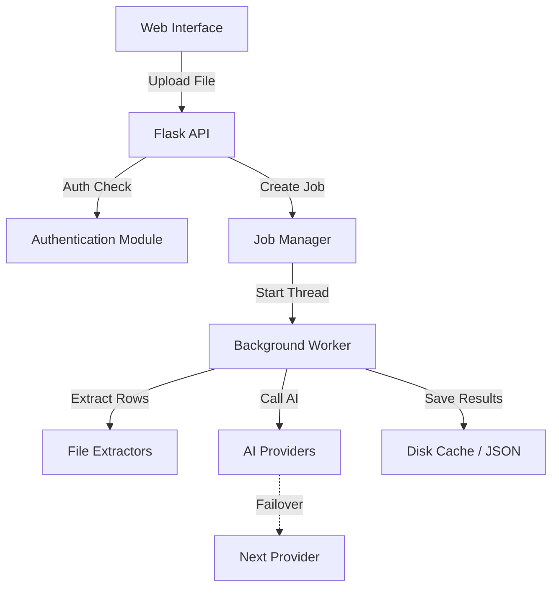
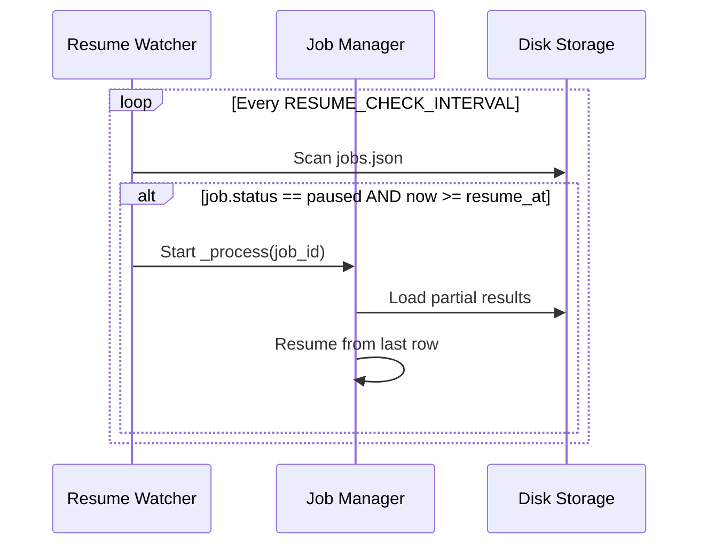

<details>
<summary>Relevant source files</summary>

The following files were used as context for generating this wiki page:

- [app.py](app.py)
- [main.py](main.py)
- [AGENTS.md](AGENTS.md)
- [CLAUDE.md](CLAUDE.md)
- [README.md](README.md)
- [prompts.py](prompts.py)
- [templates/index.html](templates/index.html)
</details>

# Flask Application Core

## Introduction
The Flask Application Core serves as the primary web-based interface and orchestration layer for the product-describer project. Its main purpose is to provide a multi-tenant environment where users can upload product lists in various formats (CSV, Excel, PDF, etc.) and generate Swedish product descriptions using AI providers like Anthropic, OpenAI, Google, and Azure OpenAI.

The core manages user authentication, background job processing, and provider configuration. It implements a robust failover system that automatically switches between AI providers when rate limits are reached and resumes paused jobs once quotas reset. The system is designed for persistence, caching partial results to disk to ensure no work is lost during service restarts or provider exhaustion.

Sources: [app.py:1-60](app.py#L1-L60), [README.md:1-50](README.md#L1-L50), [CLAUDE.md:1-25](CLAUDE.md#L1-L25)

## Application Architecture
The application follows a modular architecture where the Flask server acts as a coordinator between the frontend (HTML/JS), the authentication system, and the background processing threads.

### Component Overview
The following diagram illustrates the high-level flow of data from user interaction to AI processing.



The Flask application initializes with several critical background threads: a `resume-watcher` that checks for paused jobs ready to be restarted, and an optional `sync-worker` that integrates with external scraper APIs.

Sources: [app.py:55-75](app.py#L55-L75), [app.py:270-280](app.py#L270-L280), [AGENTS.md:15-30](AGENTS.md#L15-L30)

## Job Lifecycle and Background Processing
Jobs are handled asynchronously to prevent blocking the web server during long-running AI generations.

### State Transitions
When a user uploads a file via `/api/upload`, a unique `job_id` is generated, and a job object is stored in a global `_jobs` dictionary and persisted to `jobs.json`.

| Status | Description |
| :--- | :--- |
| `queued` | Job has been created and is waiting for a worker thread. |
| `processing` | Worker is currently generating descriptions using an AI provider. |
| `paused` | Job stopped because all providers reached rate limits; waiting for `resume_at`. |
| `done` | All rows processed and final CSV generated. |
| `error` | Processing failed due to an unhandled exception or missing configuration. |

Sources: [app.py:145-200](app.py#L145-L200), [app.py:440-470](app.py#L440-L470), [templates/index.html:1040-1055](templates/index.html#L1040-L1055)

### Resume and Persistence Logic
To ensure reliability, the core implements specific persistence mechanisms:
1. **Row Extraction Caching**: Extracted rows are saved to `outputs/{job_id}_rows.json`.
2. **Partial Results**: Each successful generation is saved to `outputs/{job_id}_partial.json` every 5 rows.
3. **Interrupted Jobs**: At startup, `_resume_interrupted_jobs()` scans for jobs left in `queued` or `processing` states and restarts them.



Sources: [app.py:100-130](app.py#L100-L130), [app.py:270-290](app.py#L270-L290), [CLAUDE.md:65-75](CLAUDE.md#L65-L75)

## API Endpoints
The Flask application provides a RESTful API for frontend interactions and job management.

### Authentication & Settings
| Endpoint | Method | Description |
| :--- | :--- | :--- |
| `/login` | `GET/POST` | User login with rate limiting. |
| `/signup` | `GET/POST` | New account creation. |
| `/api/settings` | `GET` | Retrieve configured providers and failover order. |
| `/api/settings/key`| `POST` | Save encrypted provider credentials. |

### Job Management
| Endpoint | Method | Description |
| :--- | :--- | :--- |
| `/api/upload` | `POST` | Uploads file, parses options, and starts a background job. |
| `/api/jobs` | `GET` | Lists all jobs associated with the logged-in `account_id`. |
| `/api/jobs/<id>` | `GET` | Returns real-time status and progress for a specific job. |
| `/api/jobs/<id>/download` | `GET` | Downloads the final CSV file. |

Sources: [app.py:310-350](app.py#L310-L350), [app.py:390-500](app.py#L390-L500)

## Security and Multi-tenancy
The core enforces strict multi-tenancy and data protection measures:
* **Account Scoping**: Every route (except login/signup) is protected by `@login_required`. All jobs and configurations are filtered by `session["account_id"]`.
* **Encryption**: API keys are encrypted at rest using a Fernet master key defined in `PROVIDER_CONFIG_MASTER_KEY`.
* **Session Safety**: Cookies use `SameSite=Lax`, `HTTPOnly`, and `Secure` flags to prevent CSRF and session hijacking.
* **PII Protection**: Sentry integration is configured with `send_default_pii=False` and `max_request_body_size="never"` to ensure product data never leaves the system.

Sources: [app.py:45-55](app.py#L45-L55), [app.py:77-95](app.py#L77-L95), [README.md:55-70](README.md#L55-L70), [CLAUDE.md:55-65](CLAUDE.md#L55-L65)

## Integration with Scraper (Sync Mode)
The application can run a specialized `sync-worker` thread if `SYNC_ENABLED` is set. This worker polls an external scraper API for products missing descriptions and processes them automatically.

```python
# app.py:530-550
def _sync_loop() -> None:
    while True:
        chain = provider_config.build_chain_from_env()
        products = fetch_products_missing_description(scraper_url, limit)
        if products:
            with concurrent.futures.ThreadPoolExecutor(max_workers=workers) as pool:
                futures = [pool.submit(_process_one, chain, p) for p in products]
                # ... process results and push back to scraper ...
        time.sleep(interval)
```

Sources: [app.py:520-565](app.py#L520-L565), [main.py:165-200](main.py#L165-L200), [README.md:95-110](README.md#L95-L110)

## Conclusion
The Flask Application Core is the central engine of the product-describer project, combining a user-friendly interface with a resilient background processing system. By leveraging multi-provider failover, persistent disk caching, and automated resume logic, it ensures high availability and data integrity for large-scale product description generation tasks.
