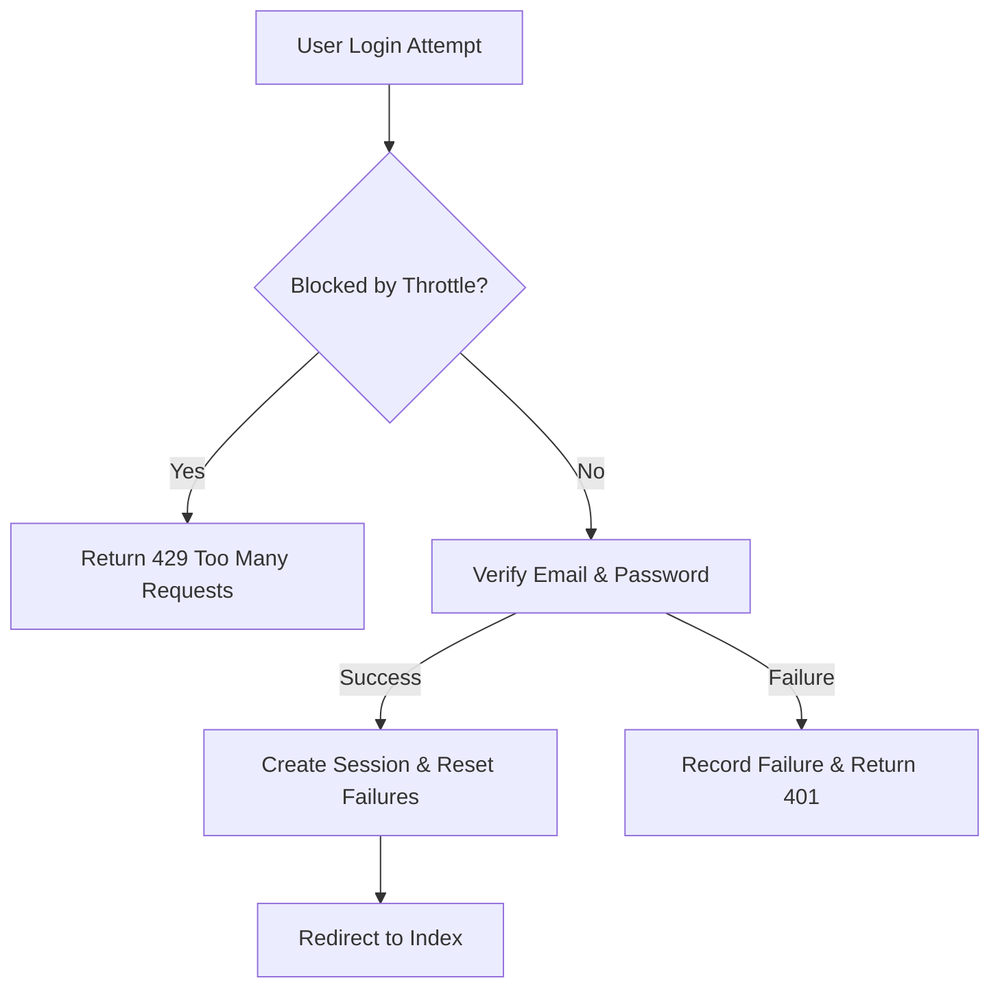
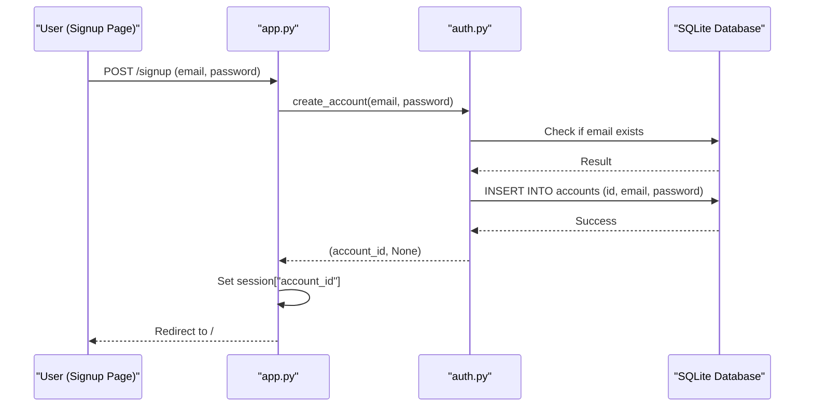
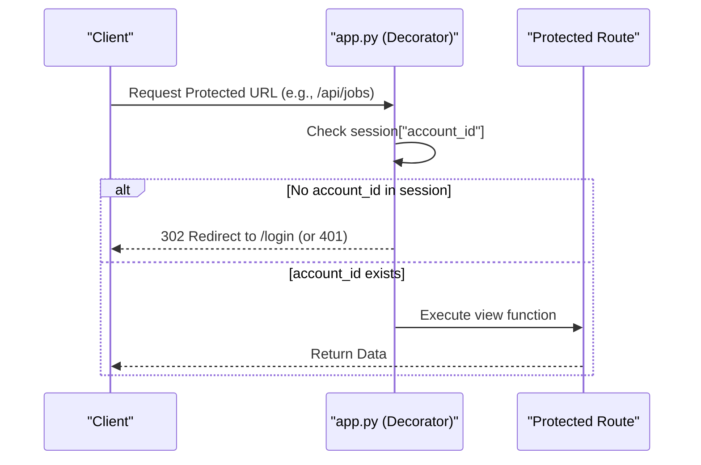

<details>
<summary>Relevant source files</summary>

The following files were used as context for generating this wiki page:

- [auth.py](auth.py)
- [app.py](app.py)
- [CLAUDE.md](CLAUDE.md)
- [README.md](README.md)
- [templates/login.html](templates/login.html)
- [templates/signup.html](templates/signup.html)

</details>

# Authentication Backend Implementation

## Introduction
The Authentication Backend Implementation in the `product-describer` project provides a multi-tenant environment where users can create accounts to manage their own AI provider keys and product description jobs. The system ensures that data, such as API keys and job history, is fully isolated per account ID, meaning the operator of the service does not become financially responsible for other users' API usage. Sources: [CLAUDE.md](CLAUDE.md), [README.md](README.md)

The backend is built using Python and Flask, utilizing SQLite for account storage. It supports standard email/password signup and login flows, session-based authentication, and includes security measures like login throttling to prevent brute-force attacks. Sources: [auth.py](auth.py), [app.py](app.py)

## Architecture and Components

The authentication system is comprised of a database layer (SQLite), a logic layer (`auth.py`), and a presentation/routing layer (`app.py`).

### Data Model
The system uses an `accounts` table in SQLite to store user credentials. The table includes a unique `id` (UUID), `email`, and a hashed `password`. 

| Field | Type | Description |
| :--- | :--- | :--- |
| id | TEXT | Primary Key, UUID unique identifier for the account |
| email | TEXT | Unique email address used for login |
| password | TEXT | Hashed password string |

Sources: [auth.py:20-25](auth.py#L20-L25)

### Logic and Security Flow
The authentication logic is abstracted into `auth.py`, which handles database interactions, password hashing, and login failure tracking.



Sources: [app.py:321-337](app.py#L321-L337), [auth.py:65-90](auth.py#L65-L90)

## Implementation Details

### Account Creation and Migration
When a new user signs up, the system checks if the email is already in use. If it is the first account ever created in the system, a migration process (`_migrate_legacy_data`) is triggered. This allows the first user to inherit any pre-existing global configurations (like API keys or jobs) that existed before the multi-tenant system was implemented. Sources: [auth.py:44-63](auth.py#L44-L63), [CLAUDE.md](CLAUDE.md)

### Session Management and Decorators
Authentication is enforced at the route level using a `login_required` decorator. This decorator checks for the presence of `account_id` in the Flask `session`. If absent, it redirects the user to the login page or returns a 401 JSON error for API requests. Sources: [app.py:82-92](app.py#L82-L92)

```python
def login_required(view):
    @functools.wraps(view)
    def wrapped(*args, **kwargs):
        if "account_id" not in session:
            if request.path.startswith("/api/"):
                return jsonify({"error": "Inte inloggad"}), 401
            return redirect(url_for("login"))
        sentry_sdk.set_user({"id": session["account_id"]})
        return view(*args, **kwargs)
    return wrapped
```

Sources: [app.py:82-92](app.py#L82-L92)

### Login Throttling
To prevent brute-force attacks, the system tracks failed login attempts using a `_login_failures` dictionary, keyed by a combination of the email and the remote IP address. After 5 failed attempts, the account is blocked for a cooldown period of 5 minutes. Sources: [auth.py:10-15](auth.py#L10-L15), [auth.py:76-90](auth.py#L76-L90)

| Configuration/Constant | Value | Description |
| :--- | :--- | :--- |
| MAX_LOGIN_ATTEMPTS | 5 | Max failed attempts before throttling |
| LOGIN_COOLDOWN_SEC | 300 | Duration of the block in seconds (5 min) |

Sources: [auth.py:11-12](auth.py#L11-L12)

## Sequence Diagrams

### User Signup Process
The following diagram illustrates the interaction between the User Interface, the Flask application, and the Authentication logic during signup.



Sources: [app.py:309-318](app.py#L309-L318), [auth.py:44-63](auth.py#L44-L63)

### Authentication Middleware (login_required)
The flow of the `login_required` decorator used to protect application routes.



Sources: [app.py:82-92](app.py#L82-L92)

## Security Configurations
The system requires specific environment variables to be set for the authentication and session management to function securely:

- **FLASK_SECRET_KEY**: Used to sign the login session cookie. It must be stable across restarts to prevent users from being logged out.
- **SESSION_COOKIE_SAMESITE**: Set to "Lax" to mitigate CSRF vectors on state-changing routes like logout or settings updates.
- **SESSION_COOKIE_HTTPONLY**: Set to `True` to prevent client-side script access to the session cookie.
- **SESSION_COOKIE_SECURE**: Controlled by the `SESSION_COOKIE_SECURE` environment variable; defaults to `True` to ensure cookies are only sent over HTTPS.

Sources: [app.py:68-75](app.py#L68-L75), [README.md](README.md)

## Summary
The Authentication Backend Implementation provides a robust, isolated, multi-tenant system for the `product-describer`. By utilizing SQLite for storage, implementing login throttling, and enforcing session-based access control via decorators, the system ensures that user data and API credits are protected. The inclusion of a legacy data migration path ensures that early adopters of the tool can seamlessly transition to the account-based model. Sources: [auth.py](auth.py), [app.py](app.py), [CLAUDE.md](CLAUDE.md)
