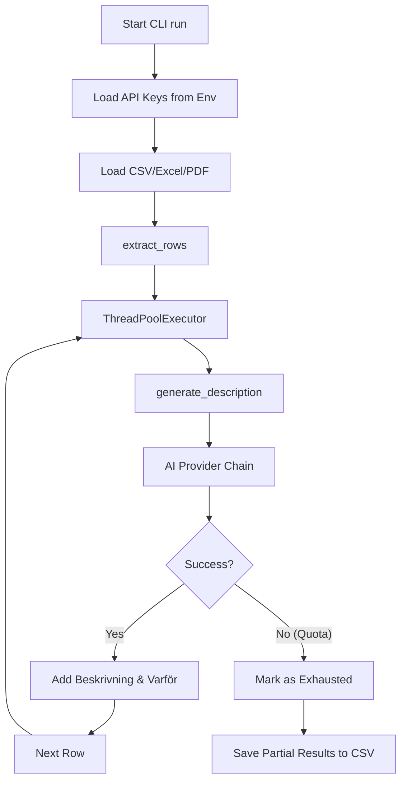
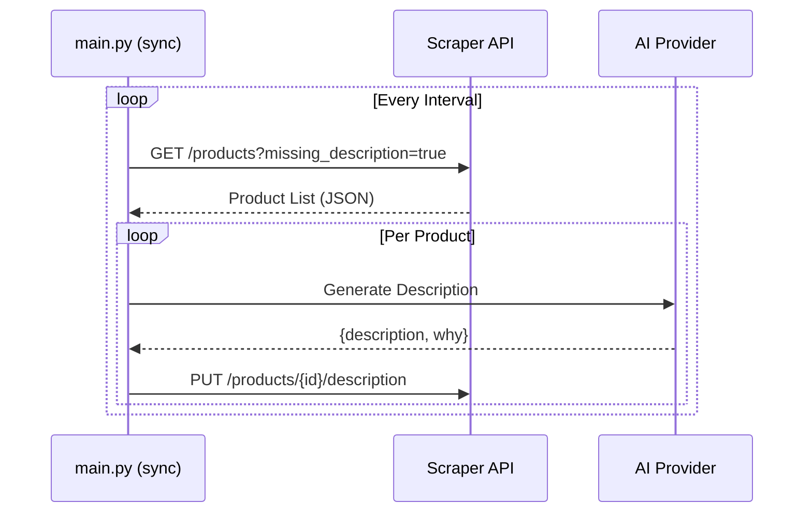

<details>
<summary>Relevant source files</summary>

The following files were used as context for generating this wiki page:

- [main.py](main.py)
- [tests/test_main.py](tests/test_main.py)
- [README.md](README.md)
- [AGENTS.md](AGENTS.md)
- [CLAUDE.md](CLAUDE.md)
- [docker-compose.yml](docker-compose.yml)
</details>

# Command Line Interface (CLI)

The Command Line Interface (CLI) for the Product Describer project provides a standalone mechanism for generating Swedish product descriptions and justifications using various AI providers. Unlike the multi-tenant web UI, the CLI operates independently of the account system, instead reading API credentials directly from environment variables.

The CLI supports two primary operational modes: a batch execution mode (**run**) for processing local files (CSV, Excel, TXT, DOCX, PDF) and an integration mode (**sync**) for communicating with an external scraper API. It leverages a "Provider Chain" to handle automatic failover between AI models when rate limits or quotas are reached.

Sources: [main.py:11-15](main.py#L11-L15), [CLAUDE.md:14-16](CLAUDE.md#L14-L16), [README.md:37-41](README.md#L37-L41)

## Command Structure and Usage

The CLI is implemented as a Python script (`main.py`) using `argparse` to manage subcommands and arguments.

### Global Configuration
CLI operations require API keys to be set as environment variables. This differentiates the CLI from the Web UI, where keys are stored in an encrypted JSON blob per account.

| Environment Variable | Description |
| :--- | :--- |
| `ANTHROPIC_API_KEY` | Key for Claude models |
| `OPENAI_API_KEY` | Key for ChatGPT models |
| `GEMINI_API_KEY` | Key for Google Gemini models |
| `AZURE_OPENAI_API_KEY` | Key for Azure OpenAI Service |
| `SCRAPER_URL` | URL for the external scraper API (Default: `http://scraper:8000`) |
| `SCRAPER_API_KEY` | Secret key for scraper API authentication |

Sources: [main.py:22-24](main.py#L22-L24), [README.md:37-41](README.md#L37-L41), [AGENTS.md:50-54](AGENTS.md#L50-L54)

### Subcommands

The CLI defines two main subcommands: `run` and `sync`.

#### 1. The `run` Command
Used for batch processing local files. It extracts product data, generates descriptions in parallel, and saves the result to a new CSV file.

```bash
python main.py run <input_file> [--output <out.csv>] [--workers <int>]
```

| Argument | Description | Default |
| :--- | :--- | :--- |
| `input` | Path to the source file (CSV, Excel, .txt, .docx, or .pdf) | Required |
| `--output` | Path for the resulting CSV file | `<input>_med_beskrivning.csv` |
| `--workers` | Number of parallel threads for AI requests | 2 |

Sources: [main.py:225-230](main.py#L225-L230), [README.md:23-24](README.md#L23-L24), [AGENTS.md:36-37](AGENTS.md#L36-L37)

#### 2. The `sync` Command
Integrates with the [scraper](https://github.com/blixten85/scraper) project to process products missing descriptions.

```bash
python main.py sync [--watch] [--interval <int>] [--limit <int>] [--workers <int>]
```

| Argument | Description | Default |
| :--- | :--- | :--- |
| `--scraper-url` | The base URL of the scraper API | `http://scraper:8000` |
| `--limit` | Maximum number of products to fetch per iteration | 50 |
| `--watch` | Enable continuous looping mode | False |
| `--interval` | Seconds to wait between loops (requires `--watch`) | 300 |
| `--workers` | Parallel threads for processing | 2 |

Sources: [main.py:232-238](main.py#L232-L238), [README.md:73-77](README.md#L73-L77)

## Core Logic and Data Flow

The CLI follows a structured execution path depending on the chosen subcommand. Both paths share the `ProviderChain` logic for AI interaction.

### Batch Execution Flow (`run`)
When executing a batch run, the system loads rows using `extractors.py` and processes them via a `ThreadPoolExecutor`.



The `run` command provides real-time progress updates, including a rate (items/second) and an Estimated Time of Arrival (ETA).
Sources: [main.py:84-138](main.py#L84-L138), [tests/test_main.py:23-33](tests/test_main.py#L23-L33)

### Sync Integration Flow (`sync`)
The sync command facilitates a bidirectional data flow with the scraper API.



Sources: [main.py:168-212](main.py#L168-L212), [README.md:57-60](README.md#L57-L60)

## Internal Components

### Provider Initialization
The CLI uses `provider_config.build_chain_from_env()` to initialize the AI connection. It checks for the presence of specific environment variables and raises a `RuntimeError` if no provider is configured.
Sources: [main.py:72-82](main.py#L72-L82)

### Data Extraction and Processing
The CLI processes unstructured data (PDF/Docx) by automatically identifying items mentioned. For structured data (CSV), it maps specific columns:
*  **Input columns**: `Site`, `Product`, `Price (SEK)`
*  **Output columns**: `Beskrivning`, `Varför`

Sources: [main.py:31-37](main.py#L31-L37), [README.md:20-22](README.md#L20-L22), [tests/test_main.py:12-19](tests/test_main.py#L12-L19)

### Error Handling and Failover
The CLI handles the `AllProvidersExhausted` exception. In `run` mode, if a quota limit is hit, the process terminates early but saves whatever rows were successfully completed. In `sync` mode, it logs a warning and waits for the next cycle.
Sources: [main.py:116-120](main.py#L116-L120), [main.py:186-191](main.py#L186-L191), [AGENTS.md:76-78](AGENTS.md#L76-L78)

## Docker Integration
The `sync` mode is frequently executed as a separate background container service.

```yaml
sync:
  image: ghcr.io/blixten85/product-describer:latest
  command: ["python", "main.py", "sync", "--watch"]
  environment:
    SCRAPER_URL: ${SCRAPER_URL:-http://scraper:8000}
```

Sources: [docker-compose.yml:19-25](docker-compose.yml#L19-L25), [README.md:62-67](README.md#L62-L67)

## Summary
The CLI serves as the high-performance engine of the Product Describer. It is designed for environment-driven configuration, making it suitable for automated pipelines and server-side background tasks where the multi-tenant web account system is not required. By utilizing a threaded execution model and a robust failover chain, it ensures resilient processing of large product catalogs.
