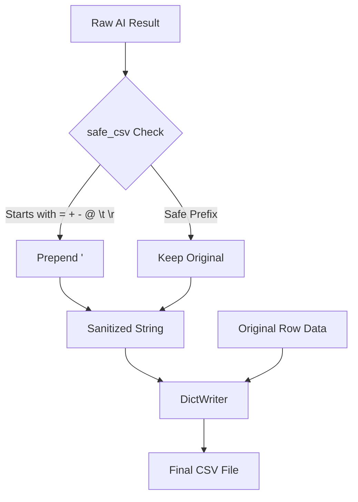
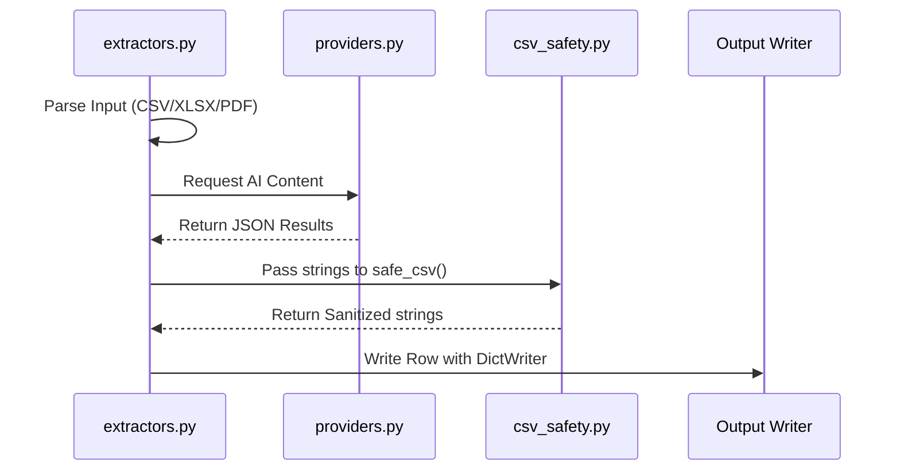

<details>
<summary>Relevant source files</summary>

The following files were used as context for generating this wiki page:

- [csv_safety.py](csv_safety.py)
- [main.py](main.py)
- [app.py](app.py)
- [extractors.py](extractors.py)
- [providers.py](providers.py)
- [AGENTS.md](AGENTS.md)
</details>

# CSV Generation & Output Safety

## Introduction
The **CSV Generation & Output Safety** module in the `product-describer` project is responsible for the structured creation of output files and the mitigation of security risks associated with CSV file formats. As the system integrates AI-generated content (descriptions and justifications) into tabular data, it must ensure that the resulting files are both technically valid and safe for use in spreadsheet applications like Microsoft Excel or Google Sheets.

The primary safety concern addressed is **CSV Formula Injection**, where AI-generated text starting with specific characters could be interpreted as an executable formula by spreadsheet software. This module centralizes sanitization logic to protect users across both the Web UI and CLI interfaces.

Sources: [csv_safety.py:1-4](csv_safety.py#L1-L4), [AGENTS.md:1-8](AGENTS.md#L1-L8)

## Core Sanitization Logic
The system implements a specialized safety utility to sanitize strings before they are written to a CSV file. This is crucial because AI models may occasionally produce output that begins with characters that trigger formula execution in spreadsheet programs.

### Formula Injection Mitigation
The `safe_csv` function identifies dangerous prefixes and escapes them by prepending a single quote (`'`). This ensures the spreadsheet software treats the cell content as literal text rather than a functional expression.

The following table describes the characters identified as dangerous:

| Character | Description | Action Taken |
| :--- | :--- | :--- |
| `=` | Equals sign (Formula start) | Prepend `'` |
| `+` | Plus sign | Prepend `'` |
| `-` | Minus sign | Prepend `'` |
| `@` | At symbol | Prepend `'` |
| `\t` | Tab | Prepend `'` |
| `\r` | Carriage return | Prepend `'` |

Sources: [csv_safety.py:6-14](csv_safety.py#L6-L14)

```python
# From csv_safety.py:12-14
def safe_csv(value: str) -> str:
    """Prefixes dangerous leading characters so a spreadsheet program 
    doesn't interpret the cell as a formula."""
    return "'" + value if _FORMULA_PREFIX.match(value) else value
```

## CSV Generation Workflow
CSV generation occurs at the final stage of a processing job. The system aggregates original product data with new AI-generated columns: `Beskrivning` (Description) and `Varför` (Why).

### Processing and Assembly Flow
Whether running via the Web UI (`app.py`) or the CLI (`main.py`), the generation process follows a similar sequence:
1. **Data Retrieval:** Original rows are loaded from the source file or internal cache.
2. **Result Mapping:** AI-generated results are mapped back to their corresponding rows via indices.
3. **Sanitization:** Every generated value is passed through `safe_csv` before insertion.
4. **Writing:** The final rows are written to disk using `csv.DictWriter`.

The following diagram illustrates the data flow from raw AI output to a safe CSV file:



Sources: [main.py:126-135](main.py#L126-L135), [app.py:236-249](app.py#L236-L249), [csv_safety.py:9](csv_safety.py#L9)

### Output File Structure
The generated CSV file extends the input schema by appending two specific columns.

| Feature | Details |
| :--- | :--- |
| **New Columns** | `Beskrivning`, `Varför` |
| **Encoding** | `utf-8` |
| **Line Terminator** | Standard newline (`\n`) with `newline=""` for CSV compliance |
| **Writer Class** | `csv.DictWriter` |

Sources: [main.py:125-131](main.py#L125-L131), [app.py:237-241](app.py#L237-L241)

## Integration Points
The safety logic is shared across the two main execution paths of the application to ensure consistent behavior.

### Web UI Implementation (`app.py`)
In the Flask application, the `_finish_job` function handles the finalization of a background task. It creates an output file in the `outputs/` directory and performs the sanitization before cleaning up temporary job files.
Sources: [app.py:233-255](app.py#L233-L255)

### CLI Implementation (`main.py`)
In CLI mode, the `cmd_run` function manages the output. It determines the output filename (defaulting to `<input>_med_beskrivning.csv`) and applies the same sanitization logic as the web path.
Sources: [main.py:124-135](main.py#L124-L135)

## Dependency on Extractors
The CSV generation relies on `extractors.py` to initially interpret the input file structure. If the input is a structured CSV, it is parsed directly. If it is unstructured (PDF/DOCX), the AI creates the initial row structure which is later populated and secured during the generation phase.



Sources: [extractors.py:46-60](extractors.py#L46-L60), [main.py:133-134](main.py#L133-L134)

## Summary
CSV Generation & Output Safety ensures that the final product of the AI pipeline is not only accurate in content but also secure for end-user consumption. By centralizing the `safe_csv` logic, the project maintains a consistent security posture, preventing AI-generated strings from inadvertently becoming malicious spreadsheet formulas. This robust handling allows users to safely download and open processed files in standard office software without risk of formula injection.
