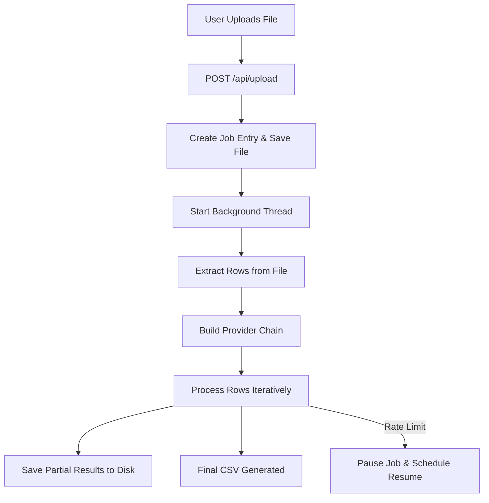
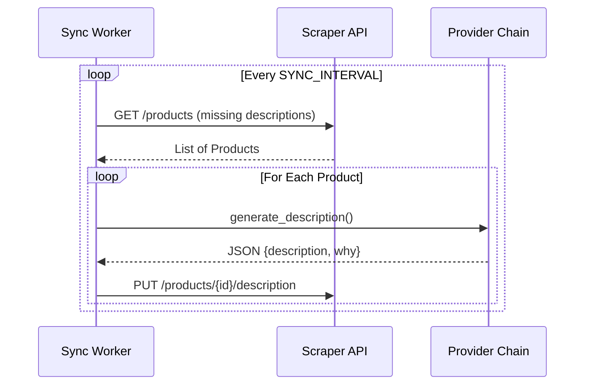

<details>
<summary>Relevant source files</summary>

The following files were used as context for generating this wiki page:

- [app.py](app.py)
- [main.py](main.py)
- [AGENTS.md](AGENTS.md)
- [CLAUDE.md](CLAUDE.md)
- [README.md](README.md)
- [prompts.py](prompts.py)
</details>

# Flask Application Core

## Introduction
The Flask Application Core serves as the central hub for the product-describer project, providing a web-based user interface and a background job execution engine. Its primary purpose is to facilitate the generation of Swedish product descriptions and justifications using various AI providers (Anthropic, OpenAI, Google, and Azure). The application supports multi-tenancy, allowing individual users to manage their own API credentials and jobs in isolation.

Sources: [AGENTS.md:3-10](AGENTS.md#L3-L10), [CLAUDE.md:12-14](CLAUDE.md#L12-L14), [app.py:59-65](app.py#L59-L65)

The core system manages the lifecycle of a description generation job, from file upload and row extraction to background processing with automatic failover and persistence. It integrates with external scraper APIs for automated synchronization and provides a RESTful API for frontend interactions.

Sources: [app.py:171-180](app.py#L171-L180), [README.md:53-62](README.md#L53-L62), [CLAUDE.md:18-28](CLAUDE.md#L18-L28)

## System Architecture

The Flask application is structured to handle concurrent web requests while managing long-running background tasks. It utilizes a threading-based approach for job processing and periodic maintenance.

### Core Components
| Component | Description |
| :--- | :--- |
| **Flask Server** | Handles routing, authentication, and API endpoints. |
| **Job Runner** | A background execution logic that processes product rows using a `ProviderChain`. |
| **Resume Watcher** | A daemon thread that monitors paused jobs and restarts them when quotas reset. |
| **Sync Worker** | An optional background worker that polls external APIs for products missing descriptions. |
| **Authentication** | Multi-tenant system using SQLite for account management and session-based access. |

Sources: [app.py:32-40](app.py#L32-L40), [app.py:270-280](app.py#L270-L280), [CLAUDE.md:21-25](CLAUDE.md#L21-L25)

### Job Processing Flow
When a user uploads a file, the system creates a unique job and initiates a background thread for processing. This prevents the web request from timing out during lengthy AI generation tasks.



Sources: [app.py:441-482](app.py#L441-L482), [app.py:171-230](app.py#L171-L230)

## Job Management and Persistence

Job state is managed through a combination of in-memory dictionaries protected by thread locks and JSON-based disk persistence. This ensures that job progress is not lost during application restarts.

### Data Persistence Structures
The application uses specific files for different types of job data:
- `jobs.json`: Metadata for all jobs (status, timestamps, file paths).
- `{job_id}_rows.json`: The raw extracted product data from the input file.
- `{job_id}_partial.json`: Intermediate results for each row to allow resumption.

Sources: [app.py:84-86](app.py#L84-L86), [app.py:126-150](app.py#L126-L150)

### Automated Maintenance
The core includes a `_purge_old_jobs` function that removes completed or failed jobs older than a configurable retention period (defaulting to 30 days) to manage disk space.

Sources: [app.py:249-267](app.py#L249-L267)

## API Endpoints

The Flask Application Core exposes several API endpoints to the frontend for managing jobs and settings.

### Job Endpoints
| Endpoint | Method | Description |
| :--- | :--- | :--- |
| `/api/upload` | POST | Accepts files and starts a background generation job. |
| `/api/jobs` | GET | Returns a list of jobs associated with the current user account. |
| `/api/jobs/<job_id>` | GET | Returns detailed status and progress for a specific job. |
| `/api/jobs/<job_id>/download` | GET | Downloads the final CSV file for a completed job. |

Sources: [app.py:441-507](app.py#L441-L507)

### Settings & Provider Configuration
Users configure their AI provider keys through the following endpoints:
- `GET /api/settings`: Retrieves current provider configurations and available models.
- `POST /api/settings/key`: Saves or updates an encrypted API key for a provider.
- `POST /api/settings/order`: Sets the priority order for provider failover.

Sources: [app.py:377-438](app.py#L377-L438)

## Security and Authentication

The core enforces strict security measures to protect user data and API credentials.

### Authentication Logic
Most routes are protected by the `@login_required` decorator. This decorator checks for an `account_id` in the session and integrates with Sentry for user-specific error tracking.

```python
# app.py:101-111
def login_required(view):
    @functools.wraps(view)
    def wrapped(*args, **kwargs):
        if "account_id" not in session:
            if request.path.startswith("/api/"):
                return jsonify({"error": "Inte inloggad"}), 401
            return redirect(url_for("login"))
        sentry_sdk.set_user({"id": session["account_id"]})
        return view(*args, **kwargs)
    return wrapped
```

### Data Protection
- **Encryption**: API keys are stored as encrypted-at-rest JSON blobs using Fernet encryption with the `PROVIDER_CONFIG_MASTER_KEY`.
- **Isolation**: Jobs, configuration, and files are scoped strictly to the `account_id` found in the user session.
- **Session Safety**: Cookies use `SameSite=Lax` and `HttpOnly` flags. The `SESSION_COOKIE_SECURE` flag is enabled by default.

Sources: [app.py:91-98](app.py#L91-L98), [CLAUDE.md:55-65](CLAUDE.md#L55-L65), [AGENTS.md:46-51](AGENTS.md#L46-L51)

## External Integrations

### Scraper API Sync
The Flask core can run a "Sync Worker" thread if enabled via environment variables. This worker polls an external scraper API, processes products, and pushes results back.



Sources: [app.py:510-539](app.py#L510-L539), [main.py:102-140](main.py#L102-L140)

### Error Reporting
Unexpected exceptions are caught by a global error handler which logs the incident and, if configured, reports it to a GitHub repository as a tagged issue via `report_error_to_github`.

Sources: [app.py:114-129](app.py#L114-L129), [CLAUDE.md:73-77](CLAUDE.md#L73-L77)

## Conclusion
The Flask Application Core provides a robust foundation for the product-describer tool, combining a user-friendly interface with a resilient background processing system. Its focus on multi-tenancy, data persistence, and automatic provider failover ensures that large-scale product description tasks can be handled efficiently and securely.
