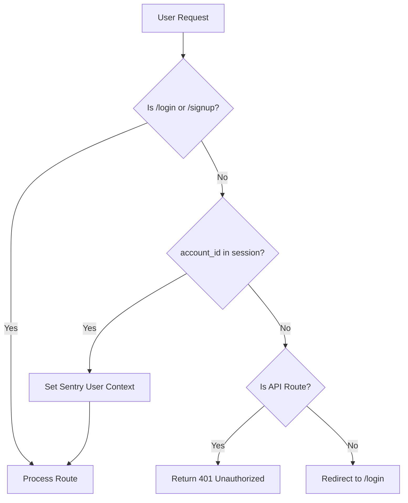
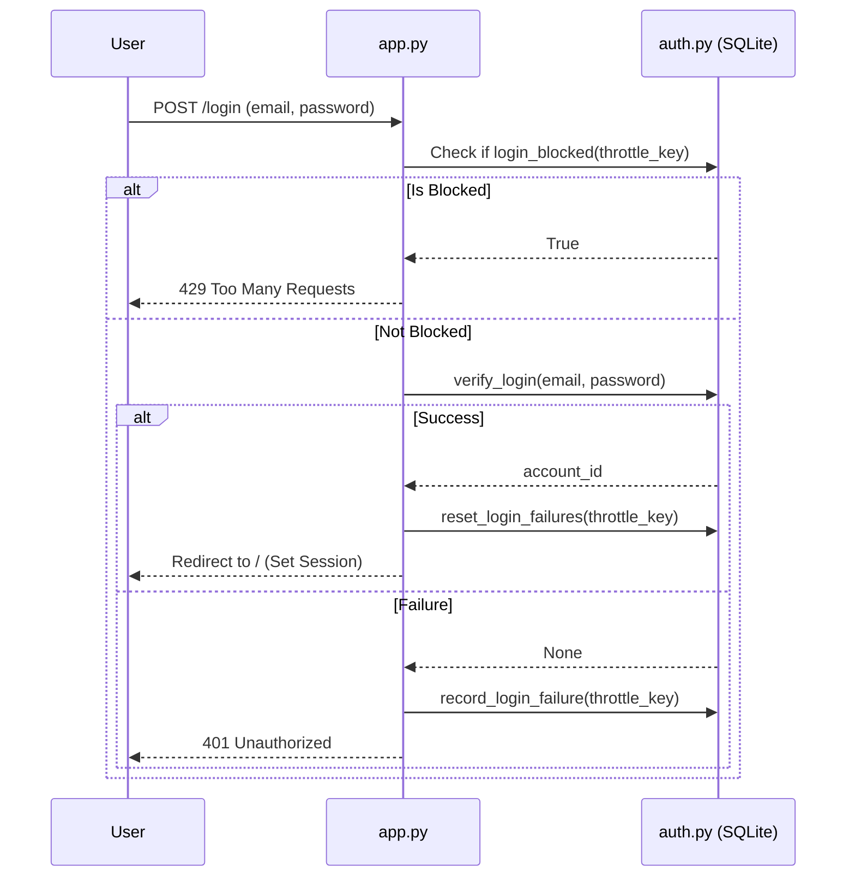

Relevant source files

The following files were used as context for generating this wiki page:

- [auth.py](auth.py)
- [app.py](app.py)
- [CLAUDE.md](CLAUDE.md)
- [README.md](README.md)
- [templates/login.html](templates/login.html)
- [templates/signup.html](templates/signup.html)

# Authentication Backend Implementation

The Authentication Backend Implementation in the `product-describer` project provides a multi-tenant environment where users can sign up, log in, and manage isolated configurations. The system ensures that each account is financially and operationally separate by requiring users to provide their own API keys for LLM providers like Claude, OpenAI, and Gemini.

The backend is built using Flask and leverages a SQLite database for account management. It includes security features such as session-based authentication, password hashing, and login throttling to prevent brute-force attacks.

Sources: [CLAUDE.md](CLAUDE.md), [README.md](README.md)

## Core Architecture and Data Flow

The authentication system is integrated directly into the Flask application structure. It utilizes a dedicated module, `auth.py`, to handle database interactions and credential verification, while `app.py` manages the web routing and session state.

### Authentication Flow
When a user attempts to access a protected route, the `login_required` decorator checks for an `account_id` in the Flask session. If missing, the user is redirected to the login page.

Sources: [app.py:101-112](app.py#L101-L112)

### Account Isolation
Multi-tenancy is achieved by scoping all user data—including jobs, provider configurations, and file uploads—to the `account_id` stored in the session. This prevents users from accessing or modifying data belonging to other accounts.

Sources: [CLAUDE.md](CLAUDE.md)

## Authentication Components

### Data Model and Storage
The system uses SQLite to store account information. Key fields include the user's email, hashed password, and a unique identifier.

| Field | Type | Description |
| :--- | :--- | :--- |
| `account_id` | UUID/String | Primary identifier for scoping user data. |
| `email` | String | User's unique email address. |
| `password_hash` | String | Securely hashed password. |

Sources: [auth.py](auth.py), [CLAUDE.md](CLAUDE.md)

### Key Functions and Logic
The `auth.py` module contains the core logic for managing account lifecycles:

*  **`create_account(email, password)`**: Validates inputs, hashes the password, and inserts a new record into the database. It returns the `account_id` or an error message.
*  **`verify_login(email, password)`**: Compares provided credentials against stored hashes.
*  **`login_blocked(throttle_key)`**: Checks if a specific IP/Email combination is currently throttled due to failed attempts.

Sources: [auth.py](auth.py), [app.py:279-312](app.py#L279-L312)

## Security Implementation

### Session Management
Flask sessions are secured using a `FLASK_SECRET_KEY`, which must be provided as an environment variable. Cookies are configured with security flags to mitigate common web vulnerabilities.

| Configuration | Value | Description |
| :--- | :--- | :--- |
| `SESSION_COOKIE_SAMESITE` | `Lax` | Prevents CSRF on state-changing routes. |
| `SESSION_COOKIE_SECURE` | Dependent on ENV | Set to `True` if TLS is enabled (default). |
| `SESSION_COOKIE_HTTPONLY` | `True` | Prevents JavaScript access to session cookies. |

Sources: [app.py:84-93](app.py#L84-L93)

### Login Throttling
To defend against brute-force attacks, the backend implements a throttling mechanism based on a combination of the user's email and their remote IP address.

Sources: [app.py:293-312](app.py#L293-L312)

### API Key Protection
API keys for providers (Claude, OpenAI, etc.) are saved as encrypted-at-rest JSON blobs using the Fernet (cryptography) library. This requires a `PROVIDER_CONFIG_MASTER_KEY` to be set in the environment.

Sources: [CLAUDE.md](CLAUDE.md), [README.md](README.md)

## Account Management Endpoints

The following table summarizes the primary authentication-related routes implemented in the backend:

| Endpoint | Method | Access | Description |
| :--- | :--- | :--- | :--- |
| `/signup` | GET/POST | Public | Handles new account creation. |
| `/login` | GET/POST | Public | Handles user authentication and session creation. |
| `/logout` | POST | Authenticated | Clears the user session. |
| `/api/status` | GET | Authenticated | Returns the configuration readiness for the current account. |

Sources: [app.py:279-330](app.py#L279-L330)

## Conclusion
The Authentication Backend Implementation provides a robust foundation for multi-tenant operation. By combining Flask session management with account-scoped data isolation and encrypted configuration storage, the system ensures that individual users can safely manage their own AI provider credentials and processing jobs without cross-account interference.

Sources: [CLAUDE.md](CLAUDE.md), [app.py](app.py)
