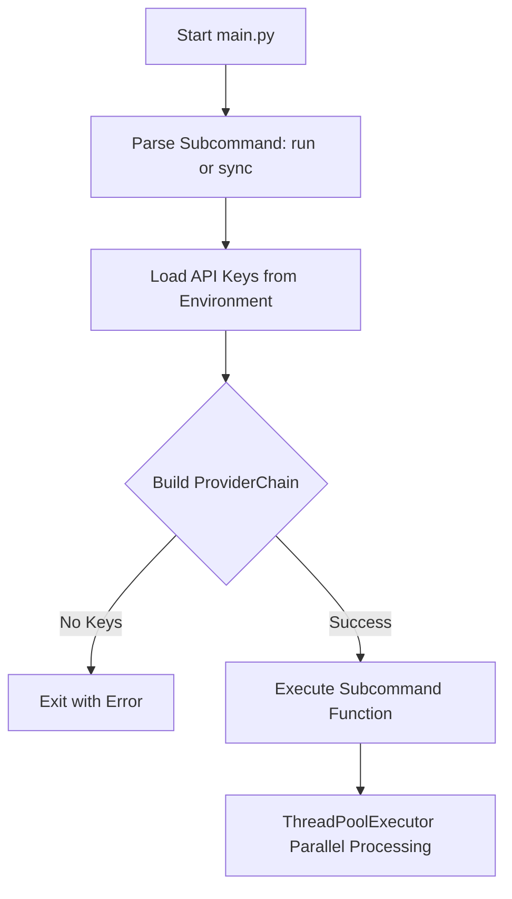
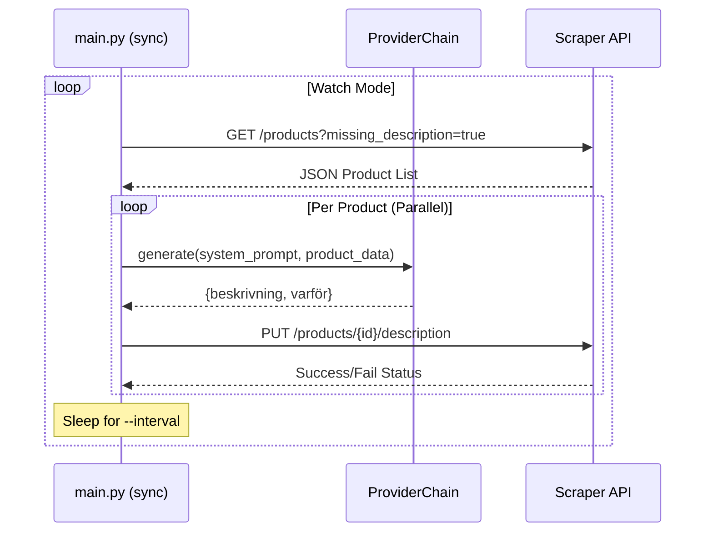

<details>
<summary>Relevant source files</summary>

The following files were used as context for generating this wiki page:

- [main.py](main.py)
- [AGENTS.md](AGENTS.md)
- [CLAUDE.md](CLAUDE.md)
- [README.md](README.md)
- [tests/test_main.py](tests/test_main.py)
- [docker-compose.yml](docker-compose.yml)
</details>

# Command Line Interface (CLI)

The Command Line Interface (CLI) for the Product Describer project provides a robust, developer-centric entry point for processing product descriptions in batch or via synchronization with external APIs. Unlike the web-based UI, the CLI operates independently of the multi-tenant account system, utilizing environment variables for provider authentication.

The CLI supports two primary operational modes: a batch "run" mode for processing local files (CSV, Excel, TXT, DOCX, PDF) and a "sync" mode designed to integrate with the [Scraper API](https://github.com/blixten85/scraper). It leverages parallel processing and the project's core provider failover engine to ensure high throughput and reliability.

Sources: [main.py:1-12](main.py#L1-L12), [README.md:25-30](README.md#L25-L30), [CLAUDE.md:14-16](CLAUDE.md#L14-L16)

## Architecture and Command Structure

The CLI is implemented as a Python script (`main.py`) using the `argparse` module to define subcommands and arguments. It acts as a wrapper around the core logic located in `providers.py` and `extractors.py`.

### Execution Flow
The following diagram illustrates the initialization and execution flow of the CLI:



The CLI mandates that at least one AI provider is configured via environment variables. If no keys (e.g., `ANTHROPIC_API_KEY`) are detected, the system exits with a diagnostic message.

Sources: [main.py:223-255](main.py#L223-L255), [main.py:102-111](main.py#L102-L111), [AGENTS.md:52-54](AGENTS.md#L52-L54)

## Subcommands and Usage

The CLI supports two distinct subcommands, each tailored for specific workflows.

### The `run` Command
The `run` command is used for one-shot batch processing of local files. It extracts product data, sends requests to the configured AI provider chain, and generates an output CSV file with added "Beskrivning" (Description) and "Varför" (Why) columns.

| Argument | Type | Default | Description |
| :--- | :--- | :--- | :--- |
| `input` | Position | N/A | Path to the source file (CSV, XLSX, TXT, DOCX, PDF) |
| `--output` | Optional | `input_med_beskrivning.csv` | Path for the resulting CSV file |
| `--workers` | Optional | 2 | Number of parallel threads for processing |

Sources: [main.py:237-242](main.py#L237-L242), [main.py:114-167](main.py#L114-L167)

### The `sync` Command
The `sync` command facilitates integration with an external scraper service. It fetches products missing descriptions via a GET request and pushes generated content back via a PUT request.

| Argument | Type | Default | Description |
| :--- | :--- | :--- | :--- |
| `--scraper-url`| Optional | `http://scraper:8000` | Base URL of the scraper service |
| `--limit` | Optional | 50 | Max products to process per cycle |
| `--watch` | Optional | False | If set, the script loops indefinitely |
| `--interval` | Optional | 300 | Wait time (seconds) between loops in watch mode |
| `--workers` | Optional | 2 | Number of parallel threads |

Sources: [main.py:244-251](main.py#L244-L251), [main.py:186-220](main.py#L186-L220)

## Synchronization Logic and Data Flow

The `sync` mode follows a specific request-response pattern to communicate with the Scraper API.



### Key Functions
- `fetch_products_missing_description`: Connects to the scraper to retrieve work items. Sources: [main.py:82-90](main.py#L82-L90)
- `push_description`: Updates the scraper with the AI-generated content. Sources: [main.py:93-100](main.py#L93-L100)
- `_process_one`: Orchestrates the generation for a single product record, handling provider exhaustion errors. Sources: [main.py:177-183](main.py#L177-L183)

## Authentication and Configuration

Unlike the Web UI, which uses a database-backed account system and encrypted files, the CLI relies purely on the host environment.

### Environment Variables
The following variables are consumed by the CLI:
- **Provider Keys**: `ANTHROPIC_API_KEY`, `OPENAI_API_KEY`, `GEMINI_API_KEY`, `AZURE_OPENAI_API_KEY`.
- **Azure Specifics**: `AZURE_OPENAI_ENDPOINT`, `AZURE_OPENAI_DEPLOYMENT`.
- **Scraper Integration**: `SCRAPER_URL`, `SCRAPER_API_KEY`, `SCRAPER_API_KEY_FILE`.

Sources: [README.md:46-52](README.md#L46-L52), [main.py:18-22](main.py#L18-L22)

### Failover Handling
If a provider returns a rate limit or quota error (raised as `AllProvidersExhausted`), the CLI reports the resume time and exits (in `run` mode) or continues the loop (in `sync` mode).

```python
# From main.py:141-147
except AllProvidersExhausted as e:
    return idx, None, e
# ...
if exc is not None:
    exhausted = True
    print(f"\nAlla konfigurerade leverantörer är uttömda. "
          f"Försök igen efter {exc.resume_at.isoformat()}.", file=sys.stderr)
```

Sources: [main.py:141-147](main.py#L141-L147), [main.py:128-135](main.py#L128-L135)

## Summary

The CLI is a versatile tool for high-volume description generation. It provides immediate access to the project's description engine for developers and automated systems, supporting both local file processing and continuous API-based synchronization. Through its parallel architecture and integration with the project's provider chain, it ensures that external rate limits do not halt workflows, instead providing clear diagnostic and recovery information.

Sources: [main.py:114-220](main.py#L114-L220), [AGENTS.md:52-59](AGENTS.md#L52-L59)
