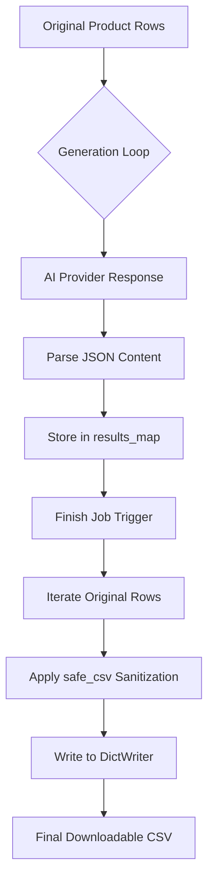

<details>
<summary>Relevant source files</summary>

The following files were used as context for generating this wiki page:

- [csv\_safety.py](csv_safety.py)
- [main.py](main.py)
- [app.py](app.py)
- [extractors.py](extractors.py)
- [providers.py](providers.py)
- [tests/test_main.py](tests/test_main.py)
</details>

# CSV Generation & Output Safety

The **CSV Generation & Output Safety** system is responsible for the structured transformation of AI-generated content into downloadable report files. It ensures that product descriptions and "why" justifications, generated via the [Multi-provider failover](#multi-provider-failover) system, are correctly mapped back to their original product data while protecting the user from CSV Injection attacks.

This module acts as the final stage in both the Web UI and CLI workflows. It handles the merging of original input fields with new AI-derived columns (`Beskrivning` and `Varför`), manages file persistence in the `outputs/` directory, and provides sanitized data formatting suitable for spreadsheet applications like Excel.

Sources: [app.py:273-287](app.py#L273-L287), [main.py:126-140](main.py#L126-L140), [README.md:15-20](README.md#L15-L20)

## CSV Formula Injection Protection

A critical security component of the output system is the protection against CSV Formula Injection (also known as CSV Injection or Excel Injection). This occurs when untrusted content—in this case, AI-generated text—starts with characters that spreadsheet software interprets as a formula (e.g., `=`, `+`, `-`, `@`).

### Sanitization Logic
The system implements a centralized safety utility in `csv_safety.py` used by both the Web and CLI interfaces. The `safe_csv` function checks for dangerous prefixes using a regular expression and prepends a single quote (`'`) to any matching string. This forces the spreadsheet software to treat the cell content as literal text rather than an executable formula.

```python
# csv_safety.py:7-12
_FORMULA_PREFIX = re.compile(r"^[=+\-@\t\r]")

def safe_csv(value: str) -> str:
    """Prefixes dangerous characters so a spreadsheet doesn't interpret the cell as a formula."""
    return "'" + value if _FORMULA_PREFIX.match(value) else value
```

Sources: [csv\_safety.py:1-12](csv\_safety.py#L1-L12), [main.py:136-137](main.py#L136-L137), [app.py:281-282](app.py#L281-L282)

## Data Flow & File Generation

The generation process follows a structured pipeline where partial results are cached to disk before the final CSV is compiled. This ensures that work is not lost if a job is interrupted or paused due to rate limits.

### Processing Pipeline
1.  **Row Extraction:** Original files (CSV, Excel, PDF, etc.) are parsed into a standard list of dictionaries.
2.  **Result Mapping:** As AI providers return descriptions, results are stored in a `results` dictionary keyed by the original row index.
3.  **Final Compilation:** The system iterates through the original rows, retrieves the corresponding AI result, applies `safe_csv` sanitization, and writes to a new CSV file.



The diagram shows the transition from raw input rows to the final sanitized CSV output.
Sources: [app.py:273-287](app.py#L273-L287), [main.py:126-140](main.py#L126-L140), [providers.py:44-58](providers.py#L44-L58)

### Comparison of CSV Generation Methods

| Feature | CLI (`main.py`) | Web UI (`app.py`) |
| :--- | :--- | :--- |
| **Output Path** | `<input>_med_beskrivning.csv` | `outputs/{job_id}_med_beskrivning.csv` |
| **Sanitization** | Calls `safe_csv` per cell | Calls `safe_csv` per cell |
| **Field Order** | Original fields + new columns | Original fields + new columns |
| **Writing Library** | `csv.DictWriter` | `csv.DictWriter` |
| **Encoding** | UTF-8 | UTF-8 |

Sources: [main.py:126-140](main.py#L126-L140), [app.py:273-287](app.py#L273-L287)

## Job Completion and Cleanup

Once the CSV file is generated, the system performs cleanup to manage disk space and data privacy. In the Web UI, the transition from "processing" to "done" involves unlinking temporary files that were used for intermediate state management.

### Cleanup Operations
- **Partial Results:** The `{job_id}_partial.json` file, which stores row-by-row progress, is deleted.
- **Extracted Rows:** The `{job_id}_rows.json` file, which stores the initial parsed data, is deleted.
- **Uploads:** The original uploaded file in the `uploads/` directory is unlinked.
- **Retention:** A background watcher (`_resume_watcher`) periodically purges final output CSVs older than `JOB_RETENTION_DAYS` (default 30).

Sources: [app.py:289-294](app.py#L289-L294), [app.py:298-316](app.py#L298-L316)

## Implementation Details

### CLI Finalization
In the CLI mode, the process is synchronous. Once all futures in the `ThreadPoolExecutor` are complete (or the provider is exhausted), the file is written immediately.

```python
# main.py:128-135
output = args.output or Path(args.input).stem + "_med_beskrivning.csv"
out_fields = fieldnames + ["Beskrivning", "Varför"]
with open(output, "w", newline="", encoding="utf-8") as f:
    writer = csv.DictWriter(f, fieldnames=out_fields)
    writer.writeheader()
    for i, row in enumerate(rows):
        parts = results.get(i, {"beskrivning": "", "varför": ""})
```

Sources: [main.py:128-135](main.py#L128-L135)

### Web UI Finalization
In the Web UI, the `_finish_job` function handles the transition. It defines the output columns and sets the job status to `done`, making the file available via the `/api/jobs/<job_id>/download` endpoint.

```python
# app.py:276-277
output_path = OUTPUT_DIR / f"{job_id}_med_beskrivning.csv"
out_fields = fieldnames + ["Beskrivning", "Varför"]
```

Sources: [app.py:276-277](app.py#L276-L277), [app.py:532-545](app.py#L532-L545)

## Conclusion
CSV Generation & Output Safety ensures that the end product of the description generation process is both useful and secure. By utilizing a centralized sanitization utility, the project protects users from formula injection across all interfaces. The automated cleanup and structured file management maintain system health by preventing unbounded growth of the `outputs/` and `uploads/` directories.
