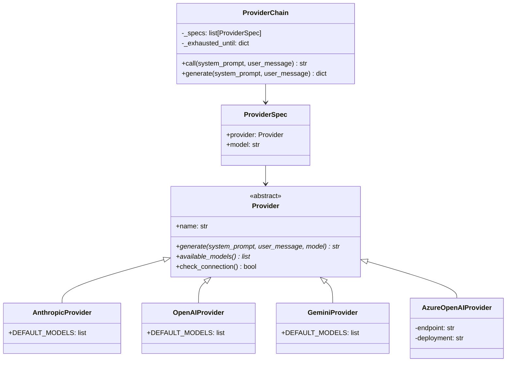
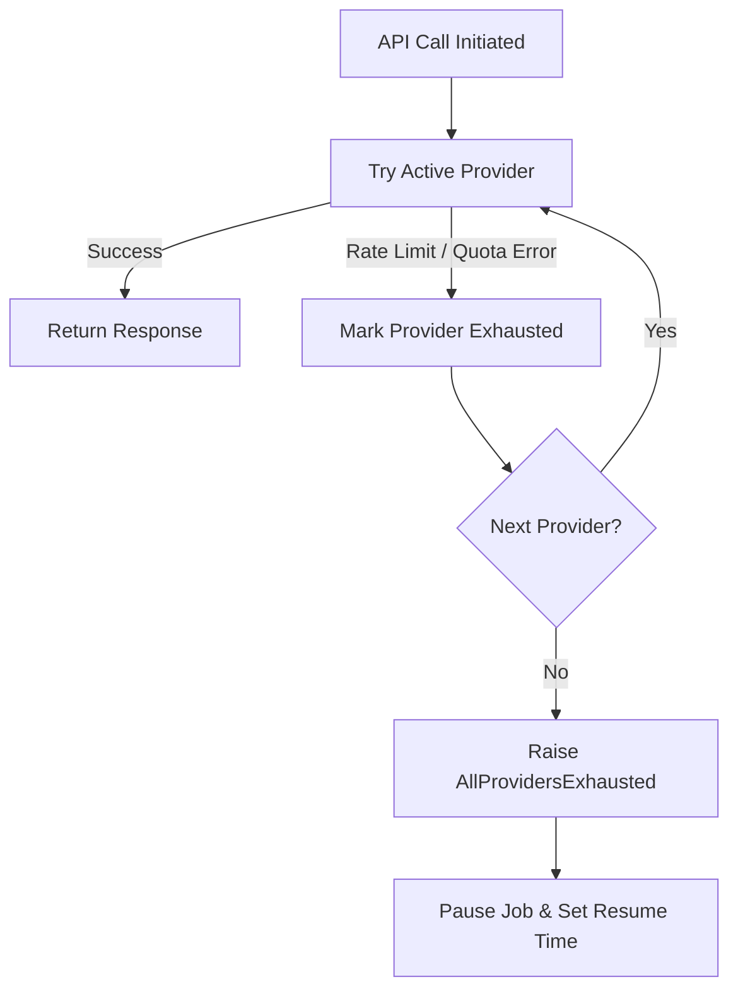
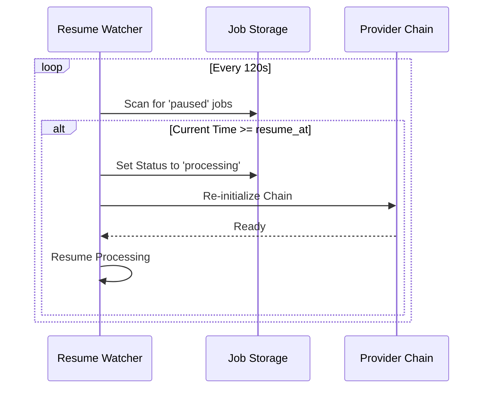

Relevant source files

The following files were used as context for generating this wiki page:

- [providers.py](providers.py)
- [provider_config.py](provider_config.py)
- [app.py](app.py)
- [main.py](main.py)
- [tests/test_providers.py](tests/test_providers.py)
- [README.md](README.md)

# Multi-Provider Failover System

The Multi-Provider Failover System is a core architectural component of the Product Describer project designed to ensure high availability and resilience when generating product descriptions via Large Language Model (LLM) APIs. Its primary purpose is to abstract multiple AI providers into a single prioritized chain that automatically handles rate limits, quota exhaustion, and billing errors by switching to the next available provider without manual intervention.

Sources: [providers.py:1-10](providers.py#L1-L10), [README.md:46-51](README.md#L46-L51)

## System Architecture

The system is built on a provider abstraction layer that standardizes interactions with multiple external AI services. The primary entry point for the application logic is the `ProviderChain`, which manages an ordered list of `Provider` implementations.

### Component Overview

| Component | Description |
| :--- | :--- |
| **Provider (Base Class)** | Abstract base class defining the standard interface for AI interaction. |
| **ProviderChain** | Orchestrator that manages failover logic and provider prioritization. |
| **ProviderSpec** | A dataclass pairing a specific `Provider` instance with a target model. |
| **RateLimitExceeded** | Specialized exception raised when a provider hits an API limit. |
| **AllProvidersExhausted** | Exception raised when no providers in the chain are currently available. |

Sources: [providers.py:53-70](providers.py#L53-L70), [providers.py:206-224](providers.py#L206-L224), [providers.py:25-45](providers.py#L25-L45)

### Class Relationship Diagram

The following diagram illustrates the relationship between the abstraction layer and concrete provider implementations.

Sources: [providers.py:72-180](providers.py#L72-L180), [providers.py:226-240](providers.py#L226-L240)

## Failover Logic and Rate Limiting

The system detects provider exhaustion through specific exception handling. It specifically monitors for HTTP 429 status codes (Rate Limits) and specific billing/quota error phrases such as "insufficient quota" or "credit balance too low".

### Failure Detection Mechanism
The system utilizes the `_is_billing_exhausted` helper to identify quota-related failures that may not return a standard 429 status code. For example, Anthropic may return a 400 error for low credit balance, which the system treats as a failover trigger.

Sources: [providers.py:182-204](providers.py#L182-L204), [tests/test_providers.py:55-68](tests/test_providers.py#L55-L68)

### Failover Sequence

When a provider is exhausted, the `ProviderChain` performs the following steps:
1. Catches the `RateLimitExceeded` exception.
2. Calculates the reset time using the `Retry-After` header or a default 6-hour window for billing errors.
3. Updates the `_exhausted_until` timestamp for that provider index.
4. Moves to the next provider in the prioritized list.

Sources: [providers.py:242-262](providers.py#L242-L262), [README.md:53-58](README.md#L53-L58)

## Configuration and Prioritization

Providers are configured via the web UI or environment variables. The failover order is stored per account in a `provider_order.json` file.

### Supported Providers
The system currently supports the following providers and their respective default models:

| Provider Key | Label | Default Model |
| :--- | :--- | :--- |
| `anthropic` | Claude (Anthropic) | `claude-sonnet-4-6` |
| `openai` | ChatGPT (OpenAI) | `gpt-4.1-mini` |
| `gemini` | Gemini (Google) | `gemini-2.5-flash` |
| `azure_openai`| Azure OpenAI Service | (Dynamic Deployment) |

Sources: [provider_config.py:34-45](provider_config.py#L34-L45), [providers.py:65-70](providers.py#L65-L70)

### Multi-Tenant Key Management
In web mode, API keys are encrypted at rest using Fernet (AES-128) and stored in account-specific directories: `config/accounts/<account_id>/credentials/`. The `PROVIDER_CONFIG_MASTER_KEY` environment variable is required for this encryption.

Sources: [provider_config.py:15-25](provider_config.py#L15-L25), [provider_config.py:60-75](provider_config.py#L60-L75), [app.py:55-65](app.py#L55-L65)

## Automatic Job Resumption

The failover system integrates with a background watcher in `app.py` that monitors paused jobs.

### Resume Process
1. A job is paused if all providers return `RateLimitExceeded`.
2. The `resume_at` timestamp is calculated based on the earliest provider reset time.
3. The `_resume_watcher` thread polls every 120 seconds (configurable via `RESUME_CHECK_INTERVAL`).
4. If `now >= resume_at`, the job status is reset to `processing` and execution resumes from the last successful row cached in the `_partial.json` file.

Sources: [app.py:100-115](app.py#L100-L115), [app.py:228-245](app.py#L228-L245), [README.md:55-58](README.md#L55-L58)

## Conclusion
The Multi-Provider Failover System provides a robust infrastructure for uninterrupted background processing of product data. By abstracting provider-specific logic and implementing automated retry/failover cycles, the project ensures that API quotas and transient errors do not cause permanent job failures, maintaining data integrity through incremental saves and automatic resumption.

Sources: [providers.py:1-10](providers.py#L1-L10), [app.py:215-225](app.py#L215-L225)
