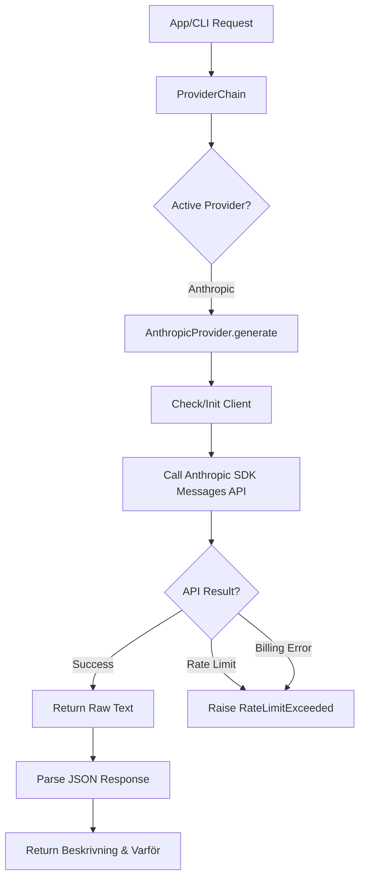
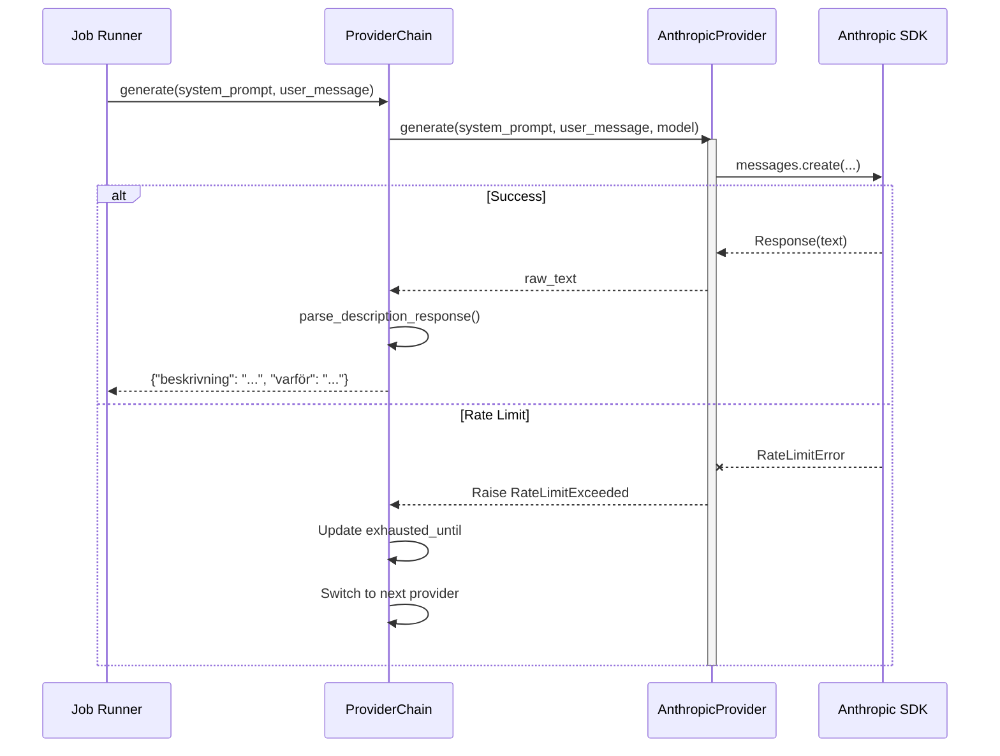

<details>
<summary>Relevant source files</summary>

The following files were used as context for generating this wiki page:

- [providers.py](providers.py)
- [app.py](app.py)
- [main.py](main.py)
- [prompts.py](prompts.py)
- [CLAUDE.md](CLAUDE.md)
- [AGENTS.md](AGENTS.md)
</details>

# Anthropic Claude Integration

The Anthropic Claude integration within the Product Describer project provides a robust mechanism for generating Swedish product descriptions and justifications using Anthropic's Large Language Models (LLMs). This integration is part of a multi-provider ecosystem that supports automatic failover and asynchronous job processing.

Claude is treated as a primary AI provider, allowing users to leverage models like Claude Sonnet, Haiku, and Opus to transform raw product data into marketing-ready content. The system handles authentication through user-provided API keys and manages rate limits by either failing over to other providers or pausing jobs until quotas reset.

Sources: [AGENTS.md:1-8](AGENTS.md#L1-L8), [CLAUDE.md:1-8](CLAUDE.md#L1-L8), [providers.py:84-88](providers.py#L84-L88)

## Architecture and Provider Abstraction

The integration is built upon an abstract `Provider` base class, with the `AnthropicProvider` class implementing the specific logic for communicating with the Anthropic Messages API.

### The AnthropicProvider Class
The `AnthropicProvider` handles the lifecycle of the Anthropic client and the execution of requests. It utilizes the `anthropic` Python SDK to send system prompts and user messages to the model.

- **Client Initialization**: The client is lazily instantiated using the `_get_client` method to ensure resources are only allocated when a request is made.
- **Model Support**: It supports multiple Claude variants defined in `DEFAULT_MODELS`.
- **Error Handling**: It specifically catches `anthropic.RateLimitError` and `anthropic.BadRequestError` (related to billing) to trigger the system's failover logic.

Sources: [providers.py:84-124](providers.py#L84-L124)

### Data Flow for Generation
The following diagram illustrates how a request flows from the application through the Anthropic provider.



The flow ensures that the application receives structured Swedish content while handling transient API issues.
Sources: [providers.py:11-30](providers.py#L11-L30), [providers.py:100-120](providers.py#L100-L120)

## Multi-Provider Failover Logic

The Claude integration does not operate in isolation. It is managed by a `ProviderChain` that handles transitions between Anthropic and other providers (OpenAI, Gemini, Azure) based on availability.

### Rate Limit and Quota Management
When Claude returns a rate limit error, the `AnthropicProvider` extracts retry hints from the API headers. If no hint is provided, the system defaults to waiting until the next UTC midnight or a 6-hour window for billing-related exhaustion.

| Feature | Description |
| :--- | :--- |
| **Failover Trigger** | Triggered by `anthropic.RateLimitError` or billing phrases like "insufficient_quota". |
| **Retry-After** | The system honors the `retry-after` header from Anthropic response headers. |
| **Job Pausing** | If Claude is the last available provider and is exhausted, the job status changes to `paused`. |
| **Automatic Resume** | A background watcher (`_resume_watcher`) checks if the `resume_at` timestamp has passed to restart the process. |

Sources: [providers.py:113-120](providers.py#L113-L120), [providers.py:192-212](providers.py#L192-L212), [app.py:270-280](app.py#L270-L280)

## Prompt Engineering for Claude

The system constructs a specific environment for Claude to ensure it outputs valid JSON and follows Swedish language conventions.

### System Prompt Construction
The `prompts.py` module builds a complex system instruction set that includes:
1.  **Base Instructions**: Forcing the model to output ONLY valid JSON.
2.  **Format Constraints**: Defining the `beskrivning` and `varför` fields.
3.  **Tone & Audience**: Injecting user-selected styles (e.g., "saklig", "lyxig") or specific target audiences.

```python
# From prompts.py
BASE_PROMPT = (
    "Du är en assistent som skriver korta produktbeskrivningar på svenska. "
    "Svara ALLTID med endast giltig JSON i exakt detta format, utan kodstaket eller extra text:\n"
    '{"beskrivning": "...", "varför": "..."}\n'
)
```

Sources: [prompts.py:3-10](prompts.py#L3-L10), [prompts.py:32-55](prompts.py#L32-L55)

## API and Implementation Details

### Configuration and Models
The Anthropic integration relies on several configuration elements:

| Element | Source File | Description |
| :--- | :--- | :--- |
| `ANTHROPIC_API_KEY` | `main.py` / `.env` | Required for authentication (CLI and Sync modes). |
| `DEFAULT_MODELS` | `providers.py` | Includes `claude-sonnet-4-6`, `claude-haiku-4-5-20251001`, and `claude-opus-4-8`. |
| `PROVIDER_LABELS` | `providers.py` | Displayed as "Claude (Anthropic)" in the Web UI. |

Sources: [providers.py:91-100](providers.py#L91-L100), [providers.py:77-82](providers.py#L77-L82), [main.py:100-110](main.py#L100-L110)

### Job Processing Sequence
This sequence shows how the `app.py` job runner interacts with Claude during a background task.



Sources: [providers.py:237-268](providers.py#L237-L268), [app.py:150-180](app.py#L150-L180)

## Integration with Sync Mode

In "Sync mode", the application polls a scraper API for products missing descriptions and uses the configured providers (including Claude) to fill them.

- **Polling**: The sync worker fetches products via `fetch_products_missing_description`.
- **Generation**: It calls `generate_description` which utilizes the Anthropic provider if it is top of the chain.
- **Persistence**: Results are pushed back to the scraper via `push_description`.

Sources: [main.py:120-150](main.py#L120-L150), [app.py:350-380](app.py#L350-L380)

Claude's integration is essential for providing high-quality, natural-sounding Swedish product content, supported by a resilient architecture that handles the complexities of API quotas and multi-user environments.

Sources: [AGENTS.md:10-25](AGENTS.md#L10-L25), [CLAUDE.md:10-25](CLAUDE.md#L10-L25)
