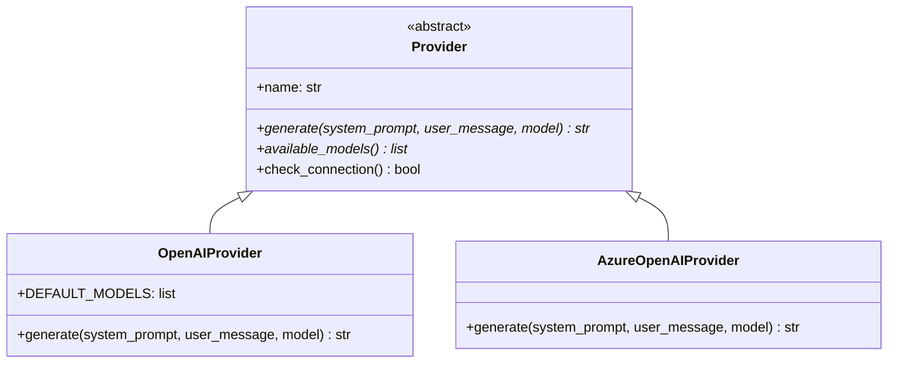
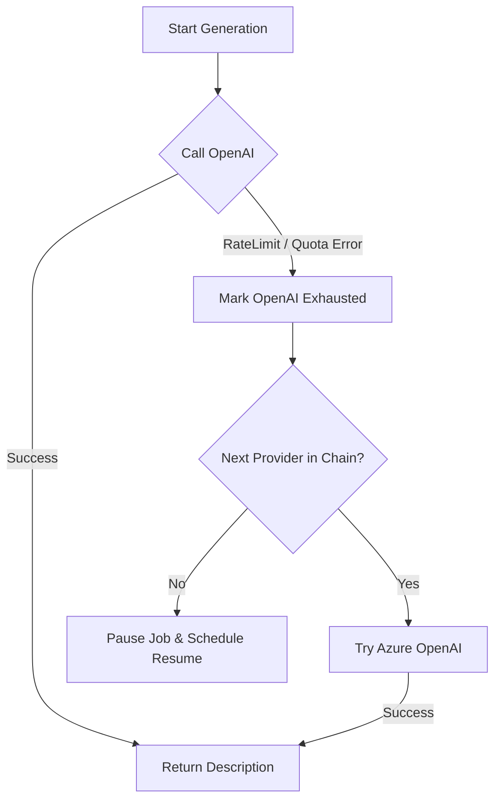

Relevant source files

The following files were used as context for generating this wiki page:

- [providers.py](providers.py)
- [provider\_config.py](provider_config.py)
- [app.py](app.py)
- [main.py](main.py)
- [README.md](README.md)
- [AGENTS.md](AGENTS.md)

# OpenAI & Azure Integrations

The OpenAI and Azure OpenAI Service integrations are core components of the product-describer's AI engine. These integrations allow the system to generate high-quality Swedish product descriptions and justifications ("Varför") by leveraging Large Language Models (LLMs) from OpenAI directly or via Microsoft's Azure cloud infrastructure.

Within the project architecture, these providers are abstracted into a unified interface, allowing for seamless switching and automatic failover. This ensures that if one service reaches a rate limit or quota exhaustion, the system can automatically transition to the next available service without interrupting the batch processing of product data.

Sources: [README.md:1-15](README.md#L1-L15), [providers.py:1-12](providers.py#L1-L12), [AGENTS.md:5-15](AGENTS.md#L5-L15)

## Provider Architecture

The project utilizes an object-oriented approach to manage different AI backends. Both OpenAI and Azure OpenAI are implemented as subclasses of a base `Provider` abstract class.

### Class Hierarchy
The following diagram illustrates the relationship between the base provider abstraction and the OpenAI-specific implementations.

Explanation: The `Provider` abstract base class defines the interface for all AI backends, which is then specialized by `OpenAIProvider` for direct API access and `AzureOpenAIProvider` for enterprise-hosted models.
Sources: [providers.py:65-71](providers.py#L65-L71), [providers.py:126-151](providers.py#L126-L151), [providers.py:186-224](providers.py#L186-L224)

### OpenAIProvider Implementation
The `OpenAIProvider` (labeled as "ChatGPT (OpenAI)") uses the standard `openai` Python SDK. It is configured to use a system prompt and user message structure for chat completions.

*  **Default Models**: `gpt-4.1`, `gpt-4.1-mini`, `gpt-4o`.
*  **Initialization**: Requires only an `api_key`.
*  **Error Handling**: Specifically catches `openai.RateLimitError` and `openai.APIStatusError` to identify quota exhaustion.

Sources: [providers.py:126-151](providers.py#L126-L151), [provider_config.py:38-43](provider_config.py#L38-L43)

### AzureOpenAIProvider Implementation
The `AzureOpenAIProvider` allows users to use OpenAI models hosted on their own Azure subscriptions. This is distinct from the standard OpenAI provider because it requires specific infrastructure endpoints.

*  **Dynamic Modeling**: Unlike other providers, models are defined by the "Deployment Name" configured in the Azure portal.
*  **Specific Requirements**: Requires an `endpoint` URL and a `deployment` name in addition to the `api_key`.
*  **API Version**: Defaults to `2024-10-21`.

Sources: [providers.py:186-224](providers.py#L186-L224), [provider_config.py:46-52](provider_config.py#L46-L52)

## Configuration and Security

Configurations for OpenAI and Azure are managed through the `provider_config.py` module, which handles storage, encryption, and environment variable mapping.

### Required Configuration Fields

| Provider | Field Name | Type | Description |
| :--- | :--- | :--- | :--- |
| **OpenAI** | `api_key` | Secret | Standard OpenAI API Key. |
| **Azure OpenAI** | `api_key` | Secret | Azure OpenAI Resource Key. |
| **Azure OpenAI** | `endpoint` | String | The base URL (e.g., `https://<resurs>.openai.azure.com`). |
| **Azure OpenAI** | `deployment` | String | The deployment name assigned to the model in Azure. |

Sources: [provider_config.py:46-52](provider_config.py#L46-L52), [README.md:38-45](README.md#L38-L45)

### Storage and Encryption
API keys and sensitive configurations are saved as encrypted-at-rest JSON blobs using the Fernet (symmetric encryption) algorithm.
*  **Master Key**: Encryption requires the `PROVIDER_CONFIG_MASTER_KEY` environment variable.
*  **Isolation**: Configurations are scoped per `account_id` in the web UI, or read from global environment variables in CLI mode.
*  **CLI Env Vars**: `OPENAI_API_KEY`, `AZURE_OPENAI_API_KEY`, `AZURE_OPENAI_ENDPOINT`, and `AZURE_OPENAI_DEPLOYMENT`.

Sources: [provider_config.py:73-81](provider_config.py#L73-L81), [app.py:270-300](app.py#L270-L300), [main.py:101-112](main.py#L101-L112)

## Failover Logic and Rate Limiting

The `ProviderChain` class manages the prioritized list of providers. If the OpenAI provider reaches a rate limit, the system fails over to Azure (or another configured provider).

### Failover Flow
The following diagram demonstrates the data flow during an OpenAI service interruption.

Explanation: The `ProviderChain` iterates through configured providers until a successful response is received or all options are exhausted.
Sources: [providers.py:265-300](providers.py#L265-L300), [README.md:65-75](README.md#L65-L75)

### Quota and Billing Detection
The system specifically monitors for billing-related errors to avoid continuous failing attempts against a provider with no remaining credits. Phrases like "insufficient_quota", "credit balance", and "billing" are matched in error responses to trigger a long-term failover (defaulting to 6 hours or next UTC midnight if no `Retry-After` header is present).

Sources: [providers.py:237-260](providers.py#L237-L260)

## Integration with Web UI
The Web UI (`app.py`) provides endpoints to manage these specific integrations.

*  **GET `/api/settings`**: Returns available models and identifies which providers (OpenAI or Azure) are correctly configured.
*  **POST `/api/settings/key`**: Saves encrypted credentials. For Azure, it validates the presence of the `endpoint` and `deployment` fields before marking the provider as "Ready".
*  **POST `/api/settings/order`**: Allows the user to prioritize OpenAI vs Azure in the failover chain.

Sources: [app.py:315-365](app.py#L315-L365), [provider_config.py:105-115](provider_config.py#L105-L115)

## Conclusion
The OpenAI and Azure OpenAI integrations provide the project with a robust, redundant foundation for generating product content. By abstracting the complexities of Azure's deployment-based architecture and providing a unified failover mechanism, the system maintains high availability even during peak usage or service-specific quota limitations.

Sources: [README.md:65-75](README.md#L65-L75), [AGENTS.md:52-60](AGENTS.md#L52-L60)
