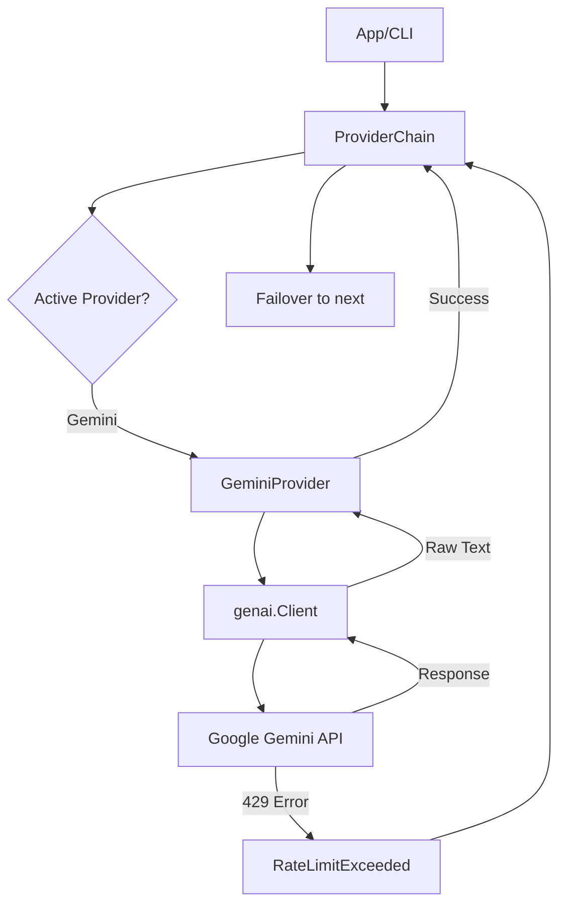
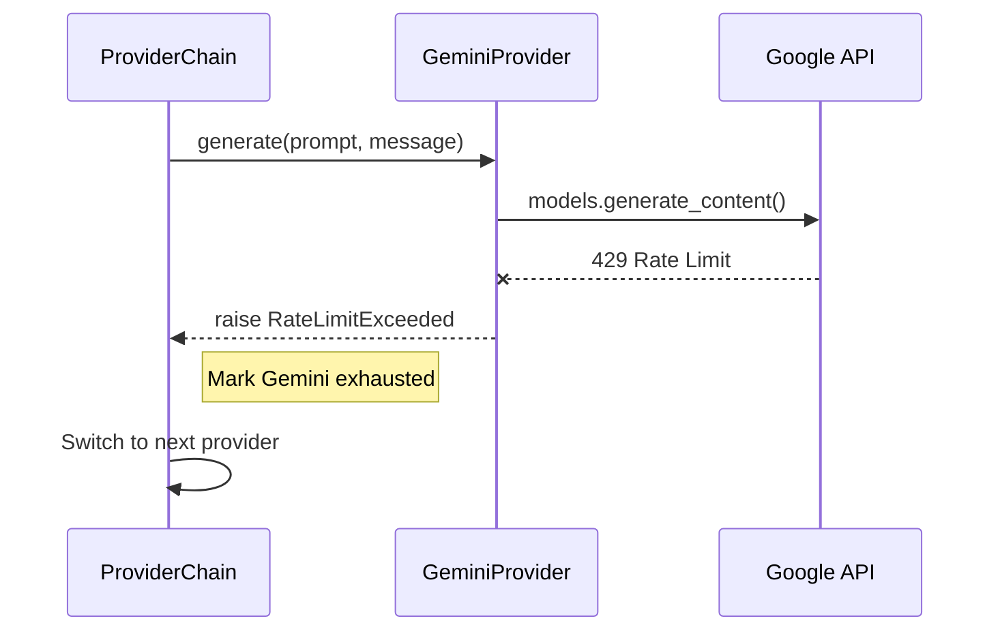

<details>
<summary>Relevant source files</summary>

The following files were used as context for generating this wiki page:

- [providers.py](providers.py)
- [app.py](app.py)
- [main.py](main.py)
- [AGENTS.md](AGENTS.md)
- [README.md](README.md)
- [templates/index.html](templates/index.html)
</details>

# Google Gemini Integration

## Introduction
The Google Gemini integration provides the `product-describer` system with the capability to generate Swedish product descriptions and justifications ("varför") using Google's Generative AI models. It is implemented as a specialized provider within a larger multi-provider ecosystem that supports automatic failover and rate-limit handling.

This integration utilizes the `google-genai` SDK to communicate with Gemini models. It serves as one of the core backends for both the Web UI and the CLI/Sync modes, offering a free-tier option for developers compared to other pay-per-use providers like Anthropic or OpenAI.

Sources: [AGENTS.md:1-10](AGENTS.md#L1-L10), [README.md:1-15](README.md#L1-L15), [providers.py:165-170](providers.py#L165-L170)

## Architecture and Components

The Gemini integration is built upon an abstract `Provider` class, ensuring consistent behavior across different AI backends. The primary component is the `GeminiProvider` class located in `providers.py`.

### Provider Implementation
The `GeminiProvider` encapsulates the logic for client instantiation, model generation, and error mapping.

*  **Client Management**: The provider uses a lazy-loading pattern for the `genai.Client`.
*  **Model Support**: It defaults to a specific set of Gemini models but can be configured to use others via the provider chain.
*  **Instruction Handling**: System instructions are passed via the `system_instruction` configuration key in the `generate_content` call.

Sources: [providers.py:165-195](providers.py#L165-L195)

### Data Flow Diagram
The following diagram illustrates how a request moves from the application through the Gemini integration to the Google API.



Sources: [providers.py:255-290](providers.py#L255-L290), [app.py:175-200](app.py#L175-L200)

## Configuration and Models

Gemini integration requires a valid API key, which can be provided via environment variables for CLI usage or through the Web UI for account-scoped jobs.

### Supported Models
The following models are defined as defaults within the integration:

| Model ID | Description |
| :--- | :--- |
| `gemini-2.5-flash` | Optimized for speed and efficiency |
| `gemini-2.5-flash-lite` | Lightweight version for lower latency |
| `gemini-2.5-pro` | High-performance model for complex reasoning |

Sources: [providers.py:168](providers.py#L168), [templates/index.html:565-580](templates/index.html#L565-L580)

### Configuration Methods
1.  **Environment Variables**: Used by `main.py` and the sync worker.
  *  `GEMINI_API_KEY`: The primary authentication credential.
2.  **Web UI Settings**: Encrypted at rest using `PROVIDER_CONFIG_MASTER_KEY` and scoped to individual user accounts.

Sources: [README.md:55-65](README.md#L55-L65), [app.py:410-430](app.py#L410-L430)

## Error Handling and Failover

A critical feature of the Gemini integration is its integration with the `ProviderChain` failover engine. 

### Rate Limit Detection
The `GeminiProvider` explicitly catches `genai_errors.ClientError`. If the error code is `429`, it raises a project-specific `RateLimitExceeded` exception. This triggers the `ProviderChain` to:
1.  Mark the Gemini provider as exhausted.
2.  Calculate a resume time based on `Retry-After` headers or a default reset (next UTC midnight).
3.  Failover to the next provider in the prioritized list.

Sources: [providers.py:22-35](providers.py#L22-L35), [providers.py:183-192](providers.py#L183-L192), [providers.py:280-295](providers.py#L280-L295)

### Sequence of Failover



Sources: [providers.py:280-295](providers.py#L280-L295), [providers.py:185-190](providers.py#L185-L190)

## Implementation Details

### Response Parsing
Model outputs from Gemini are processed by `parse_description_response`. The system expects a JSON block containing `beskrivning` and `varför`. If the model fails to return valid JSON, the entire response is treated as the description.

Sources: [providers.py:46-64](providers.py#L46-L64)

### Code Snippet: Generation Logic

```python
# providers.py:177-192
def generate(self, system_prompt: str, user_message: str, model: str) -> str:
    from google.genai import errors as genai_errors
    client = self._get_client()
    try:
        resp = client.models.generate_content(
            model=model,
            contents=user_message,
            config={"system_instruction": system_prompt},
        )
    except genai_errors.ClientError as e:
        if getattr(e, "code", None) == 429:
            raise RateLimitExceeded(self.name, retry_after=_retry_after_seconds(e)) from e
        # ... billing checks ...
        raise
    return resp.text or ""
```

Sources: [providers.py:177-192](providers.py#L177-L192)

## Conclusion
The Google Gemini integration offers a robust and cost-effective alternative for generating product content within the `product-describer` suite. By implementing the standard `Provider` interface, it benefits from the system's global failover logic, background job processing, and automatic resumption capabilities, ensuring that product description tasks continue even when API quotas are temporarily reached.
