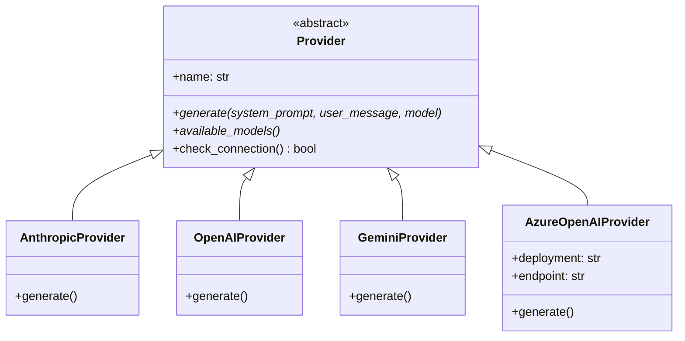
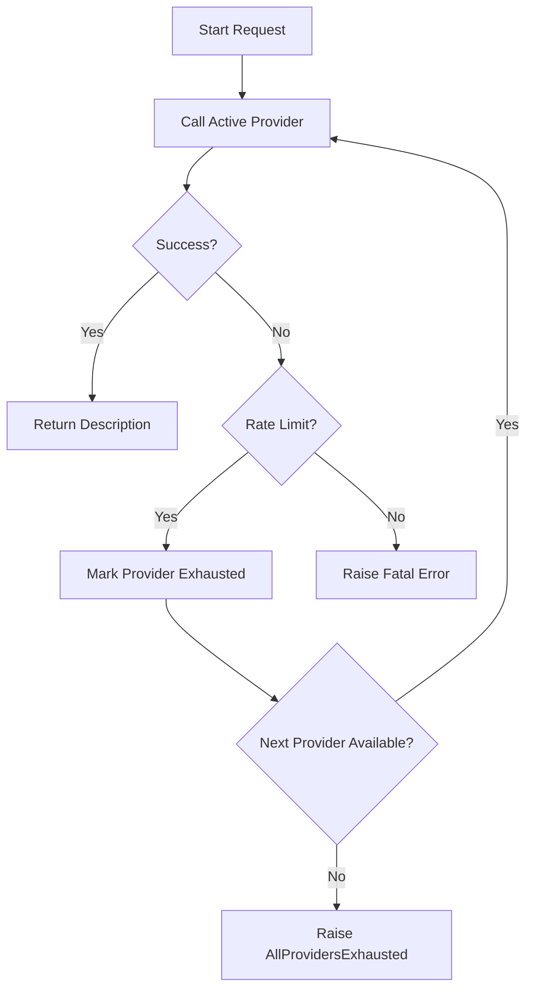
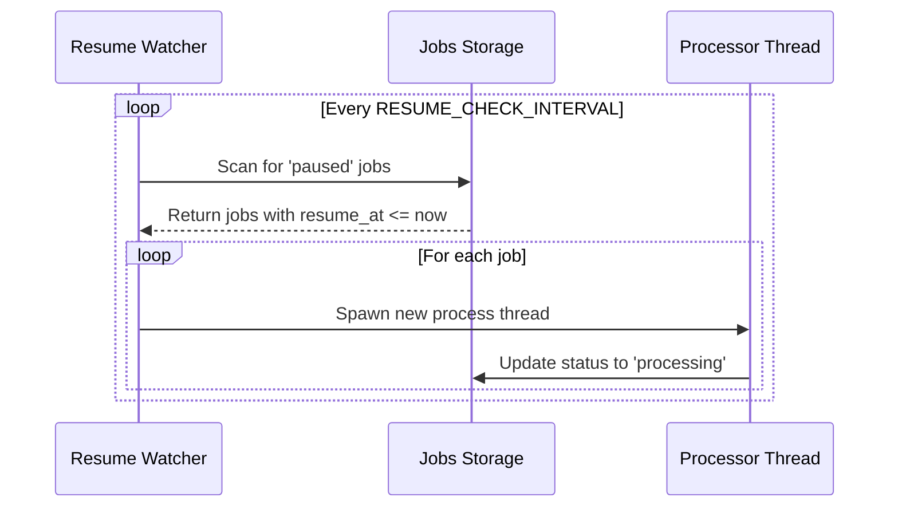

<details>
<summary>Relevant source files</summary>

The following files were used as context for generating this wiki page:

- [providers.py](providers.py)
- [provider\_config.py](provider_config.py)
- [app.py](app.py)
- [main.py](main.py)
- [AGENTS.md](AGENTS.md)
- [README.md](README.md)
</details>

# Multi-Provider Failover System

The Multi-Provider Failover System is a core architectural component of the product-describer project designed to ensure resilient and continuous generation of product descriptions. It abstracts multiple AI model providers—including Anthropic, OpenAI, Google Gemini, and Azure OpenAI—into a unified interface. The system automatically detects rate limits, quota exhaustion, or billing issues and seamlessly transitions to the next available provider in a user-defined priority list.

This system is critical for high-volume batch processing where single-provider quotas are frequently encountered. If all configured providers are exhausted, the system implements a "pause and resume" logic, tracking reset times to restart jobs automatically once quotas are refreshed. This ensures no progress is lost during long-running tasks.

Sources: [AGENTS.md:4-8](AGENTS.md#L4-L8), [README.md:58-69](README.md#L58-L69), [providers.py:1-11](providers.py#L1-L11)

## System Architecture

The architecture is built on a provider abstraction layer and a chain management engine. It separates the low-level API communication from the high-level failover logic.

### Core Components

| Component | Description |
| :--- | :--- |
| `Provider` (Abstract) | Base class defining the interface for all AI service integrations. |
| `ProviderChain` | The failover engine that manages an ordered list of providers and handles exceptions. |
| `RateLimitExceeded` | Custom exception raised when a provider hits an API limit or quota. |
| `AllProvidersExhausted` | Exception raised when every provider in the chain is currently rate-limited. |
| `ProviderSpec` | A dataclass pairing a `Provider` instance with a specific model identifier. |

Sources: [providers.py:46-51](providers.py#L46-L51), [providers.py:176-180](providers.py#L176-L180), [providers.py:202-211](providers.py#L202-L211)

### Provider Implementation Diagram

The following diagram illustrates how specific service providers inherit from the base `Provider` class to provide specialized implementations for different AI SDKs.



Sources: [providers.py:46-200](providers.py#L46-L200)

## Failover Logic and Exception Handling

The system's primary responsibility is to handle interruptions gracefully. It differentiates between transient rate limits and hard quota/billing errors.

### Detection of Exhaustion
The system identifies exhaustion through two primary methods:
1.  **SDK Exceptions**: Catching specific errors like `anthropic.RateLimitError` or `openai.RateLimitError`.
2.  **String Matching**: Identifying billing-related issues (e.g., "insufficient_quota", "credit balance") that may return standard 400 errors instead of 429 status codes.

Sources: [providers.py:76-80](providers.py#L76-L80), [providers.py:146-161](providers.py#L146-L161)

### Failover Flow
When a `RateLimitExceeded` exception occurs, the `ProviderChain` marks the current provider as "exhausted" until a calculated reset time and immediately attempts the request with the next provider in the spec list.



Sources: [providers.py:228-251](providers.py#L228-L251), [main.py:155-168](main.py#L155-L168)

## Configuration and Multi-Tenancy

Failover behavior is highly configurable and varies based on the operational mode (Web UI vs. CLI).

### Priority and Order
*  **Web UI (Multi-tenant)**: Each account maintains its own `provider_order.json` and encrypted credentials. The system filters the failover chain to only include providers with valid keys for that specific account.
*  **CLI Mode**: The chain is built from environment variables (e.g., `ANTHROPIC_API_KEY`) in a default hardcoded priority order.

Sources: [provider_config.py:112-132](provider_config.py#L112-L132), [provider_config.py:161-185](provider_config.py#L161-L185), [CLAUDE.md:12-16](CLAUDE.md#L12-L16)

### Configuration Parameters

| Parameter | Storage Location | Description |
| :--- | :--- | :--- |
| API Keys | `config/accounts/<id>/credentials/` | Encrypted keys for different AI services. |
| Provider Order | `config/accounts/<id>/provider_order.json` | Priority list for failover sequence. |
| Master Key | `PROVIDER_CONFIG_MASTER_KEY` | Environment variable used for Fernet encryption of keys at rest. |
| Reset Time | Calculated | Time until a provider is retried; defaults to next UTC midnight if not specified by API. |

Sources: [provider_config.py:14-25](provider_config.py#L14-L25), [provider_config.py:65-80](provider_config.py#L65-L80), [providers.py:164-173](providers.py#L164-L173)

## Automatic Resumption System

The application implements a background watcher to handle scenarios where all providers are exhausted.

### Job Pausing
When `AllProvidersExhausted` is raised, the job status is changed to `paused` in the state tracking file (`jobs.json`). The exception contains a `resume_at` timestamp indicating the earliest time a provider is expected to be available again.

Sources: [providers.py:34-39](providers.py#L34-L39), [app.py:117-122](app.py#L117-L122)

### Resume Watcher
A background thread in `app.py` periodically scans for paused jobs and restarts them if the current time has surpassed the `resume_at` requirement.



Sources: [app.py:236-250](app.py#L236-L250), [app.py:268-272](app.py#L268-L272)

## Implementation Example: ProviderChain
The `ProviderChain` handles the thread-safe iteration through providers.

```python
# From providers.py:228-251
def call(self, system_prompt: str, user_message: str) -> str:
    """Raw text reply from the active provider, with automatic failover."""
    while True:
        with self._lock:
            now = datetime.now(timezone.utc)
            idx = self._available_index(now)
            if idx is None:
                raise AllProvidersExhausted(self.next_resume_at())
            self._active_idx = idx
            spec = self._specs[idx]

        try:
            return spec.provider.generate(system_prompt, user_message, spec.model)
        except RateLimitExceeded as e:
            with self._lock:
                self._exhausted_until[idx] = _next_reset(e.retry_after)
            _log.warning("provider %s exhausted, resuming at %s", spec.provider.name, self._exhausted_until[idx].isoformat())
            continue
```

Sources: [providers.py:228-251](providers.py#L228-L251)

## Conclusion
The Multi-Provider Failover System provides a robust backbone for the product-describer application, shielding users and internal sync processes from the volatility of third-party AI API limits. By combining provider abstraction, intelligent error detection, and background resume logic, the system ensures that high-volume product description tasks reach completion even when individual AI services are temporarily unavailable.
