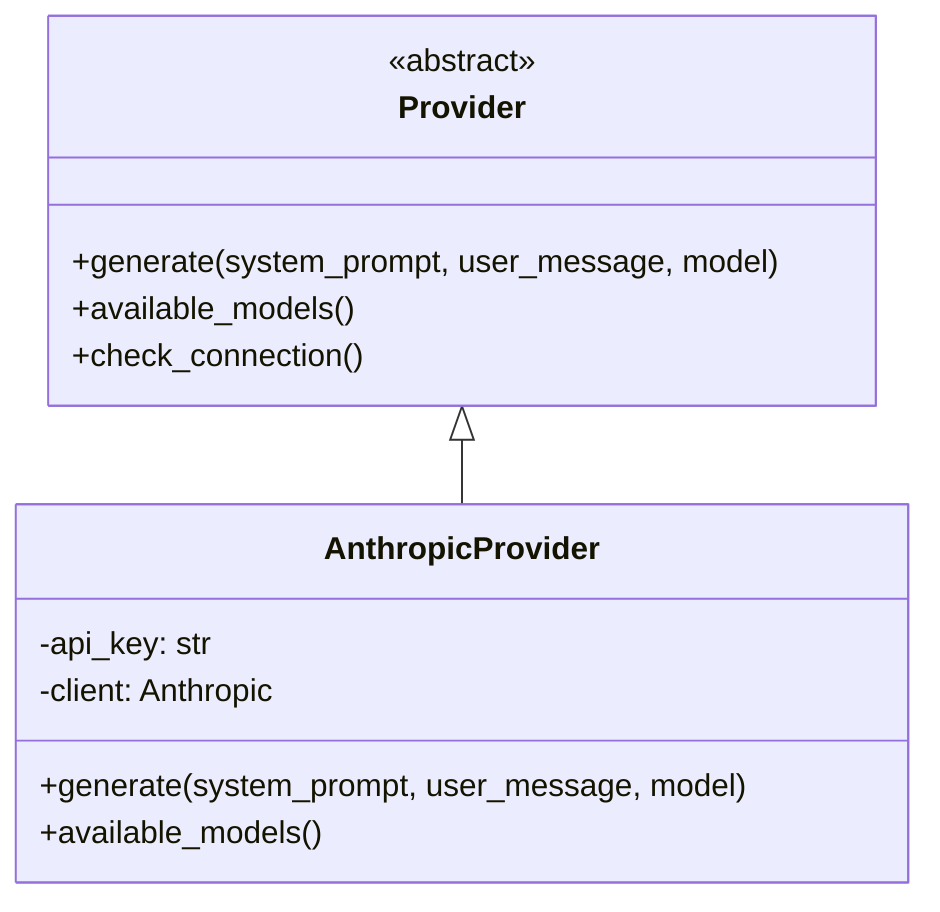
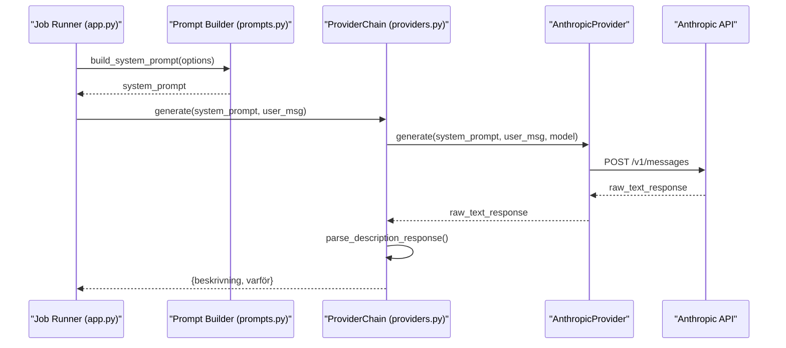
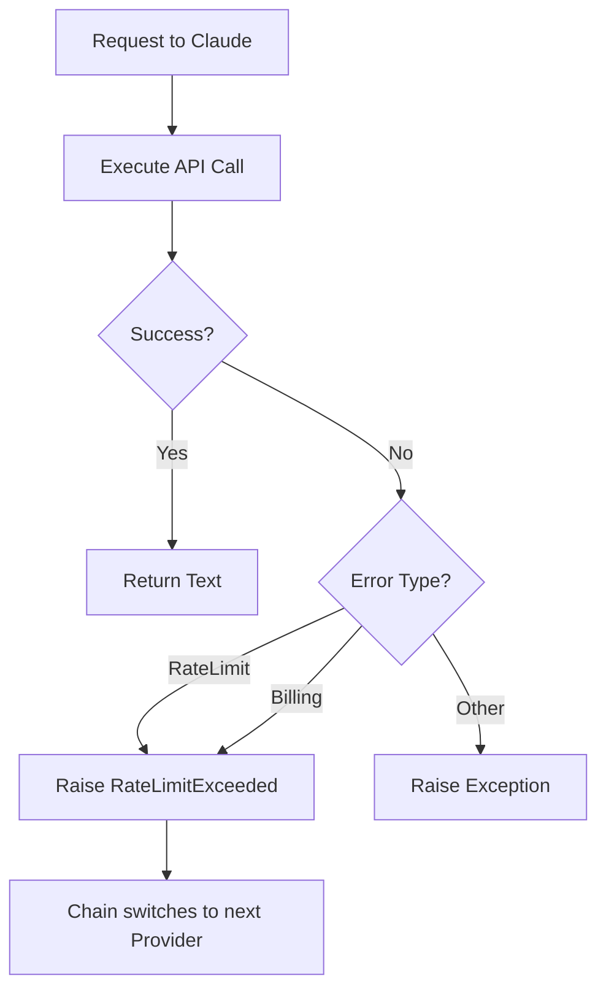

Relevant source files

The following files were used as context for generating this wiki page:

- [providers.py](providers.py)
- [prompts.py](prompts.py)
- [app.py](app.py)
- [main.py](main.py)
- [CLAUDE.md](CLAUDE.md)

# Anthropic Claude Integration

The Anthropic Claude integration within the Product Describer project enables the generation of high-quality Swedish product descriptions and justifications ("varför") using Anthropic's Large Language Models (LLMs). This integration is part of a multi-provider ecosystem that supports automatic failover between different AI services to ensure continuous operation despite rate limits or quota exhaustion.

The integration is implemented via a dedicated provider class that handles API communication, error management, and response parsing. It supports multiple Claude models and is designed to work within both the Flask web interface and the CLI batch processing modes.

Sources: [CLAUDE.md:3-8](CLAUDE.md#L3-L8), [providers.py:82-84](providers.py#L82-L84)

## Architecture and Provider Logic

The integration follows a structured abstraction pattern. Claude is implemented as a subclass of the abstract `Provider` class, ensuring it adheres to a standard interface for generating text and reporting availability.

### The AnthropicProvider Class
The `AnthropicProvider` class manages the lifecycle of the Anthropic client and the execution of requests to the Messages API. It utilizes a singleton-like pattern for the client to ensure efficient resource usage within a session.

The diagram shows the inheritance relationship between the base Provider and the Claude-specific implementation.

Sources: [providers.py:53-76](providers.py#L53-L76), [providers.py:82-117](providers.py#L82-L117)

### Model Support
The integration specifies a list of default Claude models used for generation. These models are selected based on their performance and efficiency for Swedish text generation.

| Model ID | Description |
| :--- | :--- |
| `claude-sonnet-4-6` | High-performance balanced model. |
| `claude-haiku-4-5-20251001` | Fast and cost-effective model for simpler descriptions. |
| `claude-opus-4-8` | Most capable model for complex reasoning. |

Sources: [providers.py:85](providers.py#L85), [providers.py:116-117](providers.py#L116-L117)

## Data Flow and Generation Process

The generation process involves building a specific system prompt, sending it alongside product data to the Anthropic API, and parsing the resulting JSON response.

### Execution Sequence
When a user requests a description, the system orchestrates several components to interact with Claude:

The diagram illustrates how the `ProviderChain` manages the flow from prompt construction to the final parsed dictionary.

Sources: [app.py:171-185](app.py#L171-L185), [main.py:44-50](main.py#L44-L50), [providers.py:273-274](providers.py#L273-L274)

### Prompt Construction
The `prompts.py` module constructs a system prompt that enforces a JSON output format. It includes specific instructions for tone (e.g., "saklig", "lyxig") and length (e.g., "kort", "lang").

Sources: [prompts.py:5-30](prompts.py#L5-L30)

## Error Handling and Failover

One of the critical features of the Claude integration is its robust error handling, specifically for rate limits and billing issues.

### Failover Logic
The `AnthropicProvider` catches specific exceptions from the `anthropic` SDK and translates them into a common `RateLimitExceeded` exception. This allows the `ProviderChain` to automatically switch to another configured provider (like OpenAI or Gemini) if Claude becomes unavailable.

- **RateLimitError**: Triggered when the API rate limit is hit.
- **BadRequestError**: Checked for "billing exhausted" phrases (e.g., "insufficient_quota", "credit balance").

The flow shows how the system recovers from API-specific errors to maintain service availability.

Sources: [providers.py:102-111](providers.py#L102-L111), [providers.py:202-218](providers.py#L202-L218), [providers.py:260-271](providers.py#L260-L271)

### Configuration
Claude configuration is managed per account. API keys and model preferences are stored in the user's account credentials and can be prioritized in the failover order via the web UI.

| Parameter | Source | Purpose |
| :--- | :--- | :--- |
| `api_key` | Account Config / Env | Authenticates with Anthropic. |
| `model` | Provider Order JSON | Specifies which Claude version to use. |
| `ANTHROPIC_API_KEY` | Environment Variable | Used for CLI mode (`main.py`). |

Sources: [CLAUDE.md:52-54](CLAUDE.md#L52-L54), [app.py:408-410](app.py#L408-L410), [main.py:84-88](main.py#L84-L88)

## Summary

The Anthropic Claude integration provides the primary intelligence for generating Swedish product content in the project. By implementing a standardized provider interface, the system ensures that Claude can be used interchangeably with other LLMs, benefiting from automated failover mechanisms that handle quota exhaustion and rate limiting gracefully. This architecture allows for reliable, multi-tenant AI operations where individual accounts bring their own API credentials.

Sources: [providers.py:1-10](providers.py#L1-L10), [app.py:155-165](app.py#L155-L165)
