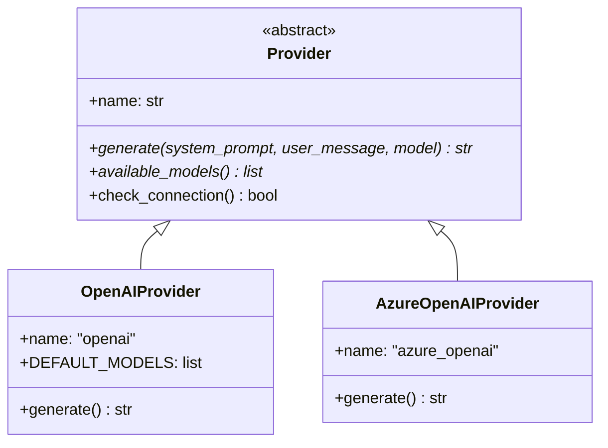
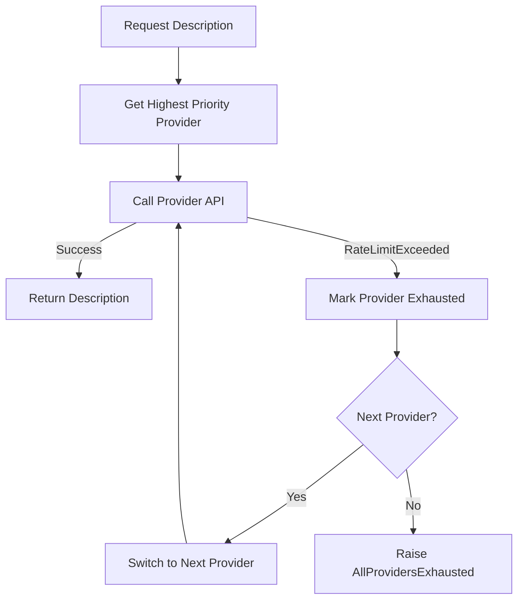
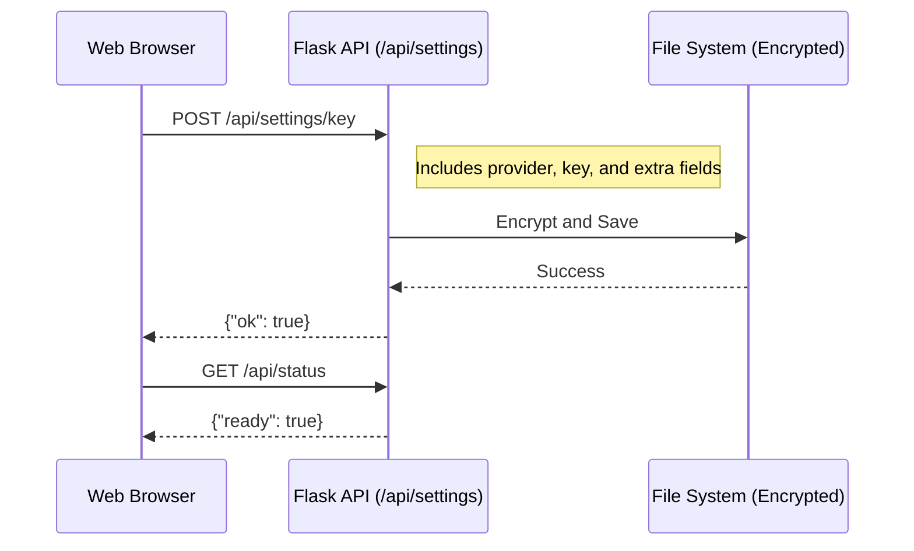

Relevant source files

The following files were used as context for generating this wiki page:

- [providers.py](providers.py)
- [provider_config.py](provider_config.py)
- [app.py](app.py)
- [main.py](main.py)
- [README.md](README.md)

# OpenAI & Azure Integrations

The product-describer project integrates with OpenAI and Azure OpenAI Service to generate Swedish product descriptions and justifications. These integrations are part of a multi-provider architecture designed with automatic failover capabilities to handle rate limits and quota exhaustion seamlessly.

OpenAI and Azure OpenAI are treated as distinct providers within the system's `Provider` abstraction. While they share underlying model logic, their configuration, authentication, and endpoint handling differ significantly. OpenAI uses standard API keys and global model identifiers, whereas Azure OpenAI requires resource-specific endpoints and deployment names.

Sources: [providers.py:1-15](providers.py#L1-L15), [README.md:1-15](README.md#L1-L15)

## Architecture and Provider Abstraction

The system uses an abstract base class `Provider` to standardize interactions across different AI services. Both OpenAI and Azure OpenAI implement this interface.

The diagram above shows the class hierarchy for AI providers, emphasizing the shared interface for text generation.

Sources: [providers.py:53-75](providers.py#L53-L75), [providers.py:127-133](providers.py#L127-L133), [providers.py:168-173](providers.py#L168-L173)

### OpenAI Integration
The `OpenAIProvider` utilizes the standard OpenAI Python SDK. It is configured primarily with an `api_key`. By default, it supports models such as `gpt-4.1`, `gpt-4.1-mini`, and `gpt-4o`.

**Key Features:**
- **Synchronous Generation:** Uses `client.chat.completions.create` to generate content.
- **Error Handling:** Specifically catches `openai.RateLimitError` and `openai.APIStatusError` to trigger failover mechanisms.
- **Billing Awareness:** Detects "insufficient quota" or "billing" errors to signal provider exhaustion.

Sources: [providers.py:127-165](providers.py#L127-L165), [providers.py:228-245](providers.py#L228-L245)

### Azure OpenAI Integration
The `AzureOpenAIProvider` is tailored for models hosted on a user's specific Azure subscription. Unlike the standard OpenAI integration, Azure requires a deployment name rather than a static model ID.

**Configuration Requirements:**
- `api_key`: The secret key from the Azure portal.
- `endpoint`: The specific Azure resource URL (e.g., `https://<resource>.openai.azure.com`).
- `deployment`: The unique name given to the model deployment in Azure.

Sources: [providers.py:168-208](providers.py#L168-L208), [provider_config.py:46-51](provider_config.py#L46-L51)

## Data Flow and Failover Logic

The `ProviderChain` manages an ordered list of `ProviderSpec` objects. When a request is made, the chain attempts to use the highest-priority provider (as defined in `provider_order.json`). If that provider fails due to rate limits or quota issues, the chain automatically switches to the next available provider.

The flow diagram illustrates the failover logic used when an OpenAI or Azure provider hits a rate limit.

Sources: [providers.py:263-315](providers.py#L263-L315), [app.py:214-250](app.py#L214-L250)

## Configuration and Secrets Management

Configuration for these integrations is stored per account in encrypted files. Azure OpenAI is unique because it requires "Extra Fields" to be considered "ready."

### Provider Configuration Parameters

| Parameter | Type | Provider | Description |
| :--- | :--- | :--- | :--- |
| `api_key` | String | Both | The secret API key (Encrypted at rest using Fernet). |
| `endpoint` | String | Azure | The base URL for the Azure OpenAI resource. |
| `deployment` | String | Azure | The name of the specific model deployment. |
| `api_version`| String | Azure | The API version (default: `2024-10-21`). |

Sources: [provider_config.py:46-51](provider_config.py#L46-L51), [providers.py:180-184](providers.py#L180-L184), [app.py:410-435](app.py#L410-L435)

### Credential Handling
Credentials are saved as an encrypted-at-rest JSON blob using a `PROVIDER_CONFIG_MASTER_KEY`. Without this key, the system cannot save or retrieve new keys, though it maintains backward compatibility for legacy plaintext keys.

Sources: [provider_config.py:84-115](provider_config.py#L84-L115), [app.py:75-85](app.py#L75-L85)

## Web UI Integration

The frontend provides a dedicated settings interface for configuring OpenAI and Azure OpenAI. For Azure, the UI dynamically renders additional input fields for the endpoint and deployment name.

This sequence shows the process of a user configuring an Azure or OpenAI provider via the web interface.

Sources: [app.py:410-445](app.py#L410-L445), [templates/index.html:565-620](templates/index.html#L565-L620)

## CLI and Sync Mode Usage

In non-web contexts, OpenAI and Azure integrations are configured via environment variables.

- **OpenAI:** Requires `OPENAI_API_KEY`.
- **Azure:** Requires `AZURE_OPENAI_API_KEY`, `AZURE_OPENAI_ENDPOINT`, and `AZURE_OPENAI_DEPLOYMENT`.

The `main.py` script uses `build_chain_from_env()` to construct the `ProviderChain` for batch processing or background synchronization with external scrapers.

Sources: [main.py:88-100](main.py#L88-L100), [provider_config.py:206-230](provider_config.py#L206-L230), [README.md:45-55](README.md#L45-L55)

## Conclusion

The OpenAI and Azure OpenAI integrations provide the core intelligence for the product-describer. By utilizing a common abstraction and a robust failover chain, the system ensures high availability even when individual provider quotas are reached. Azure's specific requirements for endpoints and deployments are handled through specialized configuration logic, ensuring it functions as a drop-in replacement or backup for standard OpenAI services.
