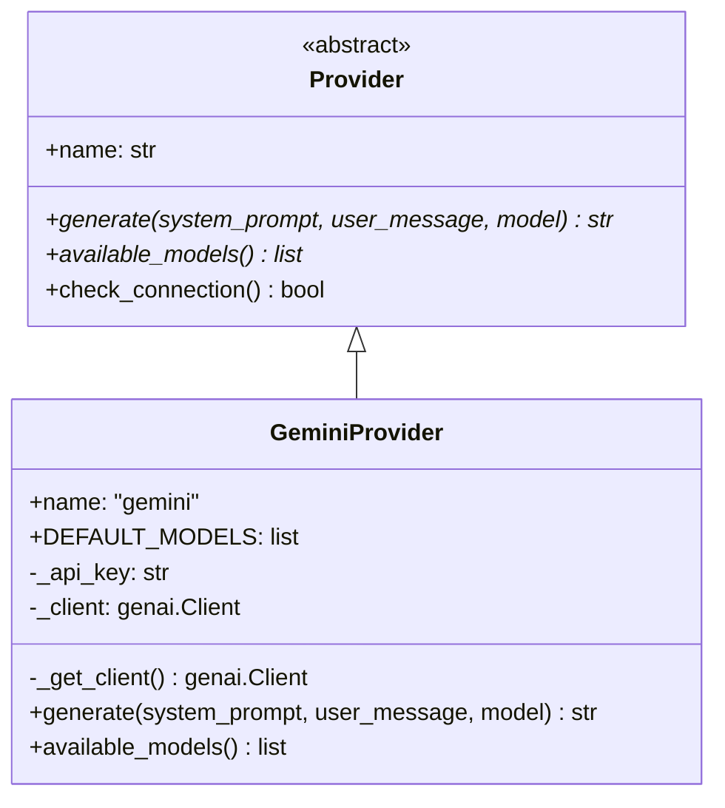
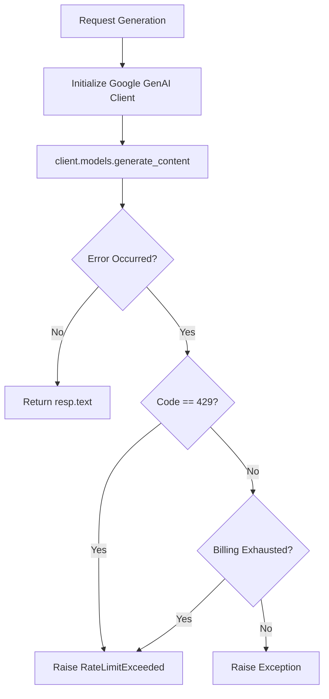

<details>
<summary>Relevant source files</summary>

The following files were used as context for generating this wiki page:

- [providers.py](providers.py)
- [app.py](app.py)
- [main.py](main.py)
- [AGENTS.md](AGENTS.md)
- [README.md](README.md)
- [requirements.txt](requirements.txt)
- [templates/index.html](templates/index.html)
</details>

# Google Gemini Integration

The Google Gemini integration within the Product Describer project provides a mechanism for generating Swedish product descriptions and justifications using Google's Generative AI models. It is implemented as a specialized provider within a larger multi-provider failover system, allowing the application to switch to Gemini if other providers (like OpenAI or Anthropic) are exhausted, or vice versa. Gemini is specifically noted for offering a free tier, making it a viable option for users without paid API subscriptions.

Sources: [README.md:8-12](README.md#L8-L12), [AGENTS.md:3-8](AGENTS.md#L3-L8), [providers.py:145-148](providers.py#L145-L148)

## Architecture and Provider Implementation

The integration is built upon a standard `Provider` abstraction defined in `providers.py`. The `GeminiProvider` class handles the lifecycle of the connection to Google's API, including client initialization, content generation, and error handling specific to the `google-genai` SDK.

### The GeminiProvider Class

The `GeminiProvider` class encapsulates the logic for interacting with Google's API. It uses a lazy-loading approach for the client to ensure the SDK is only instantiated when needed.



The diagram shows the inheritance relationship where `GeminiProvider` implements the abstract interface defined by `Provider`.
Sources: [providers.py:53-73](providers.py#L53-L73), [providers.py:145-177](providers.py#L145-L177)

### Data Flow for Content Generation

When a description is requested, the system passes a system instruction and a user message to the Gemini model. The integration specifically uses the `system_instruction` configuration parameter to guide the model's behavior.



This flowchart illustrates the internal logic of the `generate` method within the `GeminiProvider`.
Sources: [providers.py:157-174](providers.py#L157-L174)

## Configuration and Models

Gemini models are configured through the web UI under the "Inställningar" (Settings) section or via environment variables for CLI usage.

### Supported Models
The integration identifies a set of default models available for selection.

| Model ID | Description |
| :--- | :--- |
| `gemini-2.5-flash` | High-speed, lightweight model. |
| `gemini-2.5-flash-lite` | Optimized version for low latency. |
| `gemini-2.5-pro` | High-capability model for complex reasoning. |

Sources: [providers.py:147](providers.py#L147), [templates/index.html:565-570](templates/index.html#L565-L570)

### Credentials and Setup
Users must provide a `GEMINI_API_KEY` to enable the integration. In CLI or Sync mode, this is read directly from environment variables. In the web application, keys are stored as encrypted-at-rest JSON blobs per account.

| Context | Configuration Method | Variable/Key |
| :--- | :--- | :--- |
| CLI / Sync Mode | Environment Variable | `GEMINI_API_KEY` |
| Web UI | Settings Modal | `api_key` (via `POST /api/settings/key`) |
| Scraper Integration | Cloudflare Secrets | `GEMINI_API_KEY` |

Sources: [README.md:28-32](README.md#L28-L32), [app.py:500-515](app.py#L500-L515), [RESUME.md:95-98](RESUME.md#L95-L98)

## Error Handling and Failover

The Gemini integration is designed to participate in the `ProviderChain`. If Gemini returns a rate limit error (HTTP 429) or indicates that the billing quota is exhausted, the system raises a `RateLimitExceeded` exception.

### Rate Limit Detection
The system specifically looks for billing-related phrases in error messages to trigger failover:
*  "credit balance"
*  "insufficient_quota"
*  "billing"

If these are detected, a default retry delay of 6 hours (`_BILLING_RETRY_SECONDS`) is estimated since Google's API may not provide a specific `Retry-After` hint for billing exhaustion.

Sources: [providers.py:168-173](providers.py#L168-L173), [providers.py:202-212](providers.py#L202-L212), [providers.py:215-217](providers.py#L215-L217)

## Implementation Details

The following snippet demonstrates how the Gemini client is utilized to generate content with system instructions:

```python
# File: providers.py:157-167
def generate(self, system_prompt: str, user_message: str, model: str) -> str:
    from google.genai import errors as genai_errors
    client = self._get_client()
    try:
        resp = client.models.generate_content(
            model=model,
            contents=user_message,
            config={"system_instruction": system_prompt},
        )
    except genai_errors.ClientError as e:
        # Error handling logic...
```

Sources: [providers.py:157-167](providers.py#L157-L167)

## Integration with Scraper Sync

In "Sync Mode," the application polls a scraper API for products missing descriptions. If Gemini is part of the `ProviderChain` built from environment variables, it will be used to process these items automatically. Recent architectural updates (Fas 4) include deploying the engine to Cloudflare Workers where the `GEMINI_API_KEY` is set as a secret to handle background description tasks.

Sources: [app.py:643-650](app.py#L643-L650), [main.py:192-195](main.py#L192-L195), [RESUME.md:94-98](RESUME.md#L94-L98)

## Summary

Google Gemini Integration serves as a critical component of the Product Describer's multi-provider strategy. By wrapping the `google-genai` SDK within the `GeminiProvider` class, the system gains access to a cost-effective (free-tier capable) AI model that supports Swedish product description generation with built-in resilience against rate limits and quota exhaustion.
