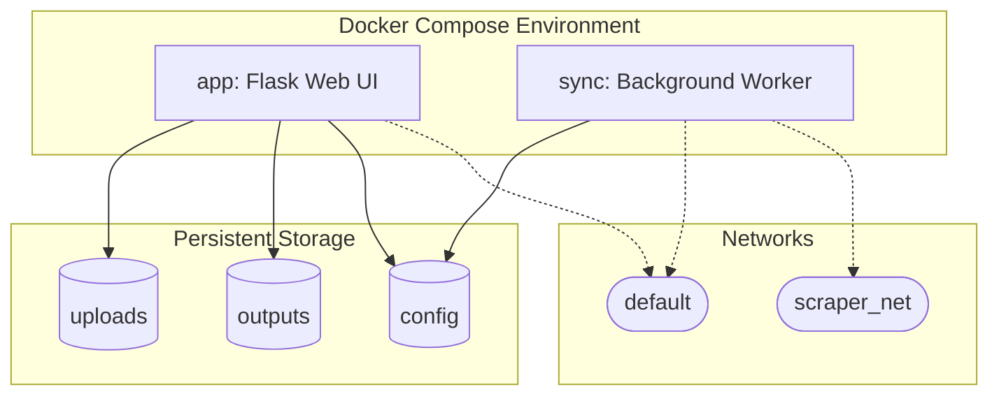
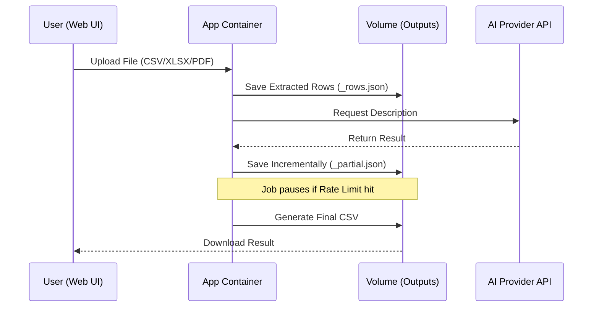

Relevant source files

The following files were used as context for generating this wiki page:

- [docker-compose.yml](docker-compose.yml)
- [README.md](README.md)
- [AGENTS.md](AGENTS.md)
- [CLAUDE.md](CLAUDE.md)
- [app.py](app.py)
- [main.py](main.py)

# Docker & Containerization Setup

The `product-describer` application utilizes Docker and Docker Compose to provide a consistent, multi-tenant environment for generating product descriptions. The setup is designed to isolate the web UI, background processing jobs, and a specialized "Sync mode" for external API integrations. By containerizing the application, it ensures that dependencies like Gunicorn, Flask, and various AI SDKs (Anthropic, OpenAI, Google Gen AI) are managed uniformly across different deployment environments.

Sources: [AGENTS.md:15-18](AGENTS.md#L15-L18), [README.md:16-19](README.md#L16-L19), [CLAUDE.md:16-19](CLAUDE.md#L16-L19)

## Service Architecture

The system architecture is defined by two primary services within the `docker-compose.yml` file: the main web application (`app`) and an optional background synchronization worker (`sync`). These services share the same base image but execute different commands and operate in different network contexts.

*The diagram above illustrates the relationship between Docker services, persistent volumes, and network layers.*

Sources: [docker-compose.yml:2-37](docker-compose.yml#L2-L37), [AGENTS.md:46-49](AGENTS.md#L46-L49)

### Web Application Service (`app`)
The `app` service runs the Flask-based web interface and handles background job execution for uploaded files. It is exposed on port `5050` and requires critical environment variables for encryption and session management.

*  **Image:** `ghcr.io/blixten85/product-describer:latest`
*  **Persistent Volumes:** Maps `/app/uploads`, `/app/outputs`, and `/app/config` to ensure data persists across container restarts.
*  **Startup Requirement:** The container will refuse to start if `PROVIDER_CONFIG_MASTER_KEY` or `FLASK_SECRET_KEY` are missing from the environment.

Sources: [docker-compose.yml:2-17](docker-compose.yml#L2-L17), [README.md:31-41](README.md#L31-L41), [app.py:72-84](app.py#L72-L84)

### Sync Service (`sync`)
The `sync` service is a specialized worker enabled via a Docker Compose profile. It runs a polling loop using `main.py sync --watch` to pull products from an external scraper API, generate descriptions via the configured AI providers, and write the results back.

*  **Command:** `python main.py sync --watch`
*  **Network Integration:** Connects to `scraper_net` to reach the scraper API directly without a reverse proxy.
*  **Environment Configuration:** Utilizes `SCRAPER_URL` and `SCRAPER_API_KEY` to authenticate with the external service.

Sources: [docker-compose.yml:19-37](docker-compose.yml#L19-L37), [README.md:57-73](README.md#L57-L73), [main.py:168-185](main.py#L168-L185)

## Configuration & Environment Variables

Docker services are configured through environment variables, typically managed via a `.env` file. These variables control security, API integration, and operational parameters.

### Required Security Variables
| Variable | Description | Source |
| :--- | :--- | :--- |
| `PROVIDER_CONFIG_MASTER_KEY` | Fernet key used to encrypt saved API keys at rest. | [docker-compose.yml:11](docker-compose.yml#L11) |
| `FLASK_SECRET_KEY` | Signs the login session cookie to keep users logged in across restarts. | [docker-compose.yml:12](docker-compose.yml#L12) |

### Operational & Sync Variables
| Variable | Default | Description |
| :--- | :--- | :--- |
| `SYNC_ENABLED` | `false` | If `true`, starts the background sync worker within the main container. |
| `SCRAPER_URL` | `http://scraper:8000` | The endpoint for the scraper API. |
| `SYNC_INTERVAL` | `300` | Seconds between polling intervals for the sync worker. |
| `SCRAPER_NETWORK` | `scraper_default` | The name of the external network for scraper integration. |

Sources: [docker-compose.yml:23-28](docker-compose.yml#L23-L28), [README.md:44-47](README.md#L44-L47), [README.md:57-67](README.md#L57-L67), [app.py:488-494](app.py#L488-L494)

## Persistence and Data Flow

Persistence is handled through Docker volumes, which store user configurations, job data, and processed files.

### Volume Mapping
*  **`uploads`**: Stores temporary files uploaded by users for description generation. Path: `/app/uploads`.
*  **`outputs`**: Contains `{job_id}_rows.json`, `{job_id}_partial.json`, and final generated CSV files. Path: `/app/outputs`.
*  **`config`**: Stores the SQLite database (`auth.db`) for user accounts and encrypted provider credentials in `config/accounts/<id>/credentials/`.

Sources: [docker-compose.yml:39-42](docker-compose.yml#L39-L42), [CLAUDE.md:33-40](CLAUDE.md#L33-L40), [app.py:86-88](app.py#L86-L88), [app.py:118-124](app.py#L118-L124)

### Data Processing Flow
When a file is uploaded via the Dockerized application, the following sequence occurs:

*The sequence diagram shows the interaction between the containerized app, persistent storage volumes, and external AI APIs.*

Sources: [app.py:339-383](app.py#L339-L383), [AGENTS.md:55-58](AGENTS.md#L55-L58), [CLAUDE.md:65-68](CLAUDE.md#L65-L68)

## Multi-tenant Isolation in Docker

The Docker setup supports a multi-tenant architecture where individual accounts are isolated within the container's file system. Every account brings its own provider keys, which are stored within the `config` volume.

*  **Account Scoping:** Job IDs, uploaded files, and output files are scoped by `account_id` within the volume structure.
*  **Volume Structure:** The `config/accounts/<account_id>/` directory ensures that one user cannot access another user's job or credentials.
*  **Encryption:** The `PROVIDER_CONFIG_MASTER_KEY` environment variable ensures that even if the container is compromised, the API keys stored in the `config` volume remain encrypted at rest.

Sources: [CLAUDE.md:11-14](CLAUDE.md#L11-L14), [CLAUDE.md:57-60](CLAUDE.md#L57-L60), [app.py:313-316](app.py#L313-L316)

## Summary

The Docker and Containerization setup for `product-describer` provides a robust, production-ready environment that prioritizes security and data persistence. By leveraging Docker Compose profiles and external networking, the system can seamlessly integrate with scraping infrastructures while maintaining strict isolation for multi-tenant web users. The use of persistent volumes for caching job progress ensures that the system is resilient to container restarts and provider rate-limiting pauses.

Sources: [docker-compose.yml:1-48](docker-compose.yml#L1-L48), [README.md:21-25](README.md#L21-L25), [AGENTS.md:55-58](AGENTS.md#L55-L58)
