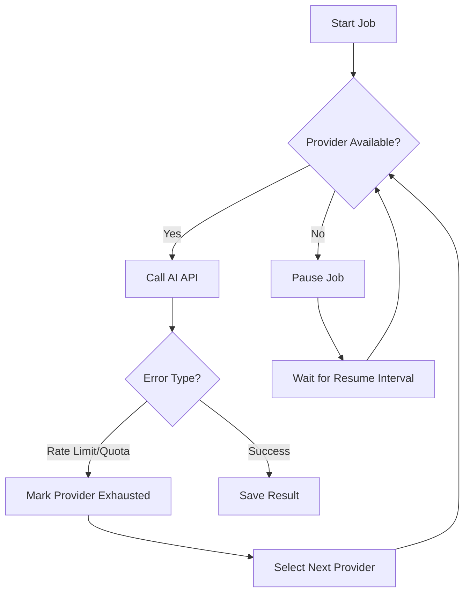
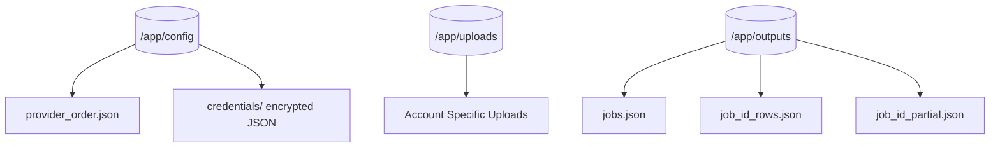

<details>
<summary>Relevant source files</summary>

The following files were used as context for generating this wiki page:

- [README.md](README.md)
- [SECURITY.md](SECURITY.md)
- [AGENTS.md](AGENTS.md)
- [CLAUDE.md](CLAUDE.md)
- [app.py](app.py)
- [main.py](main.py)
- [docker-compose.yml](docker-compose.yml)
</details>

# Environment Variables & Required Configuration

The **product-describer** application relies heavily on environment variables and specific configuration files to manage security, multi-tenancy, and integration with external AI providers and scrapers. Configuration is split between global system settings (defined in `.env` or environment variables) and account-specific settings (managed through the web UI and stored in the filesystem).

Sources: [AGENTS.md:52-54](AGENTS.md#L52-L54), [README.md:46-52](README.md#L46-L52)

## Core System Configuration

The application requires two critical security keys to start. If these are missing, the container will fail to launch with a clear error.

| Variable | Description | Requirement |
| :--- | :--- | :--- |
| `PROVIDER_CONFIG_MASTER_KEY` | A Fernet key used to encrypt saved API keys at rest. | **Required** |
| `FLASK_SECRET_KEY` | Used to sign login session cookies. Must be stable across restarts. | **Required** |
| `SESSION_COOKIE_SECURE` | Controls the 'Secure' flag on cookies. Set to '0' for local dev. | Optional (Default: 1) |
| `JOB_RETENTION_DAYS` | Number of days to keep completed/errored jobs before purging. | Optional (Default: 30) |

Sources: [README.md:46-60](README.md#L46-L60), [app.py:64-74](app.py#L64-L74), [app.py:82-84](app.py#L82-L84)

### Key Generation Snippets
Developers can generate the required keys using the following commands:

```bash
# Generate PROVIDER_CONFIG_MASTER_KEY
python -c "from cryptography.fernet import Fernet; print(Fernet.generate_key().decode())"

# Generate FLASK_SECRET_KEY
python -c "import secrets; print(secrets.token_hex(32))"
```

Sources: [README.md:52-56](README.md#L52-L56)

## AI Provider Configuration

The application supports multi-provider failover. For the Web UI, API keys are stored per account. For CLI operations, the application reads keys directly from the environment.

### CLI Mode Environment Variables
When running via `main.py`, the following variables are checked:
- `ANTHROPIC_API_KEY`: Key for Claude models.
- `OPENAI_API_KEY`: Key for ChatGPT models.
- `GEMINI_API_KEY`: Key for Google Gemini models.
- `AZURE_OPENAI_API_KEY`: Key for Azure-hosted OpenAI models.
- `AZURE_OPENAI_ENDPOINT`: Endpoint URL (Azure only).
- `AZURE_OPENAI_DEPLOYMENT`: Deployment name (Azure only).

Sources: [README.md:62-65](README.md#L62-L65), [SECURITY.md:14-15](SECURITY.md#L14-L15)

### Provider Failover Logic
The application implements an automatic failover engine. If a provider reaches its rate limit or quota, the system switches to the next configured provider in the `provider_order.json` list.



The logic for resuming paused jobs is managed by a background watcher that checks every 120 seconds (configurable via `RESUME_CHECK_INTERVAL`).
Sources: [README.md:73-82](README.md#L73-L82), [app.py:67](app.py#L67), [AGENTS.md:83-85](AGENTS.md#L83-L85)

## Sync Mode Configuration

Sync mode allows the describer to poll a scraper API for products missing descriptions and write them back automatically. This is enabled via the `sync` profile in Docker Compose.

| Variable | Description | Default |
| :--- | :--- | :--- |
| `SYNC_ENABLED` | Set to `true` to enable the background sync worker. | `false` |
| `SCRAPER_URL` | The internal or external URL of the scraper API. | `http://scraper:8000` |
| `SCRAPER_API_KEY` | The API key required to authenticate with the scraper. | (Empty) |
| `SYNC_INTERVAL` | Seconds between poll attempts. | `300` |
| `SYNC_LIMIT` | Max products to fetch per sync cycle. | `50` |
| `SCRAPER_NETWORK` | The Docker network name used to reach the scraper. | `scraper_default` |

Sources: [README.md:84-98](README.md#L84-L98), [main.py:27-29](main.py#L27-L29), [app.py:488-490](app.py#L488-L490)

## Filesystem Structure & Volumes

The application persists data across three main volumes. In a multi-tenant setup, provider configurations are isolated by `account_id`.



- **Config Path (Multi-tenant):** `config/accounts/<account_id>/credentials/`
- **Config Path (Legacy/Global):** `config/credentials/`

Sources: [AGENTS.md:52-54](AGENTS.md#L52-L54), [CLAUDE.md:61-63](CLAUDE.md#L61-L63), [app.py:112-120](app.py#L112-L120)

## Monitoring & Error Reporting

The application includes optional integration with Sentry and GitHub for error tracking.

- `SENTRY_DSN`: If set, enables Sentry error tracking for the Flask app.
- `SENTRY_TRACES_SAMPLE_RATE`: Controls performance tracing (Default: 1.0).
- `GITHUB_ERROR_REPORT_TOKEN`: If set, the application will automatically open a GitHub issue for unhandled exceptions, including redacted context.

Sources: [app.py:41-60](app.py#L41-L60), [CLAUDE.md:79-84](CLAUDE.md#L79-L84)

The configuration system ensures that while the core application remains stateless, user secrets are encrypted and background processes like Sync mode can operate autonomously with failover protection.

Summary: Configuration is split between mandatory security keys (`PROVIDER_CONFIG_MASTER_KEY`, `FLASK_SECRET_KEY`), optional integrations (Sync, Sentry, GitHub), and multi-tenant filesystem isolation for provider credentials and job data.
